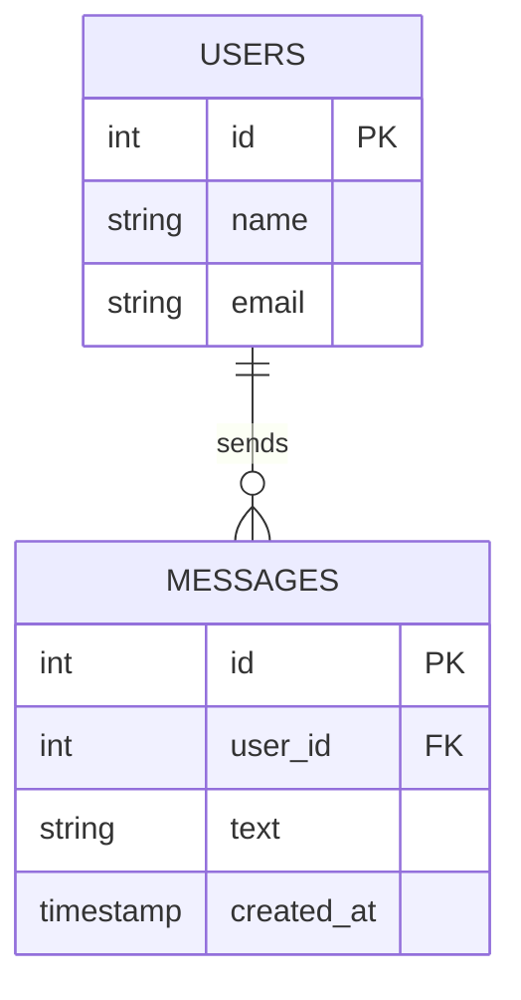
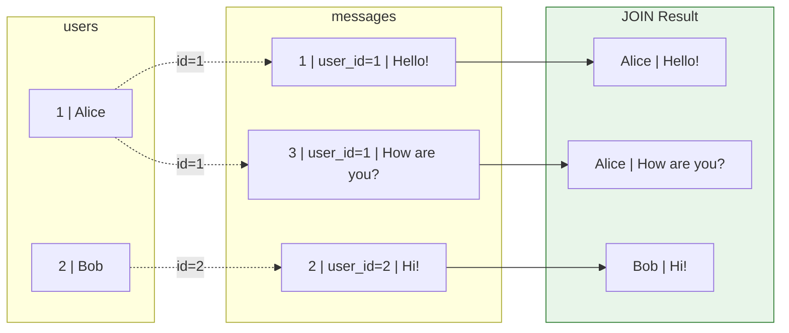
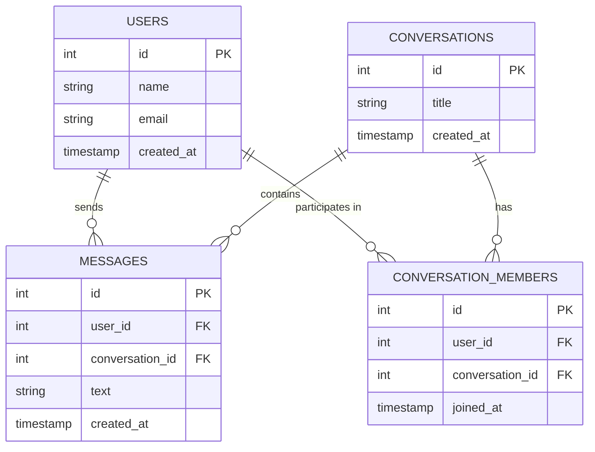

# Lesson 4.2: The Relational Model

> **Duration**: 25 min | **Section**: A - What IS a Database?

## 🎯 The Problem (3-5 min)

You're building a chat app. You have:
- Users (with names, emails)
- Messages (with content, timestamps)
- Conversations (with participants)

How do you **organize** this data? You could throw everything into one big file:

```json
{
  "user_1": {"name": "Alice", "messages": [...]},
  "user_2": {"name": "Bob", "messages": [...]}
}
```

But what if Alice is in 5 conversations? Do you duplicate her data 5 times? What if she changes her email—do you update it in 5 places?

> **Scenario**: Your app has 10,000 users. A user named "Alice" changes her email. With nested JSON, you need to find every place her data appears and update it. Miss one? Now you have TWO different emails for the same person.

## 🧪 Try It: The Naive Approach (5-10 min)

Let's try organizing everything in one flat list:

```python
data = [
    {"type": "user", "id": 1, "name": "Alice", "email": "alice@example.com"},
    {"type": "user", "id": 2, "name": "Bob", "email": "bob@example.com"},
    {"type": "message", "id": 1, "user_name": "Alice", "text": "Hello!"},
    {"type": "message", "id": 2, "user_name": "Bob", "text": "Hi!"},
    {"type": "message", "id": 3, "user_name": "Alice", "text": "How are you?"},
]
```

Now Alice changes her name to "Alice Smith":

```python
for item in data:
    if item.get("type") == "user" and item.get("name") == "Alice":
        item["name"] = "Alice Smith"
    if item.get("type") == "message" and item.get("user_name") == "Alice":
        item["user_name"] = "Alice Smith"
```

This is **update anomaly**—the same data is stored in multiple places, and you need to update ALL of them.

## 🔍 Under the Hood (10-15 min)

The **relational model** solves this by:
1. **Separating data into tables** (one per "entity")
2. **Linking tables with IDs** (foreign keys)
3. **Storing each fact ONCE** (normalization)



### The Components

| Term | Meaning | Analogy |
|------|---------|---------|
| **Table** | Collection of related data | A spreadsheet sheet |
| **Row** (Record) | One item in the table | A spreadsheet row |
| **Column** (Field) | One attribute | A spreadsheet column |
| **Primary Key (PK)** | Unique identifier for each row | Social Security Number |
| **Foreign Key (FK)** | Reference to another table's row | "See user #1 for details" |

### How It Looks in Practice

**users table:**
| id | name | email |
|:--:|------|-------|
| 1 | Alice | alice@example.com |
| 2 | Bob | bob@example.com |

**messages table:**
| id | user_id | text | created_at |
|:--:|:-------:|------|------------|
| 1 | 1 | Hello! | 2024-01-01 10:00 |
| 2 | 2 | Hi! | 2024-01-01 10:01 |
| 3 | 1 | How are you? | 2024-01-01 10:02 |

Notice: Alice's name appears ONCE. The messages table just stores `user_id = 1`.

### The Power of JOINs

To see "who sent each message," you JOIN the tables:



```sql
SELECT users.name, messages.text
FROM users
JOIN messages ON users.id = messages.user_id;
```

Result:
| name | text |
|------|------|
| Alice | Hello! |
| Bob | Hi! |
| Alice | How are you? |

## 💥 Where It Breaks (3-5 min)

The relational model isn't perfect:

| Issue | When It Happens |
|-------|-----------------|
| **Complex queries** | Many JOINs can be slow |
| **Rigid schema** | Adding a column requires migration |
| **Hierarchical data** | Trees/graphs are awkward in tables |
| **Highly variable data** | If every row has different fields |

That's why NoSQL exists—for when relational doesn't fit. But for **most apps**, relational is the right choice.

## ✅ The Fix (10-15 min)

Let's design a proper chat schema:



### The SQL to Create This

```sql
CREATE TABLE users (
    id SERIAL PRIMARY KEY,
    name VARCHAR(100) NOT NULL,
    email VARCHAR(255) UNIQUE NOT NULL,
    created_at TIMESTAMP DEFAULT NOW()
);

CREATE TABLE conversations (
    id SERIAL PRIMARY KEY,
    title VARCHAR(255),
    created_at TIMESTAMP DEFAULT NOW()
);

CREATE TABLE conversation_members (
    id SERIAL PRIMARY KEY,
    user_id INTEGER REFERENCES users(id),
    conversation_id INTEGER REFERENCES conversations(id),
    joined_at TIMESTAMP DEFAULT NOW()
);

CREATE TABLE messages (
    id SERIAL PRIMARY KEY,
    user_id INTEGER REFERENCES users(id),
    conversation_id INTEGER REFERENCES conversations(id),
    text TEXT NOT NULL,
    created_at TIMESTAMP DEFAULT NOW()
);
```

### Why This Design?

| Question | Answer |
|----------|--------|
| "Who's in conversation 1?" | Query `conversation_members WHERE conversation_id = 1` |
| "All messages by Alice?" | Query `messages WHERE user_id = 1` |
| "Alice changes email?" | Update ONE row in `users` table—done! |
| "Delete a user?" | Can enforce rules (CASCADE or RESTRICT) |

## 🎯 Practice

Design tables for a **TODO app** with:
- Users (who can have many todo lists)
- Todo Lists (which belong to one user)
- Todo Items (which belong to one list)

Questions:
1. What are the tables?
2. What columns does each table have?
3. Where are the foreign keys?
4. Draw the ER diagram (like the ones above)

## 🔑 Key Takeaways

- **Tables** separate different types of data (users, messages, etc.)
- **Primary keys** uniquely identify each row
- **Foreign keys** link tables together
- **Normalization** means storing each fact once—no duplication
- **JOINs** combine tables when you need related data

## ❓ Common Questions

| Question | Answer |
|----------|--------|
| "Why not store user_name in messages?" | Duplication! If Alice changes her name, you'd need to update every message. With foreign key, update once. |
| "What's SERIAL?" | Auto-incrementing integer. PostgreSQL generates 1, 2, 3... automatically. |
| "What's REFERENCES?" | Foreign key constraint. PostgreSQL ensures user_id exists in users table. |
| "Can a row have multiple foreign keys?" | Yes! `messages` has both `user_id` and `conversation_id`. |

## 📚 Further Reading

- [PostgreSQL Data Types](https://www.postgresql.org/docs/current/datatype.html)
- [Database Normalization Explained](https://www.guru99.com/database-normalization.html)
- [Entity-Relationship Diagrams](https://www.lucidchart.com/pages/er-diagrams)

---

**Next Lesson**: [4.3 PostgreSQL Setup](./Lesson-04-03-PostgreSQL-Setup.md) - Installing and connecting to PostgreSQL
