# Lesson 4.4: Creating Tables

> **Duration**: 30 min | **Section**: A - What IS a Database?

## 🎯 The Problem (3-5 min)

You're connected to PostgreSQL. Time to create tables!

But what data types should you use? `VARCHAR` or `TEXT`? `INTEGER` or `BIGINT`? What's `SERIAL`? What constraints prevent bad data?

> **Scenario**: You create a table for user ages with `VARCHAR`. Someone inserts "twenty-five" as their age. Your code tries to do math on it—crash! The database didn't stop the bad data.

## 🧪 Try It: The Naive Approach (5-10 min)

Let's create a table with minimal thought:

```sql
CREATE TABLE users (
    name TEXT,
    age TEXT,
    email TEXT
);

INSERT INTO users VALUES ('Alice', 'twenty-five', 'alice@example.com');
INSERT INTO users VALUES ('Bob', '30', 'bob@example.com');
INSERT INTO users VALUES (NULL, NULL, 'nobody@example.com');
INSERT INTO users VALUES ('Carol', '25', 'bob@example.com');  -- Duplicate email!
```

All of these work! But now your data is a mess:
- "twenty-five" isn't a number
- A user with no name?
- Two people with the same email?

## 🔍 Under the Hood (10-15 min)

### Data Types

PostgreSQL has types for everything:

```mermaid
flowchart TB
    subgraph TYPES["POSTGRESQL DATA TYPES"]
        subgraph NUM["Numbers"]
            INT["INTEGER
            -2B to 2B"]
            BIGINT["BIGINT
            huge numbers"]
            SERIAL["SERIAL
            auto-increment"]
            NUMERIC["NUMERIC(10,2)
            exact decimals"]
        end
        
        subgraph TEXT_T["Text"]
            VARCHAR["VARCHAR(n)
            up to n chars"]
            TEXT_TYPE["TEXT
            unlimited"]
            CHAR["CHAR(n)
            fixed length"]
        end
        
        subgraph TIME["Date/Time"]
            DATE["DATE
            2024-01-15"]
            TIME_T["TIME
            14:30:00"]
            TIMESTAMP["TIMESTAMP
            both"]
            TIMESTAMPTZ["TIMESTAMPTZ
            with timezone"]
        end
        
        subgraph OTHER["Other"]
            BOOL["BOOLEAN
            true/false"]
            JSON_T["JSON/JSONB
            structured data"]
            UUID_T["UUID
            unique IDs"]
            ARRAY["ARRAY
            lists"]
        end
    end
    
    style NUM fill:#E3F2FD,stroke:#1565C0
    style TEXT_T fill:#E8F5E9,stroke:#2E7D32
    style TIME fill:#FFF3E0,stroke:#EF6C00
    style OTHER fill:#FCE4EC,stroke:#C2185B
```



| Type | Use For | Example |
|------|---------|---------|
| `INTEGER` | Whole numbers | `42`, `-100` |
| `BIGINT` | Large whole numbers | `9223372036854775807` |
| `SERIAL` | Auto-incrementing IDs | `1`, `2`, `3`... |
| `NUMERIC(10,2)` | Money, precise decimals | `1234567.89` |
| `VARCHAR(255)` | Text with max length | `'alice@example.com'` |
| `TEXT` | Unlimited text | Long descriptions |
| `BOOLEAN` | True/false | `TRUE`, `FALSE` |
| `TIMESTAMP` | Date and time | `'2024-01-15 14:30:00'` |
| `TIMESTAMPTZ` | Timestamp with timezone | Best for global apps |
| `JSONB` | Structured data | `'{"key": "value"}'` |
| `UUID` | Unique identifiers | `'a0eebc99-9c0b-4ef8-bb6d-6bb9bd380a11'` |

### Constraints

Constraints are RULES that PostgreSQL enforces:


| Constraint | What It Does | Example |
|------------|--------------|---------|
| `PRIMARY KEY` | Unique identifier for each row | `id SERIAL PRIMARY KEY` |
| `NOT NULL` | Column cannot be empty | `email VARCHAR(255) NOT NULL` |
| `UNIQUE` | No duplicate values | `email VARCHAR(255) UNIQUE` |
| `FOREIGN KEY` | Must reference existing row | `user_id INTEGER REFERENCES users(id)` |
| `CHECK` | Custom validation | `CHECK (age >= 0)` |
| `DEFAULT` | Value if not provided | `created_at TIMESTAMP DEFAULT NOW()` |

## 💥 Where It Breaks (3-5 min)

What happens when you violate constraints?

```sql
-- Trying to insert duplicate email when UNIQUE is set
INSERT INTO users (email) VALUES ('alice@example.com');
INSERT INTO users (email) VALUES ('alice@example.com');
-- ERROR: duplicate key value violates unique constraint "users_email_key"

-- Trying to insert NULL when NOT NULL is set
INSERT INTO users (email) VALUES (NULL);
-- ERROR: null value in column "email" violates not-null constraint

-- Trying to reference non-existent user
INSERT INTO messages (user_id, text) VALUES (9999, 'Hello');
-- ERROR: insert or update on table "messages" violates foreign key constraint
```

**This is GOOD!** The database catches bad data BEFORE it enters the system.

## ✅ The Fix (10-15 min)

Let's create a proper users table:

```sql
CREATE TABLE users (
    -- Primary key: auto-incrementing, unique identifier
    id SERIAL PRIMARY KEY,
    
    -- Required text fields
    name VARCHAR(100) NOT NULL,
    email VARCHAR(255) UNIQUE NOT NULL,
    
    -- Optional fields with constraints
    age INTEGER CHECK (age >= 0 AND age < 150),
    
    -- Automatic timestamps
    created_at TIMESTAMPTZ DEFAULT NOW(),
    updated_at TIMESTAMPTZ DEFAULT NOW()
);
```

Let's trace what each part does:

```mermaid
flowchart TB
    subgraph TABLE["CREATE TABLE users"]
        ID["id SERIAL PRIMARY KEY
        ➜ Auto-generates: 1, 2, 3...
        ➜ Each value unique
        ➜ Cannot be NULL"]
        
        NAME["name VARCHAR(100) NOT NULL
        ➜ Max 100 characters
        ➜ Must provide value"]
        
        EMAIL["email VARCHAR(255) UNIQUE NOT NULL
        ➜ Max 255 characters
        ➜ No duplicates allowed
        ➜ Must provide value"]
        
        AGE["age INTEGER CHECK(age >= 0)
        ➜ Whole numbers only
        ➜ Must be non-negative
        ➜ NULL allowed (optional)"]
        
        CREATED["created_at TIMESTAMPTZ DEFAULT NOW()
        ➜ Date + time + timezone
        ➜ Auto-fills with current time"]
    end
    
    style ID fill:#C8E6C9,stroke:#2E7D32
    style NAME fill:#BBDEFB,stroke:#1565C0
    style EMAIL fill:#FFE0B2,stroke:#EF6C00
    style AGE fill:#E1BEE7,stroke:#7B1FA2
    style CREATED fill:#F5F5F5,stroke:#616161
```



### Messages Table with Foreign Key

```sql
CREATE TABLE messages (
    id SERIAL PRIMARY KEY,
    
    -- Foreign key: must reference existing user
    user_id INTEGER NOT NULL REFERENCES users(id) ON DELETE CASCADE,
    
    -- Message content
    text TEXT NOT NULL,
    
    -- Metadata
    created_at TIMESTAMPTZ DEFAULT NOW()
);
```

The `ON DELETE CASCADE` means: if a user is deleted, all their messages are automatically deleted too.

### Foreign Key Options

| Option | When User Is Deleted |
|--------|---------------------|
| `CASCADE` | Delete all their messages too |
| `SET NULL` | Set user_id to NULL (keeps message) |
| `SET DEFAULT` | Set user_id to default value |
| `RESTRICT` | Prevent deletion (error) |
| `NO ACTION` | Same as RESTRICT (default) |

### Practical Example: Full Chat Schema

```sql
-- Users table
CREATE TABLE users (
    id SERIAL PRIMARY KEY,
    username VARCHAR(50) UNIQUE NOT NULL,
    email VARCHAR(255) UNIQUE NOT NULL,
    password_hash VARCHAR(255) NOT NULL,
    display_name VARCHAR(100),
    avatar_url TEXT,
    is_active BOOLEAN DEFAULT TRUE,
    created_at TIMESTAMPTZ DEFAULT NOW(),
    last_seen_at TIMESTAMPTZ
);

-- Conversations table
CREATE TABLE conversations (
    id SERIAL PRIMARY KEY,
    title VARCHAR(255),
    is_group BOOLEAN DEFAULT FALSE,
    created_at TIMESTAMPTZ DEFAULT NOW()
);

-- Junction table for many-to-many relationship
CREATE TABLE conversation_members (
    id SERIAL PRIMARY KEY,
    conversation_id INTEGER NOT NULL REFERENCES conversations(id) ON DELETE CASCADE,
    user_id INTEGER NOT NULL REFERENCES users(id) ON DELETE CASCADE,
    joined_at TIMESTAMPTZ DEFAULT NOW(),
    -- Prevent duplicate memberships
    UNIQUE (conversation_id, user_id)
);

-- Messages table
CREATE TABLE messages (
    id SERIAL PRIMARY KEY,
    conversation_id INTEGER NOT NULL REFERENCES conversations(id) ON DELETE CASCADE,
    user_id INTEGER NOT NULL REFERENCES users(id) ON DELETE SET NULL,
    content TEXT NOT NULL,
    created_at TIMESTAMPTZ DEFAULT NOW(),
    edited_at TIMESTAMPTZ
);
```

## 🎯 Practice

Create tables for a **blog** application:

1. **authors** table:
   - `id` (auto-incrementing primary key)
   - `name` (required, max 100 chars)
   - `email` (required, unique)
   - `bio` (optional, unlimited text)
   - `created_at` (auto timestamp)

2. **posts** table:
   - `id` (auto-incrementing primary key)
   - `author_id` (foreign key to authors)
   - `title` (required, max 255 chars)
   - `content` (required, unlimited text)
   - `is_published` (boolean, default false)
   - `published_at` (optional timestamp)
   - `created_at` (auto timestamp)

3. **Test your constraints**:
   - Try inserting an author without an email
   - Try inserting a post with non-existent author_id
   - Try inserting two authors with the same email

## 🔑 Key Takeaways

- **Data types** ensure values are what you expect (integers, text, dates)
- **PRIMARY KEY** uniquely identifies each row
- **NOT NULL** makes a field required
- **UNIQUE** prevents duplicate values
- **FOREIGN KEY** links tables and enforces relationships
- **DEFAULT** provides values when not specified
- **Constraints catch bad data** before it enters your database

## ❓ Common Questions

| Question | Answer |
|----------|--------|
| "VARCHAR vs TEXT?" | Both work. VARCHAR(n) has a length limit; TEXT is unlimited. Use VARCHAR for emails, usernames. TEXT for content. |
| "INTEGER vs BIGINT?" | INTEGER holds up to ~2 billion. Use BIGINT for things that might exceed that (like global user IDs). |
| "When to use UUID?" | When you need IDs that are unique across systems, or don't want sequential IDs (security). |
| "Can I add constraints later?" | Yes! `ALTER TABLE users ADD CONSTRAINT ... ` |

## 📚 Further Reading

- [PostgreSQL Data Types](https://www.postgresql.org/docs/current/datatype.html)
- [PostgreSQL Constraints](https://www.postgresql.org/docs/current/ddl-constraints.html)
- [CREATE TABLE Syntax](https://www.postgresql.org/docs/current/sql-createtable.html)

---

**Next Lesson**: [4.5 Database Basics Q&A](./Lesson-04-05-Database-Basics-QA.md) - Primary keys, NULL, schemas explained
