# Lesson 4.5: Database Basics Q&A

> **Duration**: 10 min | **Section**: A - What IS a Database?

## 🎯 Section A Wrap-up

You've learned the fundamentals:
- Why databases exist (the persistence problem)
- How they work (ACID, WAL, buffer pool)
- The relational model (tables, relationships, normalization)
- PostgreSQL setup (server, client, connection strings)
- Creating tables (data types, constraints)

Now let's address the most common questions and solidify your mental model.

## ❓ Common Questions

### Q1: "What exactly IS a primary key?"

A primary key is a **unique identifier** for each row in a table. Think of it like a Social Security Number—no two people have the same one.

```mermaid
flowchart LR
    subgraph TABLE["users table"]
        R1["id=1 | Alice | alice@mail.com"]
        R2["id=2 | Bob | bob@mail.com"]
        R3["id=3 | Carol | carol@mail.com"]
    end
    
    PK["Primary Key (id)
    ➜ Always unique
    ➜ Never NULL
    ➜ Usually auto-increment"]
    
    PK --> R1
    PK --> R2
    PK --> R3
    
    style PK fill:#C8E6C9,stroke:#2E7D32
```



**Why do we need it?**
- To reference specific rows from other tables (foreign keys)
- To update or delete specific rows (`WHERE id = 5`)
- To ensure each row is uniquely identifiable

**What can be a primary key?**
```sql
-- Option 1: Auto-incrementing integer (most common)
id SERIAL PRIMARY KEY

-- Option 2: UUID (good for distributed systems)
id UUID PRIMARY KEY DEFAULT gen_random_uuid()

-- Option 3: Natural key (existing unique data)
email VARCHAR(255) PRIMARY KEY  -- Not recommended usually

-- Option 4: Composite key (multiple columns)
PRIMARY KEY (user_id, conversation_id)
```

---

### Q2: "What's NULL? Is it the same as empty?"

**NO!** NULL is not empty string, not zero, not false. NULL means "unknown" or "missing."


| Value | Meaning | Example |
|-------|---------|---------|
| `NULL` | Unknown/missing | User didn't provide birthday |
| `''` (empty string) | Known to be empty | User explicitly cleared their bio |
| `0` | The number zero | User has zero followers |
| `FALSE` | Boolean false | User is not verified |

**NULL is weird in comparisons:**
```sql
-- This finds nothing! NULL is not equal to anything, even itself
SELECT * FROM users WHERE age = NULL;  -- Wrong!

-- Use IS NULL instead
SELECT * FROM users WHERE age IS NULL;  -- Correct!

-- NULL in arithmetic
SELECT 5 + NULL;  -- Result: NULL (unknown + 5 = unknown)
```

---

### Q3: "What's a schema?"

A schema is a **namespace** for tables—like folders for files.


```sql
-- Create a schema
CREATE SCHEMA analytics;

-- Create table in specific schema
CREATE TABLE analytics.events (
    id SERIAL PRIMARY KEY,
    event_type VARCHAR(50),
    data JSONB
);

-- Query with schema prefix
SELECT * FROM analytics.events;

-- Or set search path
SET search_path TO analytics, public;
SELECT * FROM events;  -- Looks in analytics first
```

**Why use schemas?**
- Organize related tables
- Separate concerns (auth, analytics, billing)
- Different permissions per schema
- Avoid naming conflicts

---

### Q4: "When should I use an index?"

An index speeds up queries by creating a "lookup table" for a column:

```mermaid
flowchart LR
    subgraph WITHOUT["❌ WITHOUT INDEX"]
        Q1["SELECT * FROM users WHERE email = 'alice@mail.com'"]
        SCAN["Scan ALL 1 million rows"]
    end
    
    subgraph WITH["✅ WITH INDEX"]
        Q2["SELECT * FROM users WHERE email = 'alice@mail.com'"]
        IDX["Jump directly to row"]
    end
    
    Q1 --> SCAN
    Q2 --> IDX
    
    style WITHOUT fill:#FFEBEE,stroke:#C62828
    style WITH fill:#E8F5E9,stroke:#2E7D32
```



**When to add indexes:**
- Columns you frequently search by (`WHERE email = ...`)
- Columns you join on (`JOIN ... ON users.id = messages.user_id`)
- Columns you sort by (`ORDER BY created_at`)

**When NOT to add indexes:**
- Small tables (full scan is fast enough)
- Columns you rarely query
- Tables with lots of writes (indexes slow down INSERT/UPDATE)

```sql
-- Create an index
CREATE INDEX idx_users_email ON users(email);

-- Unique index (also enforces uniqueness)
CREATE UNIQUE INDEX idx_users_username ON users(username);

-- Composite index (multiple columns)
CREATE INDEX idx_messages_conv_created ON messages(conversation_id, created_at);
```

---

### Q5: "What happens if I don't use transactions?"

Without transactions, partial updates can corrupt your data:

```mermaid
sequenceDiagram
    participant App
    participant DB as PostgreSQL
    
    Note over App,DB: Transfer $100 from Alice to Bob
    
    App->>DB: UPDATE accounts SET balance = balance - 100 WHERE user = 'Alice'
    Note over DB: Alice: $1000 → $900 ✓
    
    Note over App,DB: 💥 Network error!
    
    App-xDB: UPDATE accounts SET balance = balance + 100 WHERE user = 'Bob'
    Note over DB: Bob: $500 (unchanged)
    
    Note over DB: ❌ $100 disappeared!
```



**With transactions:**

```sql
BEGIN;  -- Start transaction

UPDATE accounts SET balance = balance - 100 WHERE user = 'Alice';
UPDATE accounts SET balance = balance + 100 WHERE user = 'Bob';

COMMIT;  -- All or nothing
-- If anything fails before COMMIT, nothing happens
```

---

### Q6: "How do I see what's in my database?"

Essential exploration commands:

```sql
-- List all databases
\l

-- Connect to a database
\c myapp

-- List all tables in current database
\dt

-- List tables in specific schema
\dt auth.*

-- Describe a table (columns, types, constraints)
\d users

-- Show table with indexes
\d+ users

-- List all schemas
\dn

-- List all indexes
\di

-- See current database and user
SELECT current_database(), current_user;
```

---

## 🧠 Mental Model Check

Can you answer these without looking back?

| Question | Your Answer |
|----------|-------------|
| What problem do databases solve that files can't? | |
| What are the 4 ACID properties? | |
| What's the difference between a primary key and foreign key? | |
| What does `SERIAL` mean? | |
| When would you use `NOT NULL`? | |
| What's `NULL` mean vs empty string? | |
| How do you connect to PostgreSQL from the terminal? | |

## � Common Pitfalls

| Pitfall | What Happens | Fix |
|---------|--------------|-----|
| Forgetting `NOT NULL` | NULLs sneak into required fields | Add constraint: `name VARCHAR(100) NOT NULL` |
| No primary key | Can't uniquely identify rows | Always add `id SERIAL PRIMARY KEY` |
| Wrong data type | Storage/query issues | Use `INTEGER` for counts, `NUMERIC` for money |
| Connecting as superuser | Security risk | Create app-specific user with limited permissions |
| Forgetting to create index | Slow queries on large tables | Index columns used in WHERE/JOIN |

## 🔑 Key Takeaways

1. **Databases solve persistence** - Data survives restarts, crashes, concurrent access
2. **ACID guarantees reliability** - Atomicity, Consistency, Isolation, Durability
3. **Primary keys identify rows** - Every table needs one
4. **Foreign keys link tables** - Enforce referential integrity
5. **NULL means unknown** - Not empty, not zero, not false
6. **Schemas organize tables** - Like folders for your tables

## ✅ Section A Complete!

## �🔑 Section A Summary


**You now understand:**
- ✅ Why databases exist
- ✅ How PostgreSQL works internally
- ✅ The relational model
- ✅ How to set up and connect
- ✅ How to create proper tables with constraints

---

**Next Section**: [Section B: CRUD Operations](./Lesson-04-06-The-CRUD-Problem.md) - The four verbs: INSERT, SELECT, UPDATE, DELETE
