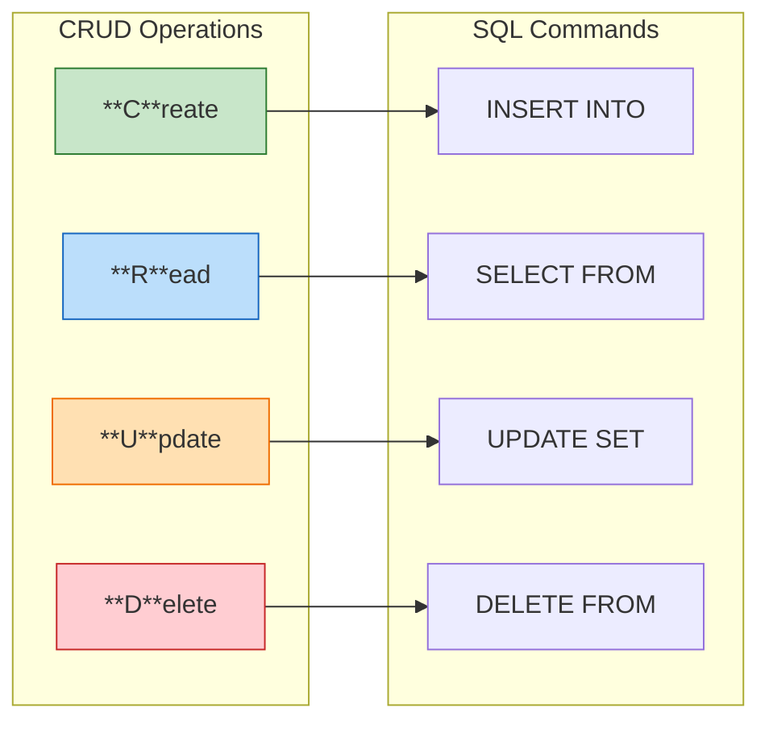

# Lesson 4.6: The CRUD Problem

> **Duration**: 5 min | **Section**: B - CRUD Operations

## 🎯 The Problem (3-5 min)

You have a database with tables. Now you need to actually DO things with the data.

Every application needs exactly four operations:

1. **Create** new records (sign up a user)
2. **Read** existing records (show user profile)
3. **Update** records (change email)
4. **Delete** records (remove account)

That's it. Every interaction with a database boils down to CRUD.

> **Scenario**: You're building a user management system. You need to: register new users, show their profiles, let them update their info, and delete accounts. What SQL commands do you use?

## 🧪 Try It: The Naive Approach (5-10 min)

You might guess the commands:

```sql
-- Create? Maybe ADD?
ADD user 'Alice';  -- Nope

-- Read? Maybe GET?
GET user WHERE name = 'Alice';  -- Nope

-- Update? Maybe CHANGE?
CHANGE user SET name = 'Bob';  -- Nope

-- Delete? Maybe REMOVE?
REMOVE user WHERE id = 1;  -- Nope
```

SQL uses different words!

## 🔍 Under the Hood (10-15 min)

SQL has four commands that map to CRUD:



| CRUD | SQL | What It Does |
|------|-----|--------------|
| **C**reate | `INSERT INTO` | Add new rows |
| **R**ead | `SELECT FROM` | Retrieve rows |
| **U**pdate | `UPDATE SET` | Modify existing rows |
| **D**elete | `DELETE FROM` | Remove rows |

### Quick Preview

```sql
-- CREATE: Add a new user
INSERT INTO users (name, email) VALUES ('Alice', 'alice@example.com');

-- READ: Get all users
SELECT * FROM users;

-- UPDATE: Change Alice's email
UPDATE users SET email = 'alice.new@example.com' WHERE name = 'Alice';

-- DELETE: Remove Alice
DELETE FROM users WHERE name = 'Alice';
```

## 🔑 Key Takeaways

- **CRUD** = Create, Read, Update, Delete
- Every database operation is one of these four
- SQL commands: INSERT, SELECT, UPDATE, DELETE
- Most of your database code will be CRUD operations

## ❓ Common Questions

| Question | Answer |
|----------|--------|
| "Why is it called CRUD?" | It's a mnemonic for the four basic operations. Easy to remember! |
| "Which operation is most common?" | SELECT (Read). Apps typically read data far more than they write. |
| "Are there other operations?" | Everything else builds on these: upsert (insert or update), bulk operations, etc. |

---

**Next Lesson**: [4.7 INSERT: Creating Data](./Lesson-04-07-INSERT-Creating-Data.md) - Adding rows to tables
