# Lesson 4.7: INSERT - Creating Data

> **Duration**: 25 min | **Section**: B - CRUD Operations

## 🎯 The Problem (3-5 min)

You have an empty table. Time to put data in it!

How do you add a new user? What if you want to add 100 users at once? What if some columns have default values?

> **Scenario**: Your app has a new signup. You have their name and email. You need to store them in the database. The `id` should be auto-generated. The `created_at` should be "now." How do you write the INSERT?

## 🧪 Try It: The Naive Approach (5-10 min)

Let's set up our table first:

```sql
CREATE TABLE users (
    id SERIAL PRIMARY KEY,
    name VARCHAR(100) NOT NULL,
    email VARCHAR(255) UNIQUE NOT NULL,
    is_active BOOLEAN DEFAULT TRUE,
    created_at TIMESTAMPTZ DEFAULT NOW()
);
```

Now let's try inserting:

```sql
-- Attempt 1: Just the values?
INSERT INTO users ('Alice', 'alice@example.com');
-- ERROR: syntax error

-- Attempt 2: Specify everything?
INSERT INTO users (id, name, email, is_active, created_at) 
VALUES (1, 'Alice', 'alice@example.com', true, '2024-01-15 10:30:00');
-- Works but... we're hardcoding the ID and timestamp!
```

## 🔍 Under the Hood (10-15 min)

### Basic INSERT Syntax


```sql
INSERT INTO table_name (column1, column2, column3)
VALUES (value1, value2, value3);
```

### Let Defaults Work For You

You don't need to specify columns with defaults:

```sql
-- Only specify what you're providing
INSERT INTO users (name, email)
VALUES ('Alice', 'alice@example.com');

-- PostgreSQL fills in:
-- id: auto-generated (1, 2, 3...)
-- is_active: TRUE (default)
-- created_at: NOW() (current timestamp)
```

Let's verify:
```sql
SELECT * FROM users;
```
| id | name | email | is_active | created_at |
|:--:|------|-------|:---------:|------------|
| 1 | Alice | alice@example.com | true | 2024-01-15 10:30:00+00 |

### INSERT with RETURNING

Want to know what was inserted (especially the generated ID)?

```sql
INSERT INTO users (name, email)
VALUES ('Bob', 'bob@example.com')
RETURNING id, name, created_at;
```
| id | name | created_at |
|:--:|------|------------|
| 2 | Bob | 2024-01-15 10:31:00+00 |

`RETURNING` gives you the inserted row immediately—super useful in Python!

### Multiple Rows at Once

```sql
-- Insert multiple users in one statement
INSERT INTO users (name, email) VALUES 
    ('Carol', 'carol@example.com'),
    ('David', 'david@example.com'),
    ('Eve', 'eve@example.com')
RETURNING id, name;
```
| id | name |
|:--:|------|
| 3 | Carol |
| 4 | David |
| 5 | Eve |

**Why batch inserts?**
- Faster (one network round trip, not three)
- Atomic (all succeed or all fail)

```mermaid
flowchart LR
    subgraph SLOW["❌ SLOW: 3 Requests"]
        R1["INSERT 1"]
        R2["INSERT 2"]
        R3["INSERT 3"]
    end
    
    subgraph FAST["✅ FAST: 1 Request"]
        R4["INSERT 1, 2, 3"]
    end
    
    style SLOW fill:#FFEBEE,stroke:#C62828
    style FAST fill:#E8F5E9,stroke:#2E7D32
```



### INSERT from SELECT

Copy data from one table to another:

```sql
-- Create archive table
CREATE TABLE users_archive (LIKE users INCLUDING ALL);

-- Copy inactive users to archive
INSERT INTO users_archive
SELECT * FROM users WHERE is_active = FALSE;
```

### ON CONFLICT (Upsert)

What if the row already exists? Instead of error, update it:

```sql
-- If email exists, update the name instead of failing
INSERT INTO users (name, email)
VALUES ('Alice Smith', 'alice@example.com')
ON CONFLICT (email) 
DO UPDATE SET name = EXCLUDED.name;
```


## 💥 Where It Breaks (3-5 min)

### Constraint Violations

```sql
-- Duplicate unique value
INSERT INTO users (name, email) VALUES ('Alice2', 'alice@example.com');
-- ERROR: duplicate key value violates unique constraint "users_email_key"

-- Missing required field
INSERT INTO users (name) VALUES ('Bob');
-- ERROR: null value in column "email" violates not-null constraint

-- Invalid foreign key
INSERT INTO messages (user_id, text) VALUES (9999, 'Hello');
-- ERROR: insert or update violates foreign key constraint
```

**These are GOOD errors!** The database is protecting your data.

### Wrong Data Types

```sql
INSERT INTO users (name, email) VALUES (123, 'not-an-email');
-- Works but... 123 is converted to string '123'

INSERT INTO users (name, email) VALUES ('Alice', 123);
-- Works but... 123 is converted to string '123'
-- Database doesn't validate email format—that's your app's job!
```

## ✅ The Fix (10-15 min)

### Best Practice: Explicit Columns

```sql
-- ✅ Good: Explicit columns, clear what you're inserting
INSERT INTO users (name, email) 
VALUES ('Alice', 'alice@example.com');

-- ❌ Bad: Relies on column order, breaks if schema changes
INSERT INTO users 
VALUES (DEFAULT, 'Alice', 'alice@example.com', DEFAULT, DEFAULT);
```

### Best Practice: Use RETURNING

```sql
-- Always get back what you inserted
INSERT INTO users (name, email) 
VALUES ('Alice', 'alice@example.com')
RETURNING *;  -- Returns all columns of inserted row
```

### Best Practice: Batch When Possible

```python
# In Python with psycopg2

# ❌ Slow: Multiple executes
for user in users:
    cursor.execute(
        "INSERT INTO users (name, email) VALUES (%s, %s)",
        (user['name'], user['email'])
    )

# ✅ Fast: Single execute with many values
from psycopg2.extras import execute_values
execute_values(
    cursor,
    "INSERT INTO users (name, email) VALUES %s",
    [(u['name'], u['email']) for u in users]
)
```

## 🎯 Practice

1. **Create a products table:**
   ```sql
   CREATE TABLE products (
       id SERIAL PRIMARY KEY,
       name VARCHAR(100) NOT NULL,
       price NUMERIC(10,2) NOT NULL CHECK (price >= 0),
       stock INTEGER DEFAULT 0,
       created_at TIMESTAMPTZ DEFAULT NOW()
   );
   ```

2. **Insert single product** with name and price only
3. **Insert multiple products** in one statement
4. **Use RETURNING** to get the generated IDs
5. **Try ON CONFLICT** - insert duplicate name, update price instead

## 🔑 Key Takeaways

- `INSERT INTO table (cols) VALUES (vals)` adds rows
- Columns with `DEFAULT` can be omitted
- `RETURNING` gives back inserted data (including generated IDs)
- Batch inserts are faster than individual inserts
- `ON CONFLICT` handles duplicates gracefully
- Constraint errors protect your data—don't ignore them!

## ❓ Common Questions

| Question | Answer |
|----------|--------|
| "How do I get the inserted ID?" | Use `RETURNING id` |
| "Can I insert partial data?" | Yes, as long as NOT NULL columns are provided |
| "What's the max batch size?" | No hard limit, but 1000-10000 rows per batch is typical |
| "Does INSERT lock the table?" | Row-level locks only—other users can still read/write other rows |

## 📚 Further Reading

- [PostgreSQL INSERT](https://www.postgresql.org/docs/current/sql-insert.html)
- [ON CONFLICT Clause](https://www.postgresql.org/docs/current/sql-insert.html#SQL-ON-CONFLICT)
- [RETURNING Clause](https://www.postgresql.org/docs/current/dml-returning.html)

---

**Next Lesson**: [4.8 SELECT: Reading Data](./Lesson-04-08-SELECT-Reading-Data.md) - Retrieving and filtering data
