# Lesson 4.8: SELECT - Reading Data

> **Duration**: 30 min | **Section**: B - CRUD Operations

## 🎯 The Problem (3-5 min)

Data is in the database. Now you need to get it back out.

But you don't want ALL the data ALL the time:
- Show me just usernames (not passwords!)
- Show me only active users
- Show me the 10 most recent messages
- Show me users whose email contains "gmail"

> **Scenario**: Your database has 10 million users. You need to display a list of the 20 most recently signed up users who are active. You can't load all 10 million into Python!

## 🧪 Try It: The Naive Approach (5-10 min)

```sql
-- Get everything
SELECT * FROM users;
```

This works for 10 rows. But with 10 million rows:
- Slow (reading all data from disk)
- Memory-hungry (loading into your app)
- Wasteful (you only needed 20!)

## 🔍 Under the Hood (10-15 min)

### Basic SELECT Syntax


```sql
SELECT column1, column2
FROM table_name
WHERE condition
ORDER BY column
LIMIT count;
```

### Selecting Columns

```sql
-- All columns (use sparingly!)
SELECT * FROM users;

-- Specific columns
SELECT name, email FROM users;

-- With aliases
SELECT name AS username, email AS contact FROM users;

-- Computed columns
SELECT name, email, created_at, 
       NOW() - created_at AS account_age
FROM users;
```

| name | email | created_at | account_age |
|------|-------|------------|-------------|
| Alice | alice@example.com | 2024-01-01 | 14 days |
| Bob | bob@example.com | 2024-01-10 | 5 days |

### WHERE: Filtering Rows


```sql
-- Equality
SELECT * FROM users WHERE is_active = TRUE;

-- Comparison
SELECT * FROM users WHERE created_at > '2024-01-01';
SELECT * FROM users WHERE age >= 18 AND age < 65;

-- Pattern matching
SELECT * FROM users WHERE email LIKE '%@gmail.com';
SELECT * FROM users WHERE name ILIKE 'alice%';  -- Case-insensitive

-- IN list
SELECT * FROM users WHERE status IN ('active', 'pending');

-- BETWEEN
SELECT * FROM users WHERE created_at BETWEEN '2024-01-01' AND '2024-01-31';

-- NULL checks
SELECT * FROM users WHERE phone IS NULL;
SELECT * FROM users WHERE phone IS NOT NULL;

-- Multiple conditions
SELECT * FROM users 
WHERE is_active = TRUE 
  AND created_at > '2024-01-01'
  AND (email LIKE '%@gmail.com' OR email LIKE '%@yahoo.com');
```

### Comparison Operators

| Operator | Meaning | Example |
|----------|---------|---------|
| `=` | Equals | `age = 25` |
| `<>` or `!=` | Not equals | `status <> 'deleted'` |
| `<`, `>` | Less/greater than | `price > 100` |
| `<=`, `>=` | Less/greater or equal | `age >= 18` |
| `LIKE` | Pattern match (case-sensitive) | `name LIKE 'A%'` |
| `ILIKE` | Pattern match (case-insensitive) | `name ILIKE 'alice%'` |
| `IN` | In a list | `status IN ('a', 'b')` |
| `BETWEEN` | In a range | `age BETWEEN 18 AND 65` |
| `IS NULL` | Is null | `phone IS NULL` |

### LIKE Patterns

| Pattern | Matches |
|---------|---------|
| `'A%'` | Starts with A |
| `'%son'` | Ends with son |
| `'%@gmail.com'` | Gmail addresses |
| `'_ob'` | 3 letters ending in "ob" (Bob, Rob) |
| `'%smith%'` | Contains "smith" anywhere |

### ORDER BY: Sorting Results

```sql
-- Ascending (default)
SELECT * FROM users ORDER BY name;

-- Descending
SELECT * FROM users ORDER BY created_at DESC;

-- Multiple columns
SELECT * FROM users ORDER BY is_active DESC, name ASC;

-- By position (not recommended)
SELECT name, email FROM users ORDER BY 1;  -- Order by first column
```

### LIMIT and OFFSET: Pagination

```sql
-- First 10 users
SELECT * FROM users LIMIT 10;

-- Users 21-30 (page 3 of 10 per page)
SELECT * FROM users LIMIT 10 OFFSET 20;

-- Top 5 most recent
SELECT * FROM users ORDER BY created_at DESC LIMIT 5;
```


### DISTINCT: Remove Duplicates

```sql
-- All unique email domains
SELECT DISTINCT 
    SPLIT_PART(email, '@', 2) AS domain
FROM users;

-- Unique combinations
SELECT DISTINCT city, country FROM users;
```

## 💥 Where It Breaks (3-5 min)

### Performance Pitfalls

```sql
-- ❌ Slow: Full table scan
SELECT * FROM users WHERE LOWER(name) = 'alice';

-- ✅ Fast: Use ILIKE instead (can use index)
SELECT * FROM users WHERE name ILIKE 'alice';

-- ❌ Slow: OFFSET with large values
SELECT * FROM users ORDER BY id LIMIT 10 OFFSET 1000000;

-- ✅ Fast: Use cursor-based pagination
SELECT * FROM users WHERE id > 1000000 ORDER BY id LIMIT 10;

-- ❌ Slow: Selecting * when you need one column
SELECT * FROM users WHERE id = 1;

-- ✅ Fast: Select only what you need
SELECT name FROM users WHERE id = 1;
```

## ✅ The Fix (10-15 min)

### Common Query Patterns

**Get one by ID:**
```sql
SELECT * FROM users WHERE id = 42;
```

**Search with pagination:**
```sql
SELECT id, name, email, created_at
FROM users
WHERE is_active = TRUE
  AND name ILIKE '%smith%'
ORDER BY created_at DESC
LIMIT 20 OFFSET 0;
```

**Get counts:**
```sql
SELECT COUNT(*) FROM users WHERE is_active = TRUE;
```

**Check existence:**
```sql
SELECT EXISTS(SELECT 1 FROM users WHERE email = 'alice@example.com');
```

### Putting It All Together

Let's trace a complex query:

```sql
SELECT id, name, email, created_at
FROM users
WHERE is_active = TRUE
  AND email LIKE '%@gmail.com'
  AND created_at > '2024-01-01'
ORDER BY created_at DESC
LIMIT 10;
```



```mermaid
flowchart TB
    subgraph STEP1["1. FROM users"]
        ALL["10 million rows"]
    end
    
    subgraph STEP2["2. WHERE filters"]
        W1["is_active = TRUE
        → 8 million"]
        W2["email LIKE '%@gmail.com'
        → 3 million"]
        W3["created_at > '2024-01-01'
        → 500,000"]
    end
    
    subgraph STEP3["3. ORDER BY created_at DESC"]
        SORTED["Sorted by date"]
    end
    
    subgraph STEP4["4. LIMIT 10"]
        RESULT["10 rows returned"]
    end
    
    ALL --> W1 --> W2 --> W3 --> SORTED --> RESULT
    
    style RESULT fill:#C8E6C9,stroke:#2E7D32
```

## 🎯 Practice

Using this table:
```sql
CREATE TABLE products (
    id SERIAL PRIMARY KEY,
    name VARCHAR(100),
    category VARCHAR(50),
    price NUMERIC(10,2),
    stock INTEGER,
    is_available BOOLEAN DEFAULT TRUE,
    created_at TIMESTAMPTZ DEFAULT NOW()
);
```

Write queries to:
1. Get all products (just id, name, price)
2. Get available products under $50
3. Get products in "electronics" category, sorted by price ascending
4. Get the 5 most expensive products
5. Get products where name contains "phone" (case-insensitive)
6. Count how many products are out of stock (stock = 0)

## 🔑 Key Takeaways

- `SELECT columns FROM table` retrieves data
- `WHERE` filters rows—use it to avoid loading unnecessary data
- `ORDER BY` sorts results (ASC default, DESC for reverse)
- `LIMIT` restricts row count, `OFFSET` skips rows
- `DISTINCT` removes duplicates
- **Don't use `SELECT *` in production**—only select what you need

## ❓ Common Questions

| Question | Answer |
|----------|--------|
| "Is `SELECT *` always bad?" | For debugging, it's fine. In production code, specify columns. |
| "LIKE vs ILIKE?" | LIKE is case-sensitive, ILIKE is case-insensitive. |
| "How do I handle NULL in WHERE?" | Use `IS NULL` or `IS NOT NULL`, not `= NULL`. |
| "Does ORDER BY slow things down?" | Yes, especially without an index. Large sorts are expensive. |

## 📚 Further Reading

- [PostgreSQL SELECT](https://www.postgresql.org/docs/current/sql-select.html)
- [Pattern Matching (LIKE)](https://www.postgresql.org/docs/current/functions-matching.html)
- [Query Performance Tips](https://www.postgresql.org/docs/current/performance-tips.html)

---

**Next Lesson**: [4.9 UPDATE & DELETE](./Lesson-04-09-UPDATE-DELETE.md) - Modifying and removing data
