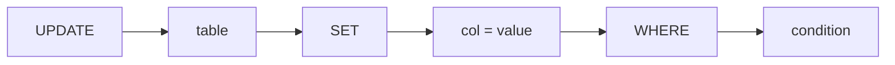
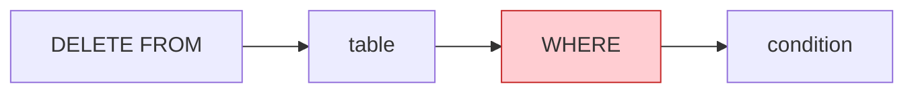
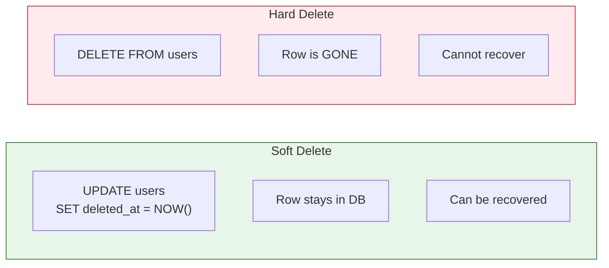
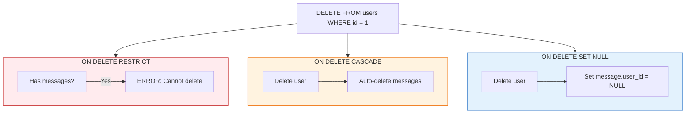

# Lesson 4.9: UPDATE & DELETE

> **Duration**: 25 min | **Section**: B - CRUD Operations

## 🎯 The Problem (3-5 min)

Data changes. Users update their profiles. Orders get cancelled. Accounts get deleted.

But changing data is **dangerous**. One wrong query can:
- Update EVERY row in the table
- Delete ALL your data
- Corrupt relationships

> **Scenario**: A user changes their email. You write `UPDATE users SET email = 'new@email.com'` and hit Enter. You forgot the `WHERE` clause. **Every user now has the same email.**

## 🧪 Try It: The Naive Approach (5-10 min)

Let's set up some test data:

```sql
CREATE TABLE users (
    id SERIAL PRIMARY KEY,
    name VARCHAR(100) NOT NULL,
    email VARCHAR(255) UNIQUE NOT NULL,
    is_active BOOLEAN DEFAULT TRUE
);

INSERT INTO users (name, email) VALUES 
    ('Alice', 'alice@example.com'),
    ('Bob', 'bob@example.com'),
    ('Carol', 'carol@example.com');
```

Now try to update Alice's email:

```sql
-- Oops! Forgot WHERE!
UPDATE users SET email = 'alice.new@example.com';

-- Check the damage
SELECT * FROM users;
```

| id | name | email | is_active |
|:--:|------|-------|:---------:|
| 1 | Alice | alice.new@example.com | true |
| 2 | Bob | alice.new@example.com | true |
| 3 | Carol | alice.new@example.com | true |

**ALL emails are now the same!** And because email is UNIQUE, this actually fails:
```
ERROR: duplicate key value violates unique constraint "users_email_key"
```

Thank goodness for constraints! But without UNIQUE, you'd have corrupted data.

## 🔍 Under the Hood (10-15 min)

### UPDATE Syntax



```sql
UPDATE table_name
SET column1 = value1, column2 = value2
WHERE condition;
```

### Safe UPDATE Pattern

```sql
-- ALWAYS include WHERE!
UPDATE users 
SET email = 'alice.new@example.com' 
WHERE id = 1;

-- Or by unique identifier
UPDATE users 
SET email = 'alice.new@example.com' 
WHERE email = 'alice@example.com';

-- Verify the change
UPDATE users 
SET email = 'alice.new@example.com' 
WHERE id = 1
RETURNING *;  -- Shows what was updated
```

### Multiple Column Updates

```sql
UPDATE users 
SET name = 'Alice Smith', 
    email = 'alice.smith@example.com',
    is_active = FALSE
WHERE id = 1
RETURNING *;
```

### Computed Updates

```sql
-- Increment a counter
UPDATE products SET stock = stock - 1 WHERE id = 42;

-- Update based on current value
UPDATE users SET login_count = login_count + 1 WHERE id = 1;

-- Update with expression
UPDATE products 
SET price = price * 1.1  -- 10% increase
WHERE category = 'electronics';
```

### UPDATE from Another Table

```sql
-- Update users based on data from another table
UPDATE users u
SET is_premium = TRUE
FROM subscriptions s
WHERE u.id = s.user_id 
  AND s.plan = 'premium'
  AND s.expires_at > NOW();
```

### DELETE Syntax



```sql
DELETE FROM table_name
WHERE condition;
```

### Safe DELETE Pattern

```sql
-- ALWAYS include WHERE!
DELETE FROM users WHERE id = 1;

-- Delete with confirmation
DELETE FROM users WHERE id = 1 RETURNING *;

-- Delete multiple rows
DELETE FROM messages 
WHERE created_at < '2023-01-01' 
RETURNING id, user_id;
```

### Delete vs Soft Delete

Many apps don't actually delete—they "soft delete":

```sql
-- Soft delete: mark as deleted
UPDATE users SET deleted_at = NOW() WHERE id = 1;

-- Hard delete: actually remove
DELETE FROM users WHERE id = 1;
```



## 💥 Where It Breaks (3-5 min)

### The Deadly Commands

```sql
-- ☠️ DANGER: Updates ALL rows
UPDATE users SET is_active = FALSE;

-- ☠️ DANGER: Deletes ALL rows
DELETE FROM users;

-- ☠️ DANGER: Drops the entire table
DROP TABLE users;

-- ☠️ DANGER: Deletes EVERYTHING faster
TRUNCATE TABLE users;
```

### Protection Strategies

**1. Always use transactions for risky operations:**
```sql
BEGIN;
DELETE FROM users WHERE id = 1;
-- Check the result before committing
SELECT * FROM users;
-- If it looks wrong:
ROLLBACK;
-- If it looks right:
COMMIT;
```

**2. Use RETURNING to see what you changed:**
```sql
DELETE FROM users WHERE is_active = FALSE RETURNING *;
```

**3. Count before delete:**
```sql
-- Check how many will be affected
SELECT COUNT(*) FROM users WHERE created_at < '2023-01-01';
-- If the number looks reasonable, then:
DELETE FROM users WHERE created_at < '2023-01-01';
```

**4. Foreign key constraints prevent orphans:**
```sql
-- If messages references users:
DELETE FROM users WHERE id = 1;
-- ERROR: violates foreign key constraint "messages_user_id_fkey"
-- Good! You can't delete a user with messages.

-- Unless you use CASCADE:
DELETE FROM users WHERE id = 1;  -- Also deletes their messages
```

## ✅ The Fix (10-15 min)

### UPDATE Best Practices

```sql
-- 1. Always use WHERE with primary key when updating one row
UPDATE users SET name = 'Alice' WHERE id = 1;

-- 2. Use RETURNING to verify
UPDATE users SET email = 'new@email.com' WHERE id = 1 RETURNING *;

-- 3. Use transactions for safety
BEGIN;
UPDATE users SET is_active = FALSE WHERE last_login < '2023-01-01';
SELECT COUNT(*) FROM users WHERE is_active = FALSE;  -- Check count
COMMIT;  -- or ROLLBACK if wrong

-- 4. Consider using UPDATE ... FROM for complex updates
UPDATE order_items oi
SET price = p.current_price
FROM products p
WHERE oi.product_id = p.id
  AND oi.order_id = 123;
```

### DELETE Best Practices

```sql
-- 1. Always use WHERE
DELETE FROM sessions WHERE expires_at < NOW();

-- 2. Count first
SELECT COUNT(*) FROM logs WHERE created_at < '2023-01-01';
DELETE FROM logs WHERE created_at < '2023-01-01';

-- 3. Use transactions
BEGIN;
DELETE FROM users WHERE id = 1;
-- Verify
SELECT * FROM users WHERE id = 1;  -- Should be empty
COMMIT;

-- 4. Consider soft delete for important data
UPDATE users SET deleted_at = NOW() WHERE id = 1;
```

### Cascading Deletes

When you delete a user, what happens to their messages?

```sql
-- Option 1: Block deletion (default)
CREATE TABLE messages (
    user_id INTEGER REFERENCES users(id)  -- RESTRICT is default
);

-- Option 2: Delete messages too
CREATE TABLE messages (
    user_id INTEGER REFERENCES users(id) ON DELETE CASCADE
);

-- Option 3: Set to NULL
CREATE TABLE messages (
    user_id INTEGER REFERENCES users(id) ON DELETE SET NULL
);
```



## 🎯 Practice

1. **Create a products table:**
```sql
CREATE TABLE products (
    id SERIAL PRIMARY KEY,
    name VARCHAR(100) NOT NULL,
    price NUMERIC(10,2) NOT NULL,
    stock INTEGER DEFAULT 0,
    is_available BOOLEAN DEFAULT TRUE
);

INSERT INTO products (name, price, stock) VALUES
    ('Widget', 9.99, 100),
    ('Gadget', 19.99, 50),
    ('Gizmo', 29.99, 0);
```

2. **Practice UPDATE:**
   - Increase Widget's price by 10%
   - Set stock to 0 for Gizmo
   - Mark products with stock = 0 as unavailable

3. **Practice DELETE:**
   - Delete the Gizmo product
   - Delete all unavailable products

4. **Use RETURNING** on all operations to verify

## 🔑 Key Takeaways

- `UPDATE table SET col = val WHERE condition` modifies rows
- `DELETE FROM table WHERE condition` removes rows
- **ALWAYS include WHERE** unless you really mean "all rows"
- Use `RETURNING` to verify what was changed
- Use transactions for safety—ROLLBACK if wrong
- Consider soft delete for important data
- Foreign key ON DELETE controls cascading behavior

## ❓ Common Questions

| Question | Answer |
|----------|--------|
| "How do I undo a DELETE?" | You can't (unless in a transaction). Use soft delete for recovery. |
| "Can I UPDATE a primary key?" | Yes, but usually a bad idea—foreign keys might break. |
| "DELETE vs TRUNCATE?" | DELETE is row-by-row (can use WHERE). TRUNCATE removes all rows instantly. |
| "How to delete duplicates?" | Use `DELETE ... WHERE id NOT IN (SELECT MIN(id) ... GROUP BY ...)` |

## 📚 Further Reading

- [PostgreSQL UPDATE](https://www.postgresql.org/docs/current/sql-update.html)
- [PostgreSQL DELETE](https://www.postgresql.org/docs/current/sql-delete.html)
- [Soft Delete Patterns](https://www.percona.com/blog/soft-delete-pattern/)

---

**Next Lesson**: [4.10 CRUD Q&A](./Lesson-04-10-CRUD-QA.md) - Common mistakes and recovery strategies
