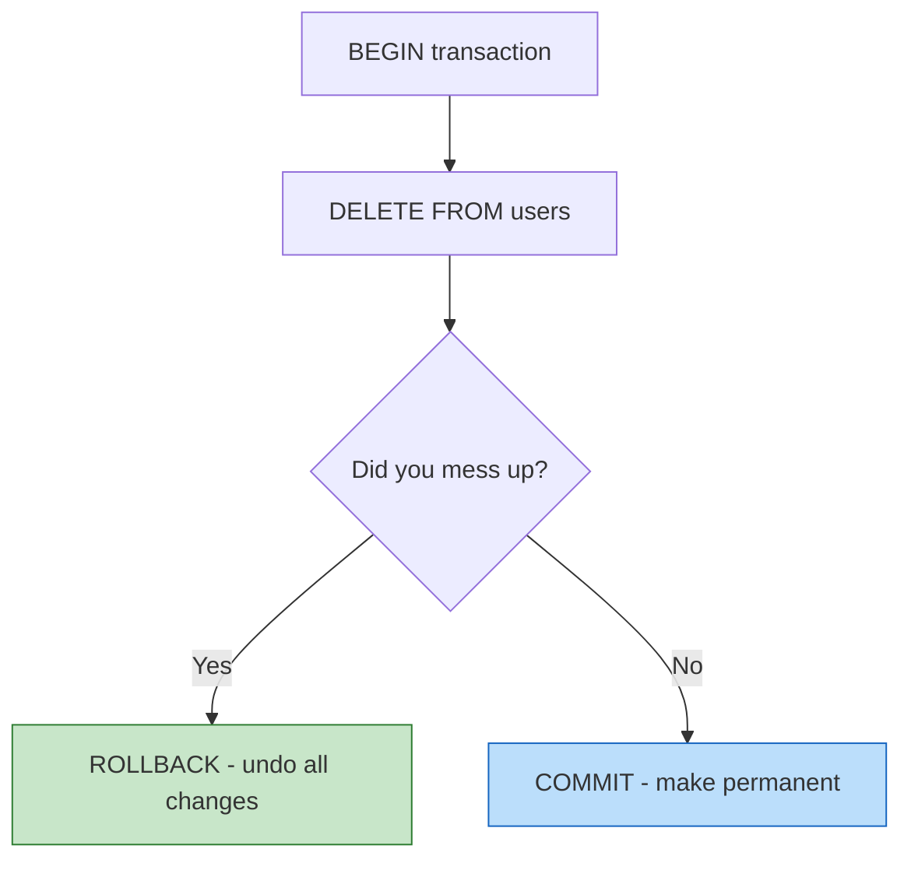
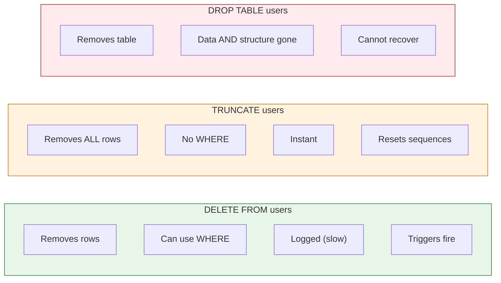
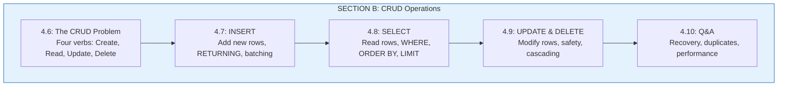

# Lesson 4.10: CRUD Q&A

> **Duration**: 10 min | **Section**: B - CRUD Operations

## 🎯 Section B Wrap-up

You've mastered the four fundamental database operations:
- **INSERT** - Create new rows
- **SELECT** - Read existing rows  
- **UPDATE** - Modify existing rows
- **DELETE** - Remove rows

Now let's address common questions and disaster scenarios.

## ❓ Common Questions

### Q1: "I deleted everything! How do I recover?"

**If you're NOT in a transaction:** The data is gone. This is why backups exist.

**If you ARE in a transaction:**
```sql
BEGIN;
DELETE FROM users;  -- Oops!
-- Don't panic yet!
ROLLBACK;  -- Undo everything since BEGIN
SELECT * FROM users;  -- Data is back!
```

**Prevention:**
```sql
-- Always start risky operations with BEGIN
BEGIN;
DELETE FROM users WHERE id = 1;
-- Check before committing
SELECT * FROM users WHERE id = 1;
-- If good: COMMIT
-- If bad: ROLLBACK
```



---

### Q2: "UPDATE without WHERE—am I screwed?"

**If caught immediately (still in transaction):**
```sql
ROLLBACK;  -- Phew!
```

**If already committed:**
1. **Restore from backup** (if you have one)
2. **Use RETURNING** next time to verify before committing:
```sql
BEGIN;
UPDATE users SET email = 'test@test.com' WHERE id = 1
RETURNING *;  -- Shows what would change
-- Check the output, then COMMIT or ROLLBACK
```

**Prevention—use a pattern:**
```sql
-- Step 1: SELECT to see what will be affected
SELECT * FROM users WHERE created_at < '2023-01-01';

-- Step 2: If count looks right, do the UPDATE
UPDATE users SET is_active = FALSE WHERE created_at < '2023-01-01';
```

---

### Q3: "What's the difference between DELETE, TRUNCATE, and DROP?"



| Command | What It Does | Use Case |
|---------|--------------|----------|
| `DELETE FROM users WHERE ...` | Remove specific rows | Normal deletion |
| `DELETE FROM users` | Remove all rows (slowly) | Rarely needed |
| `TRUNCATE users` | Remove all rows (instantly) | Clearing test data |
| `DROP TABLE users` | Remove table entirely | Removing unused tables |

---

### Q4: "How do I handle duplicate INSERTs?"

**Option 1: Let it fail (if duplicates shouldn't happen)**
```sql
-- If email is UNIQUE, this fails:
INSERT INTO users (email) VALUES ('alice@example.com');
-- ERROR: duplicate key value violates unique constraint
```

**Option 2: ON CONFLICT DO NOTHING (ignore duplicates)**
```sql
INSERT INTO users (email, name) VALUES ('alice@example.com', 'Alice')
ON CONFLICT (email) DO NOTHING;
-- No error, no insert
```

**Option 3: ON CONFLICT DO UPDATE (upsert)**
```sql
INSERT INTO users (email, name) VALUES ('alice@example.com', 'Alice New')
ON CONFLICT (email) DO UPDATE SET name = EXCLUDED.name;
-- Updates existing row
```

---

### Q5: "What's the fastest way to INSERT lots of data?"

```sql
-- ❌ Slow: Individual inserts
INSERT INTO users (name) VALUES ('Alice');
INSERT INTO users (name) VALUES ('Bob');
INSERT INTO users (name) VALUES ('Carol');

-- ✅ Faster: Multi-row insert
INSERT INTO users (name) VALUES 
    ('Alice'),
    ('Bob'),
    ('Carol');

-- ✅✅ Fastest: COPY command (for bulk data)
COPY users (name, email) FROM '/path/to/file.csv' CSV HEADER;
```

**In Python:**
```python
# ❌ Slow
for user in users:
    cursor.execute("INSERT INTO users (name) VALUES (%s)", (user,))

# ✅ Fast
from psycopg2.extras import execute_batch
execute_batch(cursor, "INSERT INTO users (name) VALUES (%s)", 
              [(u,) for u in users])

# ✅✅ Fastest
from psycopg2.extras import execute_values
execute_values(cursor, "INSERT INTO users (name) VALUES %s", 
               [(u,) for u in users])
```

---

### Q6: "How do I find and remove duplicate rows?"

```sql
-- Find duplicates
SELECT email, COUNT(*) 
FROM users 
GROUP BY email 
HAVING COUNT(*) > 1;

-- Delete duplicates (keep one)
DELETE FROM users a
USING users b
WHERE a.id > b.id 
  AND a.email = b.email;

-- Or with CTE (clearer)
WITH duplicates AS (
    SELECT id, ROW_NUMBER() OVER (PARTITION BY email ORDER BY id) as rn
    FROM users
)
DELETE FROM users 
WHERE id IN (SELECT id FROM duplicates WHERE rn > 1);
```

---

### Q7: "How do I UPDATE or DELETE with a JOIN?"

**UPDATE with JOIN:**
```sql
-- Update orders based on customer data
UPDATE orders o
SET discount = 0.1
FROM customers c
WHERE o.customer_id = c.id
  AND c.is_premium = TRUE;
```

**DELETE with JOIN:**
```sql
-- Delete orders for inactive customers
DELETE FROM orders o
USING customers c
WHERE o.customer_id = c.id
  AND c.is_active = FALSE;
```

---

## 🧠 Mental Model Check

Can you answer these without looking back?

| Question | Your Answer |
|----------|-------------|
| What SQL command adds new rows? | |
| What SQL command retrieves rows? | |
| What SQL command modifies existing rows? | |
| What SQL command removes rows? | |
| How do you undo a DELETE? | |
| What's the difference between DELETE and TRUNCATE? | |
| How do you handle duplicate inserts? | |

## � Common Pitfalls

| Pitfall | What Happens | Fix |
|---------|--------------|-----|
| `DELETE` without `WHERE` | Deletes ALL rows! | Always write WHERE first, then DELETE |
| `UPDATE` without `WHERE` | Updates ALL rows! | Use transactions: `BEGIN`, check, `COMMIT/ROLLBACK` |
| Not using `RETURNING` | Don't know what was affected | Add `RETURNING *` to see changed rows |
| Single-row INSERTs in loop | Slow (1000 queries for 1000 rows) | Use multi-row INSERT or `execute_values` |
| Trusting user input | SQL injection | Always use parameterized queries |

## 🔑 Key Takeaways

1. **CRUD = Create, Read, Update, Delete** - The four database verbs
2. **INSERT adds rows** - Use RETURNING to get generated IDs
3. **SELECT reads rows** - Filter with WHERE, sort with ORDER BY
4. **UPDATE modifies rows** - ALWAYS use WHERE clause
5. **DELETE removes rows** - Use transactions for safety
6. **ON CONFLICT handles duplicates** - Upsert pattern

## ✅ Section B Complete!

## �🔑 Section B Summary



**You now understand:**
- ✅ INSERT for creating data (with RETURNING)
- ✅ SELECT for reading data (with filtering and pagination)
- ✅ UPDATE for modifying data (safely!)
- ✅ DELETE for removing data (with backup plans)
- ✅ Transaction safety for risky operations

---

**Next Section**: [Section C: Queries](./Lesson-04-11-The-Query-Problem.md) - Advanced filtering, aggregations, and JOINs
