# Lesson 4.11: The Query Problem

> **Duration**: 5 min | **Section**: C - Queries

## 🎯 The Problem (3-5 min)

You know basic SELECT. But real questions are more complex:

- "How many messages did each user send?"
- "What's the average order value?"
- "Who are the top 10 customers by total spending?"
- "Which users signed up this month but haven't made a purchase?"

A simple `SELECT * FROM users` won't answer these.

> **Scenario**: Your boss asks, "What's our revenue per product category for last quarter?" You can't just SELECT all orders—you need to group, sum, filter by date, and combine data from multiple tables.

## 🧪 Try It: The Naive Approach (5-10 min)

```python
# The Python approach: load everything, then process
orders = cursor.fetchall()  # 1 million orders...

revenue_by_category = {}
for order in orders:
    if order['date'] >= last_quarter_start:
        category = get_product_category(order['product_id'])  # Another query!
        revenue_by_category[category] = revenue_by_category.get(category, 0) + order['total']
```

Problems:
- Loading 1 million rows into Python
- Extra query for each order to get category
- Slow, memory-hungry, inefficient

## 🔍 Under the Hood (10-15 min)

SQL can do all of this **in the database**:

```sql
SELECT 
    p.category,
    SUM(o.total) as revenue
FROM orders o
JOIN products p ON o.product_id = p.id
WHERE o.created_at >= '2024-01-01'
GROUP BY p.category
ORDER BY revenue DESC;
```



```mermaid
flowchart LR
    subgraph PYTHON["❌ Python Approach"]
        P1["Load 1M orders"]
        P2["Loop through each"]
        P3["Query category per order"]
        P4["Aggregate in memory"]
    end
    
    subgraph SQL["✅ SQL Approach"]
        S1["Database JOINs tables"]
        S2["Filters by date"]
        S3["Groups by category"]
        S4["Returns 10 rows"]
    end
    
    style PYTHON fill:#FFEBEE,stroke:#C62828
    style SQL fill:#E8F5E9,stroke:#2E7D32
```

The database:
- Already has indexes for fast lookups
- Can process data without network transfer
- Uses optimized algorithms for grouping/sorting

## 🔑 Key Takeaways

- Complex questions need **aggregations** (COUNT, SUM, AVG)
- Related data needs **JOINs** (combine tables)
- Let the database do the work—it's faster than Python
- Learn to think in sets, not loops

## 📚 What's Coming

| Lesson | Topic | You'll Learn |
|--------|-------|--------------|
| 4.12 | Filtering & Sorting | ORDER BY, LIMIT, LIKE, IN, BETWEEN |
| 4.13 | Aggregations | COUNT, SUM, AVG, GROUP BY, HAVING |
| 4.14 | JOINs | Combining tables, INNER vs LEFT |
| 4.15 | Q&A | Subqueries, performance, patterns |

---

**Next Lesson**: [4.12 Filtering & Sorting](./Lesson-04-12-Filtering-Sorting.md) - Advanced WHERE clauses and ordering
