# Lesson 4.12: Filtering & Sorting

> **Duration**: 30 min | **Section**: C - Queries

## 🎯 The Problem (3-5 min)

You need to find specific data in specific order:
- Products under $50, sorted by price
- Users whose email ends with "@gmail.com"
- The 10 most recent orders
- Messages from the last 7 days

> **Scenario**: Your e-commerce site needs to show "Electronics under $100, sorted by popularity, page 3 (20 per page)." That's filtering, sorting, and pagination all in one query.

## 🧪 Try It: The Naive Approach (5-10 min)

```sql
-- Get everything, then filter in Python?
SELECT * FROM products;
-- Then in Python:
-- [p for p in products if p['category'] == 'electronics' and p['price'] < 100]
```

This works for 100 products. But with 1 million? You're loading 999,900 rows you don't need.

## 🔍 Under the Hood (10-15 min)

### ORDER BY - Sorting Results

```sql
-- Ascending (A-Z, 1-9, oldest-newest) - default
SELECT * FROM products ORDER BY name;
SELECT * FROM products ORDER BY name ASC;  -- Explicit

-- Descending (Z-A, 9-1, newest-oldest)
SELECT * FROM products ORDER BY price DESC;

-- Multiple columns (sort by first, then second for ties)
SELECT * FROM products ORDER BY category, price DESC;

-- By expression
SELECT * FROM products ORDER BY price * quantity DESC;  -- Total value

-- NULLS handling
SELECT * FROM products ORDER BY release_date NULLS LAST;  -- NULLs at end
SELECT * FROM products ORDER BY release_date NULLS FIRST;  -- NULLs at start
```


### LIMIT and OFFSET - Pagination

```sql
-- First 10 results
SELECT * FROM products LIMIT 10;

-- Results 11-20 (skip first 10)
SELECT * FROM products LIMIT 10 OFFSET 10;

-- Page N (0-indexed): OFFSET = page * size
-- Page 0: OFFSET 0
-- Page 1: OFFSET 10
-- Page 2: OFFSET 20
SELECT * FROM products 
ORDER BY id  -- Always ORDER BY when paginating!
LIMIT 10 OFFSET 20;  -- Page 3
```


### Advanced WHERE Clauses

#### IN - Match any in a list

```sql
-- Instead of multiple ORs:
SELECT * FROM products WHERE category = 'electronics' OR category = 'computers' OR category = 'phones';

-- Use IN:
SELECT * FROM products WHERE category IN ('electronics', 'computers', 'phones');

-- NOT IN:
SELECT * FROM products WHERE category NOT IN ('discontinued', 'archived');

-- IN with subquery:
SELECT * FROM users WHERE id IN (
    SELECT user_id FROM orders WHERE total > 1000
);
```

#### BETWEEN - Range of values

```sql
-- Inclusive range
SELECT * FROM products WHERE price BETWEEN 10 AND 50;
-- Same as: WHERE price >= 10 AND price <= 50

-- Date ranges
SELECT * FROM orders WHERE created_at BETWEEN '2024-01-01' AND '2024-01-31';

-- Not between
SELECT * FROM products WHERE price NOT BETWEEN 10 AND 50;
```

#### LIKE and ILIKE - Pattern Matching

```sql
-- Wildcards: % = any characters, _ = single character

-- Starts with 'Pro'
SELECT * FROM products WHERE name LIKE 'Pro%';

-- Ends with 'phone'
SELECT * FROM products WHERE name LIKE '%phone';

-- Contains 'book'
SELECT * FROM products WHERE name LIKE '%book%';

-- Exactly 5 characters ending in 'phone'
SELECT * FROM products WHERE name LIKE '_phone';

-- Case-insensitive (PostgreSQL)
SELECT * FROM products WHERE name ILIKE '%PHONE%';
```

| Pattern | Matches | Doesn't Match |
|---------|---------|---------------|
| `'Pro%'` | Product, ProMax | pro, myPro |
| `'%phone'` | iPhone, smartphone | Phone, phones |
| `'%book%'` | ebook, notebook, bookstore | Book (exact match works) |
| `'_at'` | cat, bat, mat | at, that |
| `'Pro%' ILIKE` | Product, product, PRODUCT | myPro |

#### NULL Checks

```sql
-- NULL is special - can't use = or <>
SELECT * FROM users WHERE phone = NULL;  -- ❌ WRONG (always empty)
SELECT * FROM users WHERE phone IS NULL;  -- ✅ CORRECT

SELECT * FROM users WHERE phone IS NOT NULL;

-- COALESCE - default value for NULL
SELECT name, COALESCE(phone, 'No phone') as phone FROM users;
```

#### Combining Conditions

```sql
-- AND - both must be true
SELECT * FROM products WHERE category = 'electronics' AND price < 100;

-- OR - either can be true
SELECT * FROM products WHERE category = 'electronics' OR category = 'computers';

-- Parentheses for complex logic
SELECT * FROM products 
WHERE (category = 'electronics' OR category = 'computers')
  AND price < 100
  AND is_available = TRUE;

-- NOT - negation
SELECT * FROM products WHERE NOT is_archived;
```


## 💥 Where It Breaks (3-5 min)

### Performance Issues

```sql
-- ❌ Slow: Function on column prevents index use
SELECT * FROM users WHERE LOWER(email) = 'alice@example.com';

-- ✅ Fast: Use ILIKE instead
SELECT * FROM users WHERE email ILIKE 'alice@example.com';

-- ❌ Slow: Leading wildcard can't use index
SELECT * FROM products WHERE name LIKE '%phone';

-- ✅ Faster: Use full-text search for this
SELECT * FROM products WHERE to_tsvector('english', name) @@ to_tsquery('phone');

-- ❌ Slow: Large OFFSET
SELECT * FROM products ORDER BY id LIMIT 10 OFFSET 1000000;

-- ✅ Fast: Cursor-based pagination
SELECT * FROM products WHERE id > 1000000 ORDER BY id LIMIT 10;
```

## ✅ The Fix (10-15 min)

### Complete Filtering Example

```sql
-- E-commerce product search
SELECT 
    id,
    name,
    price,
    category,
    rating
FROM products
WHERE 
    -- Category filter
    category IN ('electronics', 'computers')
    -- Price range
    AND price BETWEEN 50 AND 500
    -- In stock
    AND stock > 0
    -- Search term
    AND name ILIKE '%laptop%'
    -- Quality filter
    AND rating >= 4.0
ORDER BY 
    rating DESC,    -- Best rated first
    price ASC       -- Then cheapest
LIMIT 20 OFFSET 0;  -- First page
```

### Cursor-Based Pagination (Better for Large Tables)

```sql
-- Instead of OFFSET (slow for large pages)
-- First page:
SELECT * FROM products ORDER BY id LIMIT 20;
-- Returns ids 1-20, last id is 20

-- Next page:
SELECT * FROM products WHERE id > 20 ORDER BY id LIMIT 20;
-- Returns ids 21-40, last id is 40

-- Next page:
SELECT * FROM products WHERE id > 40 ORDER BY id LIMIT 20;
```



```mermaid
flowchart LR
    subgraph OFFSET["❌ OFFSET Pagination"]
        O1["Page 1000: Skip 10,000 rows"]
        O2["SLOW as page increases"]
    end
    
    subgraph CURSOR["✅ Cursor Pagination"]
        C1["Page 1000: WHERE id > 10000"]
        C2["Same speed for any page"]
    end
    
    style OFFSET fill:#FFEBEE,stroke:#C62828
    style CURSOR fill:#C8E6C9,stroke:#2E7D32
```

## 🎯 Practice

Create a sample table:
```sql
CREATE TABLE products (
    id SERIAL PRIMARY KEY,
    name VARCHAR(100),
    category VARCHAR(50),
    price NUMERIC(10,2),
    stock INTEGER,
    rating NUMERIC(2,1),
    created_at TIMESTAMPTZ DEFAULT NOW()
);

INSERT INTO products (name, category, price, stock, rating) VALUES
    ('iPhone 15', 'phones', 999.99, 50, 4.8),
    ('Galaxy S24', 'phones', 899.99, 30, 4.6),
    ('MacBook Pro', 'computers', 1999.99, 20, 4.9),
    ('Dell XPS', 'computers', 1299.99, 15, 4.5),
    ('iPad Pro', 'tablets', 1099.99, 25, 4.7),
    ('AirPods Pro', 'audio', 249.99, 100, 4.4),
    ('Sony WH-1000', 'audio', 349.99, 40, 4.8),
    ('Nintendo Switch', 'gaming', 299.99, 60, 4.7);
```

Write queries for:
1. All products under $500, sorted by price ascending
2. All phones and tablets (use IN)
3. Products with rating between 4.5 and 5.0
4. Products whose name contains "Pro" (case-insensitive)
5. Top 3 highest-rated products
6. Products on page 2 (3 per page) sorted by name

## 🔑 Key Takeaways

- `ORDER BY` sorts results (ASC/DESC, multiple columns)
- `LIMIT` and `OFFSET` handle pagination
- `IN` matches any value in a list
- `BETWEEN` matches a range (inclusive)
- `LIKE`/`ILIKE` for pattern matching (`%` = any, `_` = single char)
- `IS NULL` / `IS NOT NULL` for null checks
- Combine with `AND`, `OR`, `NOT`, and parentheses

## ❓ Common Questions

| Question | Answer |
|----------|--------|
| "LIKE vs ILIKE?" | LIKE is case-sensitive, ILIKE is case-insensitive (PostgreSQL only) |
| "Why use cursor pagination?" | OFFSET gets slower as page number increases; cursor stays constant |
| "Can I ORDER BY multiple columns?" | Yes! `ORDER BY rating DESC, price ASC` |
| "How to check for empty string?" | `WHERE name = ''` (not IS NULL - that's different) |

## 📚 Further Reading

- [PostgreSQL Pattern Matching](https://www.postgresql.org/docs/current/functions-matching.html)
- [Pagination Best Practices](https://use-the-index-luke.com/sql/partial-results/fetch-next-page)
- [Full Text Search](https://www.postgresql.org/docs/current/textsearch.html)

---

**Next Lesson**: [4.13 Aggregations](./Lesson-04-13-Aggregations.md) - COUNT, SUM, AVG, GROUP BY, HAVING
