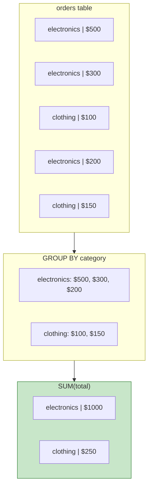
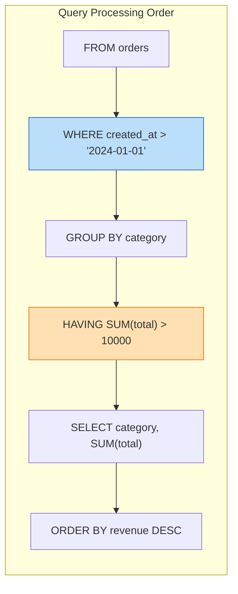

# Lesson 4.13: Aggregations

> **Duration**: 30 min | **Section**: C - Queries

## 🎯 The Problem (3-5 min)

You need answers that summarize data:
- "How many users do we have?"
- "What's the average order value?"
- "What's total revenue by month?"
- "Which product category sells the most?"

These aren't about individual rows—they're about **groups** of rows.

> **Scenario**: Your CFO asks, "What's our total revenue per product category, but only show categories with over $10,000 in sales?" You need to group, sum, and filter the groups.

## 🧪 Try It: The Naive Approach (5-10 min)

```python
# Python approach: load all orders, then calculate
orders = cursor.execute("SELECT * FROM orders").fetchall()

revenue_by_category = {}
for order in orders:
    category = order['category']
    revenue_by_category[category] = revenue_by_category.get(category, 0) + order['total']

# Filter to those over $10,000
result = {k: v for k, v in revenue_by_category.items() if v > 10000}
```

With 1 million orders:
- Load ALL orders into memory
- Loop through each one
- Slow and memory-intensive

## 🔍 Under the Hood (10-15 min)

### Aggregate Functions

SQL can summarize data directly:

```sql
-- Count all rows
SELECT COUNT(*) FROM users;

-- Count non-null values
SELECT COUNT(email) FROM users;  -- Excludes NULLs

-- Sum values
SELECT SUM(total) FROM orders;

-- Average
SELECT AVG(price) FROM products;

-- Min and Max
SELECT MIN(price), MAX(price) FROM products;

-- Combine them
SELECT 
    COUNT(*) as total_orders,
    SUM(total) as revenue,
    AVG(total) as avg_order,
    MIN(total) as smallest_order,
    MAX(total) as largest_order
FROM orders;
```

| Function | Purpose | Handles NULL |
|----------|---------|--------------|
| `COUNT(*)` | Count all rows | Counts all |
| `COUNT(col)` | Count non-null values | Skips NULL |
| `SUM(col)` | Total of values | Skips NULL |
| `AVG(col)` | Average of values | Skips NULL |
| `MIN(col)` | Smallest value | Skips NULL |
| `MAX(col)` | Largest value | Skips NULL |

### GROUP BY - Summarize by Category



```sql
-- Revenue per category
SELECT 
    category,
    SUM(total) as revenue
FROM orders
GROUP BY category;

-- Count per category
SELECT 
    category,
    COUNT(*) as order_count,
    SUM(total) as revenue,
    AVG(total) as avg_order
FROM orders
GROUP BY category;
```

| category | order_count | revenue | avg_order |
|----------|:-----------:|--------:|----------:|
| electronics | 3 | 1000.00 | 333.33 |
| clothing | 2 | 250.00 | 125.00 |

### GROUP BY Multiple Columns

```sql
-- Revenue per category per month
SELECT 
    category,
    DATE_TRUNC('month', created_at) as month,
    SUM(total) as revenue
FROM orders
GROUP BY category, DATE_TRUNC('month', created_at)
ORDER BY month, category;
```

| category | month | revenue |
|----------|-------|--------:|
| clothing | 2024-01-01 | 1500.00 |
| electronics | 2024-01-01 | 8500.00 |
| clothing | 2024-02-01 | 2200.00 |
| electronics | 2024-02-01 | 12000.00 |

### HAVING - Filter Groups

`WHERE` filters rows. `HAVING` filters groups.



```sql
-- Categories with over $10,000 in revenue
SELECT 
    category,
    SUM(total) as revenue
FROM orders
GROUP BY category
HAVING SUM(total) > 10000;

-- Categories with more than 100 orders
SELECT 
    category,
    COUNT(*) as order_count
FROM orders
GROUP BY category
HAVING COUNT(*) > 100;
```

### WHERE vs HAVING

| Clause | Filters | When |
|--------|---------|------|
| `WHERE` | Individual rows | Before grouping |
| `HAVING` | Groups | After grouping |

```sql
-- Find categories with over $10k revenue from 2024 orders only
SELECT 
    category,
    SUM(total) as revenue
FROM orders
WHERE created_at >= '2024-01-01'  -- Filter ROWS first
GROUP BY category
HAVING SUM(total) > 10000;        -- Filter GROUPS after
```

### Common Aggregation Patterns

#### Count with Conditions

```sql
-- Count active vs inactive users
SELECT 
    COUNT(*) FILTER (WHERE is_active = TRUE) as active_users,
    COUNT(*) FILTER (WHERE is_active = FALSE) as inactive_users
FROM users;

-- Or use CASE
SELECT 
    SUM(CASE WHEN is_active = TRUE THEN 1 ELSE 0 END) as active_users,
    SUM(CASE WHEN is_active = FALSE THEN 1 ELSE 0 END) as inactive_users
FROM users;
```

#### Running Totals (Window Functions Preview)

```sql
-- Running total of revenue
SELECT 
    created_at,
    total,
    SUM(total) OVER (ORDER BY created_at) as running_total
FROM orders;
```

| created_at | total | running_total |
|------------|------:|-------------:|
| 2024-01-01 | 100 | 100 |
| 2024-01-02 | 150 | 250 |
| 2024-01-03 | 200 | 450 |

## 💥 Where It Breaks (3-5 min)

### Common GROUP BY Errors

```sql
-- ❌ ERROR: column must be in GROUP BY or aggregate function
SELECT category, name, SUM(total)
FROM orders
GROUP BY category;
-- What "name" should it show? There are multiple!

-- ✅ Either add to GROUP BY:
SELECT category, name, SUM(total)
FROM orders
GROUP BY category, name;

-- ✅ Or aggregate it:
SELECT category, ARRAY_AGG(DISTINCT name), SUM(total)
FROM orders
GROUP BY category;
```

### NULL Handling

```sql
-- COUNT(*) counts all rows
-- COUNT(column) skips NULLs

SELECT COUNT(*) as total, COUNT(email) as with_email FROM users;
-- If 10 users, 2 without email: total=10, with_email=8

-- AVG skips NULLs, which might not be what you want
SELECT AVG(rating) FROM products;  -- Excludes unrated products

-- To treat NULL as 0:
SELECT AVG(COALESCE(rating, 0)) FROM products;
```

## ✅ The Fix (10-15 min)

### Complete Analytics Query

```sql
-- Monthly revenue report with multiple metrics
SELECT 
    DATE_TRUNC('month', created_at) as month,
    COUNT(*) as total_orders,
    COUNT(DISTINCT user_id) as unique_customers,
    SUM(total) as revenue,
    AVG(total) as avg_order_value,
    MAX(total) as largest_order,
    SUM(total) / COUNT(DISTINCT user_id) as revenue_per_customer
FROM orders
WHERE created_at >= '2024-01-01'
GROUP BY DATE_TRUNC('month', created_at)
HAVING SUM(total) > 1000
ORDER BY month DESC;
```

### Category Performance Dashboard

```sql
SELECT 
    p.category,
    COUNT(DISTINCT o.id) as total_orders,
    COUNT(DISTINCT o.user_id) as unique_buyers,
    SUM(o.quantity) as units_sold,
    SUM(o.total) as revenue,
    AVG(o.total) as avg_order_value,
    
    -- Percentage of total revenue
    ROUND(
        100.0 * SUM(o.total) / SUM(SUM(o.total)) OVER (), 
        2
    ) as revenue_percentage
FROM orders o
JOIN products p ON o.product_id = p.id
GROUP BY p.category
ORDER BY revenue DESC;
```

## 🎯 Practice

Create sample data:
```sql
CREATE TABLE orders (
    id SERIAL PRIMARY KEY,
    user_id INTEGER,
    category VARCHAR(50),
    total NUMERIC(10,2),
    created_at TIMESTAMPTZ DEFAULT NOW()
);

INSERT INTO orders (user_id, category, total, created_at) VALUES
    (1, 'electronics', 599.99, '2024-01-15'),
    (1, 'electronics', 299.99, '2024-01-20'),
    (2, 'clothing', 89.99, '2024-01-18'),
    (2, 'clothing', 129.99, '2024-02-01'),
    (3, 'electronics', 1299.99, '2024-02-10'),
    (3, 'books', 29.99, '2024-02-12'),
    (1, 'books', 49.99, '2024-02-15'),
    (4, 'clothing', 199.99, '2024-02-20'),
    (4, 'electronics', 899.99, '2024-03-01');
```

Write queries for:
1. Total number of orders
2. Total revenue across all orders
3. Average order value
4. Revenue per category
5. Number of unique customers
6. Categories with more than $500 in total revenue
7. Orders per month with total revenue
8. Category with the highest average order value

## 🔑 Key Takeaways

- **Aggregate functions** summarize many rows into one value
- `COUNT(*)` counts all rows; `COUNT(col)` counts non-null values
- `SUM`, `AVG`, `MIN`, `MAX` work on numeric columns
- `GROUP BY` creates groups to summarize
- `HAVING` filters groups (after aggregation)
- `WHERE` filters rows (before aggregation)
- All non-aggregated columns must be in GROUP BY

## ❓ Common Questions

| Question | Answer |
|----------|--------|
| "WHERE vs HAVING?" | WHERE filters rows before grouping; HAVING filters groups after |
| "Can I use alias in HAVING?" | No, repeat the expression: `HAVING SUM(total) > 1000` |
| "How to count distinct values?" | `COUNT(DISTINCT column)` |
| "What if GROUP BY column has NULL?" | NULL values form their own group |

## 📚 Further Reading

- [PostgreSQL Aggregate Functions](https://www.postgresql.org/docs/current/functions-aggregate.html)
- [GROUP BY and HAVING](https://www.postgresql.org/docs/current/queries-table-expressions.html#QUERIES-GROUP)
- [Window Functions](https://www.postgresql.org/docs/current/tutorial-window.html)

---

**Next Lesson**: [4.14 JOINs Under the Hood](./Lesson-04-14-JOINs-Under-The-Hood.md) - Combining tables together
