# Lesson 4.14: JOINs Under the Hood

> **Duration**: 35 min | **Section**: C - Queries

## 🎯 The Problem (3-5 min)

Your data is split across tables. Users in one table, orders in another. But you need combined information:

- "Show me all orders WITH the customer name"
- "Which products have never been ordered?"
- "List all conversations with participant names"

A single table can't answer these. You need to **join** tables.

> **Scenario**: You want to display an order history: "Order #123 by Alice for iPhone, $999." The order table has user_id and product_id—not names. How do you get the names?

## 🧪 Try It: The Naive Approach (5-10 min)

```python
# Python approach: multiple queries
orders = cursor.execute("SELECT * FROM orders").fetchall()

for order in orders:
    user = cursor.execute(f"SELECT name FROM users WHERE id = {order['user_id']}").fetchone()
    product = cursor.execute(f"SELECT name FROM products WHERE id = {order['product_id']}").fetchone()
    print(f"Order #{order['id']} by {user['name']} for {product['name']}")
```

With 1000 orders:
- 1 query for orders
- 1000 queries for users
- 1000 queries for products
- **2001 total queries!** (N+1 problem)

## 🔍 Under the Hood (10-15 min)

### The JOIN Concept

A JOIN combines rows from two tables based on a related column:


```sql
SELECT users.name, orders.total
FROM orders
JOIN users ON users.id = orders.user_id;
```

One query, all the data!

### JOIN Syntax

```sql
SELECT columns
FROM table1
JOIN table2 ON table1.column = table2.column;

-- With aliases (cleaner)
SELECT u.name, o.total
FROM orders o
JOIN users u ON u.id = o.user_id;
```

### Types of JOINs


#### Setup for Examples

```sql
-- users
-- | id | name   |
-- |----|--------|
-- | 1  | Alice  |
-- | 2  | Bob    |
-- | 3  | Carol  |  (no orders)

-- orders
-- | id | user_id | total |
-- |----|---------|-------|
-- | 1  | 1       | 100   |
-- | 2  | 1       | 200   |
-- | 3  | 2       | 150   |
-- | 4  | 99      | 50    |  (user doesn't exist!)
```

#### INNER JOIN (Default)

Only rows that match in BOTH tables:

```sql
SELECT u.name, o.total
FROM users u
INNER JOIN orders o ON u.id = o.user_id;
```

| name | total |
|------|------:|
| Alice | 100 |
| Alice | 200 |
| Bob | 150 |

- Carol excluded (no orders)
- Order #4 excluded (user 99 doesn't exist)

#### LEFT JOIN (LEFT OUTER JOIN)

All rows from LEFT table, matching rows from RIGHT (or NULL):

```sql
SELECT u.name, o.total
FROM users u
LEFT JOIN orders o ON u.id = o.user_id;
```

| name | total |
|------|------:|
| Alice | 100 |
| Alice | 200 |
| Bob | 150 |
| Carol | NULL |

- Carol included (with NULL for order)
- Order #4 still excluded (we're keeping all users, not all orders)

#### RIGHT JOIN (RIGHT OUTER JOIN)

All rows from RIGHT table, matching rows from LEFT (or NULL):

```sql
SELECT u.name, o.total
FROM users u
RIGHT JOIN orders o ON u.id = o.user_id;
```

| name | total |
|------|------:|
| Alice | 100 |
| Alice | 200 |
| Bob | 150 |
| NULL | 50 |

- Carol excluded (no matching order)
- Order #4 included (with NULL for user)

#### FULL OUTER JOIN

All rows from BOTH tables:

```sql
SELECT u.name, o.total
FROM users u
FULL OUTER JOIN orders o ON u.id = o.user_id;
```

| name | total |
|------|------:|
| Alice | 100 |
| Alice | 200 |
| Bob | 150 |
| Carol | NULL |
| NULL | 50 |

### Visual Comparison

```mermaid
flowchart LR
    subgraph INNER["INNER JOIN"]
        I["A ∩ B"]
    end
    
    subgraph LEFT["LEFT JOIN"]
        L["All A + matching B"]
    end
    
    subgraph RIGHT["RIGHT JOIN"]
        R["All B + matching A"]
    end
    
    subgraph FULL["FULL JOIN"]
        F["All A + All B"]
    end
```



### Multiple JOINs

```sql
-- Orders with user AND product names
SELECT 
    o.id as order_id,
    u.name as customer,
    p.name as product,
    o.quantity,
    o.total
FROM orders o
JOIN users u ON u.id = o.user_id
JOIN products p ON p.id = o.product_id;
```


### Self JOIN

A table joined to itself:

```sql
-- Employees with their managers
SELECT 
    e.name as employee,
    m.name as manager
FROM employees e
LEFT JOIN employees m ON e.manager_id = m.id;
```

| employee | manager |
|----------|---------|
| Alice | NULL |
| Bob | Alice |
| Carol | Alice |
| David | Bob |

## 💥 Where It Breaks (3-5 min)

### Cartesian Product (Accidental)

```sql
-- ❌ WRONG: Missing ON clause = every row paired with every row!
SELECT * FROM users, orders;
-- 3 users × 4 orders = 12 rows!

-- ✅ CORRECT: Specify the relationship
SELECT * FROM users u JOIN orders o ON u.id = o.user_id;
```

### Ambiguous Columns

```sql
-- ❌ ERROR: "id" exists in both tables
SELECT id, name, total
FROM users u JOIN orders o ON u.id = o.user_id;

-- ✅ CORRECT: Prefix with table alias
SELECT u.id as user_id, u.name, o.id as order_id, o.total
FROM users u JOIN orders o ON u.id = o.user_id;
```

### Performance on Large Tables

JOINs on unindexed columns are slow:

```sql
-- Make sure foreign key columns are indexed
CREATE INDEX idx_orders_user_id ON orders(user_id);
CREATE INDEX idx_orders_product_id ON orders(product_id);
```

## ✅ The Fix (10-15 min)

### Common JOIN Patterns

#### Get Related Data

```sql
-- Orders with customer info
SELECT o.*, u.name, u.email
FROM orders o
JOIN users u ON u.id = o.user_id
WHERE o.created_at > NOW() - INTERVAL '30 days';
```

#### Find Missing Relationships

```sql
-- Users who have never ordered (LEFT JOIN + IS NULL)
SELECT u.id, u.name, u.email
FROM users u
LEFT JOIN orders o ON u.id = o.user_id
WHERE o.id IS NULL;

-- Products never ordered
SELECT p.id, p.name
FROM products p
LEFT JOIN order_items oi ON p.id = oi.product_id
WHERE oi.id IS NULL;
```

#### Aggregate with JOIN

```sql
-- Total spent per customer
SELECT 
    u.name,
    COUNT(o.id) as order_count,
    COALESCE(SUM(o.total), 0) as total_spent
FROM users u
LEFT JOIN orders o ON u.id = o.user_id
GROUP BY u.id, u.name
ORDER BY total_spent DESC;
```

#### Multiple Tables

```sql
-- Complete order details
SELECT 
    o.id as order_id,
    u.name as customer,
    u.email,
    p.name as product,
    p.category,
    oi.quantity,
    oi.price,
    o.created_at
FROM orders o
JOIN users u ON u.id = o.user_id
JOIN order_items oi ON oi.order_id = o.id
JOIN products p ON p.id = oi.product_id
WHERE o.created_at > '2024-01-01'
ORDER BY o.created_at DESC;
```

### JOIN Decision Tree


## 🎯 Practice

Create sample data:
```sql
CREATE TABLE users (
    id SERIAL PRIMARY KEY,
    name VARCHAR(100)
);

CREATE TABLE orders (
    id SERIAL PRIMARY KEY,
    user_id INTEGER REFERENCES users(id),
    total NUMERIC(10,2),
    created_at TIMESTAMPTZ DEFAULT NOW()
);

INSERT INTO users (name) VALUES ('Alice'), ('Bob'), ('Carol');
INSERT INTO orders (user_id, total) VALUES 
    (1, 100), (1, 200), (2, 150);
```

Write queries for:
1. All orders with customer names (INNER JOIN)
2. All users with their orders (LEFT JOIN, including users with no orders)
3. Total amount spent per user (JOIN + GROUP BY)
4. Users who have never placed an order
5. Average order value per user

## 🔑 Key Takeaways

- `JOIN` combines rows from multiple tables
- `INNER JOIN` returns only matching rows
- `LEFT JOIN` returns all left rows + matching right (or NULL)
- Always specify the JOIN condition with `ON`
- Use table aliases for cleaner queries
- Index foreign key columns for performance
- Use LEFT JOIN + IS NULL to find missing relationships

## ❓ Common Questions

| Question | Answer |
|----------|--------|
| "JOIN vs INNER JOIN?" | Same thing—INNER is the default |
| "When to use LEFT vs INNER?" | LEFT when you want all left rows even without matches |
| "Can I join 10 tables?" | Yes, but performance suffers—consider restructuring |
| "Does join order matter?" | For INNER, no. For LEFT/RIGHT, yes—the "left" table is the one you write first |

## 📚 Further Reading

- [PostgreSQL JOIN Syntax](https://www.postgresql.org/docs/current/queries-table-expressions.html#QUERIES-FROM)
- [Visual Explanation of JOINs](https://blog.codinghorror.com/a-visual-explanation-of-sql-joins/)
- [JOIN Performance](https://use-the-index-luke.com/sql/join)

---

**Next Lesson**: [4.15 Query Q&A](./Lesson-04-15-Query-QA.md) - Subqueries, CTEs, and performance tips
