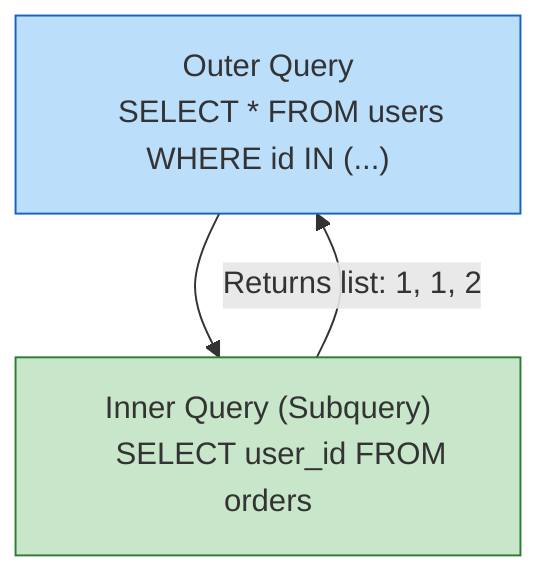
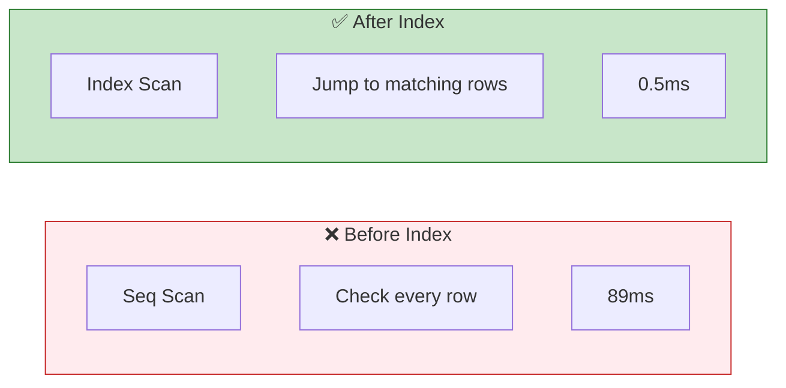
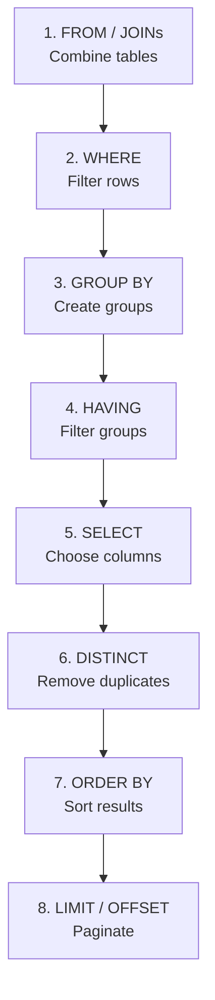
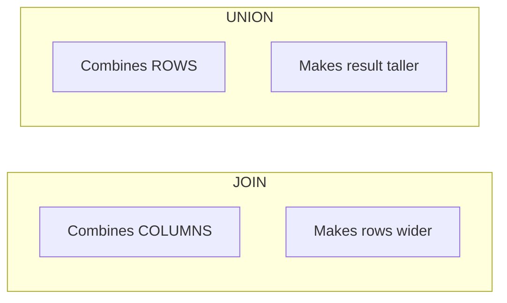
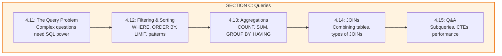

# Lesson 4.15: Query Q&A

> **Duration**: 10 min | **Section**: C - Queries

## 🎯 Section C Wrap-up

You've learned to ask sophisticated questions:
- Filtering and sorting with advanced WHERE clauses
- Aggregations with GROUP BY and HAVING
- Combining tables with JOINs

Now let's cover advanced patterns and common questions.

## ❓ Common Questions

### Q1: "What's a subquery?"

A subquery is a SELECT inside another SELECT:

```sql
-- Find users who have placed orders
SELECT * FROM users
WHERE id IN (
    SELECT user_id FROM orders
);

-- Find users with above-average spending
SELECT * FROM users u
WHERE (
    SELECT SUM(total) FROM orders WHERE user_id = u.id
) > (
    SELECT AVG(total_per_user) FROM (
        SELECT SUM(total) as total_per_user 
        FROM orders 
        GROUP BY user_id
    ) x
);
```



---

### Q2: "What's a CTE (Common Table Expression)?"

A CTE is a named subquery that makes complex queries readable:

```sql
-- Without CTE (hard to read)
SELECT * FROM (
    SELECT user_id, SUM(total) as total_spent
    FROM orders
    GROUP BY user_id
) user_totals
WHERE total_spent > 1000;

-- With CTE (much cleaner!)
WITH user_totals AS (
    SELECT user_id, SUM(total) as total_spent
    FROM orders
    GROUP BY user_id
)
SELECT * FROM user_totals WHERE total_spent > 1000;
```

**Multiple CTEs:**
```sql
WITH 
active_users AS (
    SELECT id, name FROM users WHERE is_active = TRUE
),
user_orders AS (
    SELECT user_id, COUNT(*) as order_count
    FROM orders
    GROUP BY user_id
)
SELECT 
    u.name, 
    COALESCE(o.order_count, 0) as orders
FROM active_users u
LEFT JOIN user_orders o ON u.id = o.user_id;
```

---

### Q3: "How do I optimize slow queries?"

**Step 1: Use EXPLAIN ANALYZE**
```sql
EXPLAIN ANALYZE
SELECT * FROM orders WHERE user_id = 123;
```

```
Seq Scan on orders  (cost=0.00..1234.00 rows=100 width=32) (actual time=45.123..89.456 rows=100 loops=1)
  Filter: (user_id = 123)
  Rows Removed by Filter: 9900
```

`Seq Scan` = reading every row (slow). We need an index!

**Step 2: Add appropriate indexes**
```sql
CREATE INDEX idx_orders_user_id ON orders(user_id);
```

**Step 3: Re-check with EXPLAIN ANALYZE**
```
Index Scan using idx_orders_user_id on orders  (cost=0.00..8.27 rows=100 width=32) (actual time=0.123..0.456 rows=100 loops=1)
  Index Cond: (user_id = 123)
```

Much faster!



---

### Q4: "What's the order of SQL operations?"



This is why:
- `WHERE` can't use column aliases (SELECT hasn't run yet)
- `HAVING` can only reference aggregated columns
- `ORDER BY` CAN use column aliases

---

### Q5: "Subquery vs JOIN - which is faster?"

Usually they're equivalent, but:

```sql
-- Subquery (IN)
SELECT * FROM users
WHERE id IN (SELECT user_id FROM orders WHERE total > 100);

-- JOIN (often optimized the same way)
SELECT DISTINCT u.*
FROM users u
JOIN orders o ON u.id = o.user_id
WHERE o.total > 100;

-- EXISTS (often fastest for "does it exist?")
SELECT * FROM users u
WHERE EXISTS (
    SELECT 1 FROM orders o 
    WHERE o.user_id = u.id AND o.total > 100
);
```

**Rule of thumb:**
- `EXISTS` for "does any match exist?" (stops at first match)
- `JOIN` when you need data from both tables
- `IN` for small lists (readable, but can be slow with big subqueries)

---

### Q6: "How do I handle NULL in aggregations?"

```sql
-- COUNT(*) counts all rows
-- COUNT(column) counts non-null values
SELECT 
    COUNT(*) as total_rows,
    COUNT(phone) as with_phone,
    COUNT(*) - COUNT(phone) as without_phone
FROM users;

-- COALESCE to treat NULL as zero
SELECT 
    product_id,
    COALESCE(SUM(quantity), 0) as total_sold
FROM order_items
GROUP BY product_id;

-- NULLIF to avoid division by zero
SELECT 
    category,
    SUM(revenue) / NULLIF(COUNT(*), 0) as avg_revenue
FROM products
GROUP BY category;
```

---

### Q7: "What's the difference between UNION and JOIN?"



```sql
-- JOIN: Combine columns (horizontal)
SELECT u.name, o.total
FROM users u
JOIN orders o ON u.id = o.user_id;
-- Result: | name | total |

-- UNION: Combine rows (vertical)
SELECT name, email FROM customers
UNION
SELECT name, email FROM suppliers;
-- Result: All rows from both (duplicates removed)

-- UNION ALL: Keep duplicates
SELECT name FROM customers
UNION ALL
SELECT name FROM suppliers;
```

---

## 🧠 Mental Model Check

Can you answer these without looking back?

| Question | Your Answer |
|----------|-------------|
| What does INNER JOIN return? | |
| What does LEFT JOIN return? | |
| What does GROUP BY do? | |
| Difference between WHERE and HAVING? | |
| What's a CTE? | |
| How to find slow queries? | |

## � Common Pitfalls

| Pitfall | What Happens | Fix |
|---------|--------------|-----|
| `SELECT *` in production | Returns unneeded columns, slow | Select only needed columns |
| Missing index on JOIN column | Full table scan, very slow | `CREATE INDEX idx_orders_user_id ON orders(user_id)` |
| GROUP BY without understanding | Wrong aggregation results | GROUP BY all non-aggregated columns |
| WHERE on wrong side of LEFT JOIN | Converts to INNER JOIN behavior | Put filter in ON clause or use subquery |
| N+1 query problem | 1000 users = 1001 queries | Use JOINs to fetch related data |

## 🔑 Key Takeaways

1. **JOINs combine tables** - One query instead of N+1
2. **INNER JOIN = matching only** - Rows must exist in both tables
3. **LEFT JOIN = all left + matching right** - NULLs for missing
4. **GROUP BY creates buckets** - For aggregations (COUNT, SUM, AVG)
5. **HAVING filters groups** - WHERE filters rows, HAVING filters aggregates
6. **CTEs improve readability** - `WITH name AS (...)` for complex queries

## ✅ Section C Complete!

## �🔑 Section C Summary



**You now understand:**
- ✅ Advanced filtering and sorting
- ✅ Aggregations with GROUP BY
- ✅ All types of JOINs
- ✅ Subqueries and CTEs
- ✅ Query optimization basics

---

**Next Section**: [Section D: Python + PostgreSQL](./Lesson-04-16-The-Connection-Problem.md) - Connecting Python to your database
