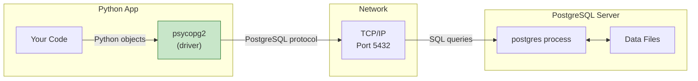

# Lesson 4.16: The Connection Problem

> **Duration**: 5 min | **Section**: D - Python + PostgreSQL

## 🎯 The Problem (3-5 min)

You've mastered SQL in psql. But your app is written in Python.

How does Python talk to PostgreSQL? They're completely different things:
- PostgreSQL is a server (written in C)
- Python is your app (different process, maybe different machine)

> **Scenario**: You're building a web app. User clicks "Sign Up." Your Python code receives the form data. Now you need to INSERT into PostgreSQL. How does that actually work?

## 🧪 Try It: The Naive Approach (5-10 min)

```python
# Can't just import postgresql...
import postgresql  # ModuleNotFoundError!

# Can't call SQL directly...
result = SELECT * FROM users;  # SyntaxError!

# Maybe subprocess?
import subprocess
result = subprocess.run(['psql', '-c', 'SELECT * FROM users'], capture_output=True)
# Works but... parsing text output? Yikes.
```

## 🔍 Under the Hood (10-15 min)

Python needs a **database driver**—a library that:
1. Opens a network connection to PostgreSQL
2. Sends SQL queries over that connection
3. Parses the results back into Python objects



### Popular Python PostgreSQL Libraries

| Library | Type | Best For |
|---------|------|----------|
| **psycopg2** | Low-level driver | Direct SQL control |
| **psycopg3** | Low-level driver | Modern async support |
| **SQLAlchemy** | ORM | Object-oriented apps |
| **asyncpg** | Async driver | High-performance async |

We'll learn:
- **psycopg2** (this lesson) - understand the fundamentals
- **SQLAlchemy** (next lesson) - for real applications

## 🔑 Key Takeaways

- Python needs a **driver** to talk to PostgreSQL
- The driver handles network communication and data conversion
- **psycopg2** is the most popular low-level driver
- **SQLAlchemy** builds on drivers to provide ORM features

---

**Next Lesson**: [4.17 psycopg2 Under the Hood](./Lesson-04-17-psycopg2-Under-The-Hood.md) - Connection, cursor, execute, fetch
