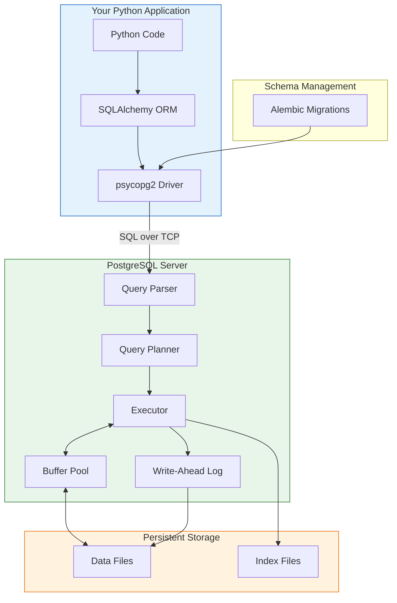

# Lesson 4.21: Module 4 Review

> **Duration**: 15 min | **Section**: Module Review

## 🎯 Module 4 Complete!

You've mastered PostgreSQL—from understanding why databases exist to integrating them with Python applications.

## 🧠 The Complete Mental Model



## 📚 What You Learned

### Section A: What IS a Database?

| Lesson | Key Concept |
|--------|-------------|
| 4.0 | **Persistence Problem** - Variables die; databases survive |
| 4.1 | **ACID Guarantees** - Atomicity, Consistency, Isolation, Durability |
| 4.2 | **Relational Model** - Tables, foreign keys, normalization |
| 4.3 | **PostgreSQL Setup** - Server, client, connection strings |
| 4.4 | **Creating Tables** - Data types, constraints, relationships |
| 4.5 | **Q&A** - Primary keys, NULL, schemas, indexes |

### Section B: CRUD Operations

| Lesson | Key Concept |
|--------|-------------|
| 4.6 | **CRUD** - Create, Read, Update, Delete |
| 4.7 | **INSERT** - Adding data, RETURNING, ON CONFLICT |
| 4.8 | **SELECT** - Filtering, sorting, pagination |
| 4.9 | **UPDATE/DELETE** - Safe modifications, transactions |
| 4.10 | **Q&A** - Recovery, duplicates, performance |

### Section C: Queries

| Lesson | Key Concept |
|--------|-------------|
| 4.11 | **Query Problem** - Complex questions need SQL power |
| 4.12 | **Filtering** - WHERE, LIKE, IN, BETWEEN |
| 4.13 | **Aggregations** - COUNT, SUM, GROUP BY, HAVING |
| 4.14 | **JOINs** - Combining tables, INNER vs LEFT |
| 4.15 | **Q&A** - Subqueries, CTEs, optimization |

### Section D: Python + PostgreSQL

| Lesson | Key Concept |
|--------|-------------|
| 4.16 | **Connection Problem** - Python needs a driver |
| 4.17 | **psycopg2** - Parameterized queries, cursors |
| 4.18 | **SQLAlchemy ORM** - Objects ↔ tables, relationships |
| 4.19 | **Migrations** - Schema version control with Alembic |
| 4.20 | **Q&A** - ORM vs SQL, patterns, debugging |

## ✅ Independence Check

Can you do these WITHOUT looking anything up?

### Know (Definitions)

| Question | ✓ |
|----------|---|
| What is a relational database? | |
| What are the four ACID properties? | |
| What's the difference between PRIMARY KEY and FOREIGN KEY? | |
| What does SERIAL mean in PostgreSQL? | |
| What's the difference between VARCHAR and TEXT? | |

### Understand (Concepts)

| Question | ✓ |
|----------|---|
| Why use a database instead of JSON files? | |
| Why do we normalize data (avoid duplication)? | |
| What's the N+1 query problem and how to solve it? | |
| Why use parameterized queries? | |
| When would you use ORM vs raw SQL? | |

### Apply (Skills)

| Task | ✓ |
|------|---|
| Design a schema for a new application | |
| Write JOIN queries to combine tables | |
| Create indexes for common queries | |
| Use SQLAlchemy to perform CRUD | |
| Write and run Alembic migrations | |

### Analyze (Debugging)

| Question | ✓ |
|----------|---|
| How would you debug a slow query? | |
| What causes "connection refused" errors? | |
| Why might a migration fail? | |
| How to recover from accidental DELETE? | |

### Create (Projects)

| Task | ✓ |
|------|---|
| Build a complete CRUD API with database | |
| Design and implement a chat schema | |
| Set up proper connection pooling | |
| Implement cursor-based pagination | |

## 🎯 Module Project

**Design and implement a chat database:**

```sql
-- Users who can send messages
CREATE TABLE users (
    id SERIAL PRIMARY KEY,
    username VARCHAR(50) UNIQUE NOT NULL,
    email VARCHAR(255) UNIQUE NOT NULL,
    created_at TIMESTAMPTZ DEFAULT NOW()
);

-- Conversations (can have multiple participants)
CREATE TABLE conversations (
    id SERIAL PRIMARY KEY,
    title VARCHAR(255),
    created_at TIMESTAMPTZ DEFAULT NOW()
);

-- Many-to-many: users in conversations
CREATE TABLE conversation_members (
    conversation_id INTEGER REFERENCES conversations(id) ON DELETE CASCADE,
    user_id INTEGER REFERENCES users(id) ON DELETE CASCADE,
    joined_at TIMESTAMPTZ DEFAULT NOW(),
    PRIMARY KEY (conversation_id, user_id)
);

-- Messages in conversations
CREATE TABLE messages (
    id SERIAL PRIMARY KEY,
    conversation_id INTEGER REFERENCES conversations(id) ON DELETE CASCADE,
    user_id INTEGER REFERENCES users(id) ON DELETE SET NULL,
    content TEXT NOT NULL,
    created_at TIMESTAMPTZ DEFAULT NOW()
);

-- Indexes for common queries
CREATE INDEX idx_messages_conversation ON messages(conversation_id, created_at DESC);
CREATE INDEX idx_conversation_members_user ON conversation_members(user_id);
```

**Write these queries:**
1. Get the last 20 messages in a conversation with sender names
2. Get all conversations for a user with the most recent message
3. Count messages per user per day
4. Find users who haven't sent a message in 30 days

## 🔗 Quick Reference

### Essential Commands

```bash
# psql
psql -U postgres -h localhost -d mydb
\l          # List databases
\dt         # List tables
\d table    # Describe table
\q          # Quit

# Alembic
alembic init alembic
alembic revision --autogenerate -m "message"
alembic upgrade head
alembic downgrade -1
alembic history
```

### Essential SQL

```sql
-- Create
INSERT INTO users (name, email) VALUES ('Alice', 'a@b.com') RETURNING *;

-- Read
SELECT * FROM users WHERE is_active = TRUE ORDER BY created_at DESC LIMIT 10;

-- Update
UPDATE users SET name = 'Bob' WHERE id = 1;

-- Delete
DELETE FROM users WHERE id = 1;

-- Join
SELECT u.name, COUNT(m.id)
FROM users u
LEFT JOIN messages m ON u.id = m.user_id
GROUP BY u.id
HAVING COUNT(m.id) > 10;
```

### Essential Python

```python
# psycopg2
conn = psycopg2.connect("postgresql://...")
cursor = conn.cursor(cursor_factory=RealDictCursor)
cursor.execute("SELECT * FROM users WHERE id = %s", (user_id,))
user = cursor.fetchone()
conn.commit()

# SQLAlchemy
session.add(User(name="Alice"))
session.commit()
user = session.query(User).filter(User.id == 1).first()
```

## 🔗 Next Module

You now have persistent storage mastered. But how do you:
- Run your app anywhere consistently?
- Deploy to production?
- Manage dependencies?

→ [Module 5: Docker](../Module-05-Docker/) - Containers for consistent deployment

## 🔗 References

- [PostgreSQL Documentation](https://www.postgresql.org/docs/)
- [SQLAlchemy Documentation](https://docs.sqlalchemy.org/)
- [Alembic Documentation](https://alembic.sqlalchemy.org/)
- [psycopg2 Documentation](https://www.psycopg.org/docs/)
- [Use The Index, Luke](https://use-the-index-luke.com/)
