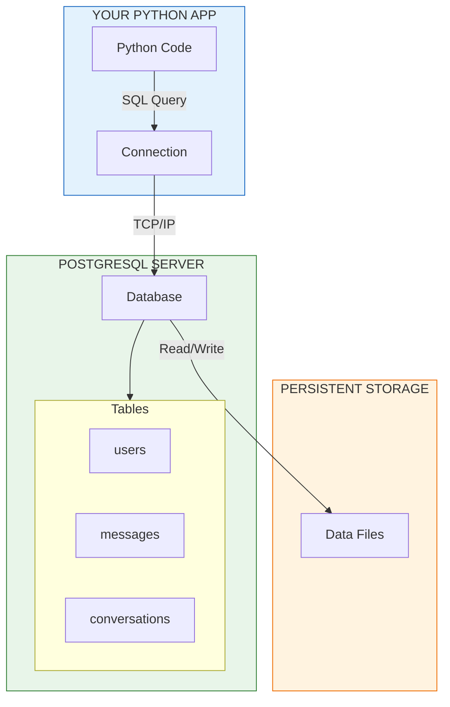

# Module 4: PostgreSQL

> **Duration**: 1 Week | **Lessons**: 22

## 🎯 Module Overview

Your Python variables vanish when your program ends. Your lists, dictionaries, user data—gone. PostgreSQL is how you make data **survive**: restarts, crashes, and thousands of simultaneous users. This module teaches you to think in tables, relationships, and queries—the foundation of every real application.

## 🧠 Mental Model

> **Key Insight**: PostgreSQL is a **server** running separately from your code. Your Python connects to it over the network, sends SQL queries, and gets results back. The data lives on disk—it survives everything.

## 📋 Prerequisites

- Module 1: Linux & Terminal (command line basics)
- Module 3: Python Core (dictionaries, classes, file I/O)
- Basic understanding of data structures

## 🗂️ Module Structure

| Section | Lessons | Focus |
|---------|:-------:|-------|
| A: What IS a Database? | 4.0 - 4.5 | The persistence problem, relational model, setup |
| B: CRUD Operations | 4.6 - 4.10 | INSERT, SELECT, UPDATE, DELETE |
| C: Queries | 4.11 - 4.15 | Filtering, aggregations, JOINs |
| D: Python + PostgreSQL | 4.16 - 4.21 | psycopg2, SQLAlchemy, migrations |

## 📚 Lessons

### Section A: What IS a Database?

| # | Lesson | Duration | What We're Solving |
|:-:|--------|:--------:|-------------------|
| 4.0 | The Persistence Problem | 10 min | Your data disappears when the program ends |
| 4.1 | Databases Under the Hood | 25 min | How data survives on disk with ACID guarantees |
| 4.2 | The Relational Model | 25 min | Tables, rows, columns, and relationships |
| 4.3 | PostgreSQL Setup | 20 min | Installing and connecting with psql |
| 4.4 | Creating Tables | 30 min | CREATE TABLE, data types, constraints |
| 4.5 | Database Basics Q&A | 10 min | Primary keys, NULL, schemas explained |

### Section B: CRUD Operations (The Four Verbs)

| # | Lesson | Duration | What We're Solving |
|:-:|--------|:--------:|-------------------|
| 4.6 | The CRUD Problem | 5 min | Every app needs Create, Read, Update, Delete |
| 4.7 | INSERT: Creating Data | 25 min | Adding rows to tables |
| 4.8 | SELECT: Reading Data | 30 min | Retrieving and filtering data |
| 4.9 | UPDATE & DELETE | 25 min | Modifying and removing data (carefully!) |
| 4.10 | CRUD Q&A | 10 min | Common mistakes and recovery |

### Section C: Queries (Asking Questions)

| # | Lesson | Duration | What We're Solving |
|:-:|--------|:--------:|-------------------|
| 4.11 | The Query Problem | 5 min | Complex questions need complex queries |
| 4.12 | Filtering & Sorting | 30 min | ORDER BY, LIMIT, LIKE, IN, BETWEEN |
| 4.13 | Aggregations | 30 min | COUNT, SUM, AVG, GROUP BY, HAVING |
| 4.14 | JOINs Under the Hood | 35 min | Connecting tables together |
| 4.15 | Query Q&A | 10 min | Subqueries, multiple joins, performance |

### Section D: Python + PostgreSQL

| # | Lesson | Duration | What We're Solving |
|:-:|--------|:--------:|-------------------|
| 4.16 | The Connection Problem | 5 min | Python needs to talk to the database |
| 4.17 | psycopg2 Under the Hood | 30 min | Connection, cursor, execute, fetch |
| 4.18 | SQLAlchemy ORM | 40 min | Python classes ↔ database tables |
| 4.19 | Migrations | 30 min | Schema changes over time with Alembic |
| 4.20 | PostgreSQL Q&A | 10 min | ORM vs raw SQL, connection pooling, transactions |
| 4.21 | Module 4 Review | 15 min | Full database mental model |

## 🎯 Module Project

**Design and implement a chat database schema:**
- Tables for `users`, `conversations`, `messages`
- Proper foreign keys and relationships
- Indexes for performance
- Queries for "last 10 messages in conversation X"
- Python integration with SQLAlchemy

## ✅ Independence Check

After this module, you should be able to:

| Level | Question |
|-------|----------|
| **Know** | What is a relational database? What are tables, rows, columns, primary keys, foreign keys? |
| **Understand** | Why do we normalize data? Why use a database instead of JSON files? |
| **Apply** | Can you design a schema for a new app from scratch? Write JOINs? |
| **Analyze** | When does a query become slow? When to use an index? |
| **Create** | Can you build a complete Python app with PostgreSQL persistence? |

## 🔗 References

- [PostgreSQL Official Documentation](https://www.postgresql.org/docs/current/)
- [PostgreSQL Tutorial](https://www.postgresqltutorial.com/)
- [psycopg2 Documentation](https://www.psycopg.org/docs/)
- [SQLAlchemy Documentation](https://docs.sqlalchemy.org/)
- [Alembic Migration Tool](https://alembic.sqlalchemy.org/)
- [Use The Index, Luke - SQL Indexing](https://use-the-index-luke.com/)

## 🔗 Next Module

→ [Module 5: Docker](../Module-05-Docker/README.md)
