# Lesson 5.0: The "Works on My Machine" Problem

> **Duration**: 10 min | **Section**: The Problem

## 🎯 The Problem

You've built an amazing Python application. It runs perfectly on your laptop. You're ready to share it with the world.

> **Scenario**: You send your code to a teammate. They try to run it:
> 
> ```bash
> $ python main.py
> ModuleNotFoundError: No module named 'pandas'
> ```
> 
> "Did you install the dependencies?"
> 
> ```bash
> $ pip install -r requirements.txt
> ERROR: numpy requires Python >=3.10, but you have Python 3.8
> ```
> 
> "Oh, you need Python 3.11..."
> 
> After an hour of setup, it finally runs:
> 
> ```bash
> $ python main.py
> FileNotFoundError: /Users/alice/config/settings.json
> ```
> 
> "That's my local path! You need to update it for your machine..."

Sound familiar? This is the **"Works on My Machine"** problem.

## 🔍 Why Does This Happen?

```mermaid
flowchart TB
    subgraph YOUR["YOUR MACHINE"]
        YP["Python 3.11.4"]
        YL["numpy 1.26.0
        pandas 2.1.0
        requests 2.31.0"]
        YC["Config in /Users/you/..."]
        YE["ENV: OPENAI_API_KEY=sk-..."]
    end
    
    subgraph THEIR["THEIR MACHINE"]
        TP["Python 3.8.10"]
        TL["numpy 1.24.0
        pandas ???
        requests ???"]
        TC["No /Users/you/ folder!"]
        TE["ENV: ???"]
    end
    
    YOUR -->|"Send Code"| THEIR
    THEIR -->|"💥 BREAKS"| ERR["Errors:
    Wrong Python
    Missing packages
    Wrong paths
    Missing env vars"]
    
    style YOUR fill:#E8F5E9,stroke:#2E7D32
    style THEIR fill:#FFEBEE,stroke:#C62828
    style ERR fill:#FFEBEE,stroke:#C62828
```



Your code doesn't just depend on Python. It depends on:
- **Specific Python version** (3.11.4, not 3.8.10)
- **Specific package versions** (pandas 2.1.0, not 1.5.0)
- **Operating system features** (Linux commands on Mac/Windows)
- **File paths** (your home directory structure)
- **Environment variables** (API keys, database URLs)

## 🧪 Traditional "Solutions"

### Approach 1: Write Installation Instructions

```markdown
## Installation

1. Install Python 3.11
2. Create virtual environment: `python -m venv venv`
3. Activate: `source venv/bin/activate`
4. Install deps: `pip install -r requirements.txt`
5. Set environment variables...
6. Create config file at...
7. Install PostgreSQL...
8. Create database...
```

**Problem**: 50-step instructions. Each step can fail differently on each system.

### Approach 2: Virtual Machines

"Just run the same Linux VM as production!"

**Problem**: VMs are:
- **Huge** (gigabytes per VM)
- **Slow** to start (minutes)
- **Resource-heavy** (each VM needs full OS)

## 💡 The Real Question

> What if you could package your ENTIRE environment—Python version, packages, config files, everything—into a single file that runs exactly the same everywhere?

That's exactly what **Docker containers** do.


## 🔑 Key Takeaways

- **"Works on my machine"** = Different environments, different results
- **Dependencies include**: Python version, packages, OS, paths, env vars
- **Installation instructions**: Tedious, error-prone, incomplete
- **VMs**: Heavy, slow, resource-intensive
- **Docker containers**: Package everything, run anywhere

## ❓ Preview Questions

| Question | We'll Answer |
|----------|--------------|
| What exactly IS a container? | Lesson 5.1-5.2 |
| How is it different from a VM? | Lesson 5.1 |
| How do I create one? | Lesson 5.10-5.11 |
| How do I use it with databases? | Lesson 5.18-5.20 |

---

**Next Lesson**: [5.1 Containers vs VMs](./Lesson-05-01-Containers-vs-VMs.md) - How containers work without a full OS
