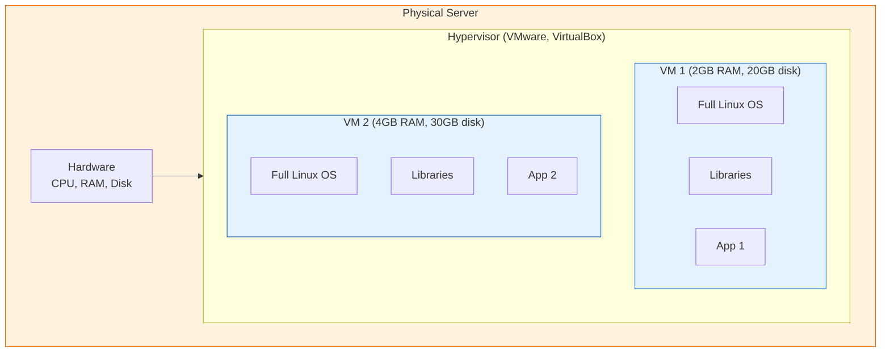
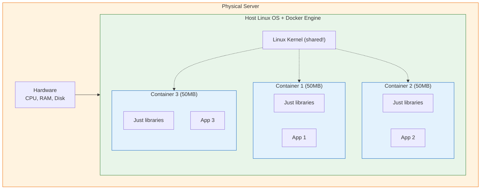
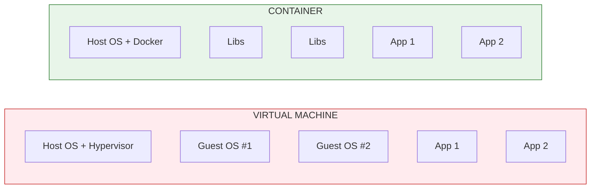
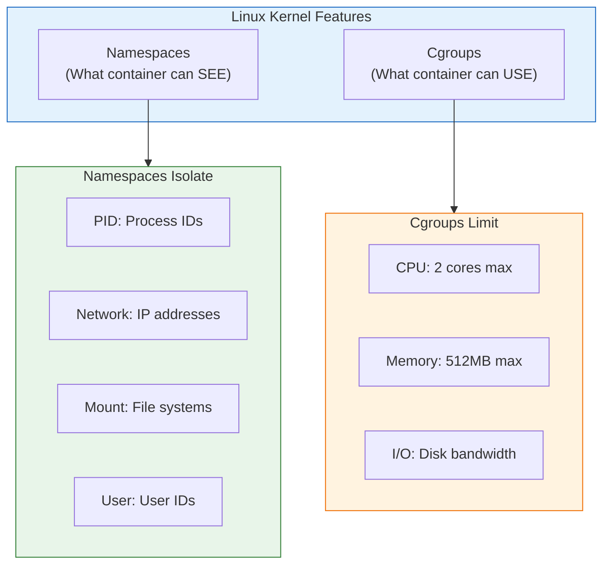

# Lesson 5.1: Containers vs VMs

> **Duration**: 25 min | **Section**: A - What IS Docker?

## 🎯 The Problem

You need to run applications in isolated environments. There are two main approaches:
- **Virtual Machines (VMs)**: Full operating system simulation
- **Containers**: Lightweight process isolation

Which should you use? Let's understand the fundamental difference.

## 🔍 Under the Hood: Virtual Machines

A VM runs a **complete operating system** on simulated hardware:

**The Analogy**: VMs are like building a **complete house** for each tenant. Each house has its own foundation, walls, plumbing, electrical. Expensive and slow to build.

### VM Characteristics

| Aspect | Reality |
|--------|---------|
| **Size** | Gigabytes (full OS per VM) |
| **Startup** | Minutes (boot entire OS) |
| **Isolation** | Complete (separate kernel) |
| **Overhead** | High (duplicated OS resources) |

## 🔍 Under the Hood: Containers

Containers share the **host's operating system kernel**:

**The Analogy**: Containers are like **apartments** in a building. They share foundation, plumbing, electrical. Each apartment just decorates its own space. Fast and efficient.

### Container Characteristics

| Aspect | Reality |
|--------|---------|
| **Size** | Megabytes (just app + libs) |
| **Startup** | Seconds (just start process) |
| **Isolation** | Process-level (shared kernel) |
| **Overhead** | Minimal (no OS duplication) |

## 📊 Direct Comparison

| Feature | Virtual Machine | Container |
|---------|----------------|-----------|
| **Startup Time** | Minutes | Seconds |
| **Size** | GBs | MBs |
| **Memory Overhead** | High (OS per VM) | Low (shared kernel) |
| **Isolation** | Strongest | Good |
| **Portability** | Hypervisor-dependent | Any Docker host |
| **Density** | ~10 VMs per server | ~100+ containers per server |

## 🧠 How Container Isolation Works

Containers use **Linux kernel features** for isolation:

### Namespaces: What the container can SEE

Each container has its own view of:
- **PID namespace**: Process 1 in container ≠ Process 1 on host
- **Network namespace**: Container has its own IP address
- **Mount namespace**: Container has its own filesystem
- **User namespace**: root in container ≠ root on host

### Cgroups: What the container can USE

Limits on resources:
- **CPU**: "Use at most 2 CPU cores"
- **Memory**: "Use at most 512MB RAM"
- **I/O**: "Read at most 100MB/s from disk"

## 💥 When to Use Which?

| Use Case | Best Choice | Why |
|----------|-------------|-----|
| Running many microservices | **Containers** | Lightweight, fast scaling |
| Running different OS (Windows on Linux) | **VMs** | Need different kernel |
| Development environments | **Containers** | Fast startup, easy cleanup |
| Security-critical isolation | **VMs** | Stronger isolation |
| Legacy applications | **VMs** | May need specific OS |
| CI/CD pipelines | **Containers** | Fast, reproducible |

## 🎯 Practice

1. List 3 things that are shared between containers on the same host
2. Why can you run 100 containers but only 10 VMs on the same server?
3. What Linux feature limits how much CPU a container can use?

## 🔑 Key Takeaways

- **VMs**: Full OS per VM, minutes to start, GBs in size
- **Containers**: Shared kernel, seconds to start, MBs in size
- **Namespaces**: Control what containers can see
- **Cgroups**: Control what containers can use
- **Containers aren't VMs**: They're isolated processes with resource limits

## ❓ Common Questions

| Question | Answer |
|----------|--------|
| Are containers less secure than VMs? | Different security model. VMs have stronger isolation, but containers can be made very secure with proper configuration. |
| Can I run Windows containers on Linux? | No, containers share the host kernel. Windows containers need Windows host (or VM running Windows). |
| Do containers replace VMs? | No, they complement each other. Many run containers INSIDE VMs for the best of both. |

## 📚 Further Reading

- [Docker - What is a Container?](https://www.docker.com/resources/what-container/)
- [Linux Namespaces](https://man7.org/linux/man-pages/man7/namespaces.7.html)
- [Containers vs VMs - Red Hat](https://www.redhat.com/en/topics/containers/containers-vs-vms)

---

**Next Lesson**: [5.2 Docker Under the Hood](./Lesson-05-02-Docker-Under-The-Hood.md) - Images, containers, and layers
