# Lesson 5.2: Docker Under the Hood

> **Duration**: 30 min | **Section**: A - What IS Docker?

## 🎯 The Problem

You've heard about containers. But what exactly happens when you run one? What's an "image"? What are "layers"? Let's trace through Docker's internals.

## 🔍 The Core Concepts

Docker has three fundamental building blocks:


### The Analogy

| Concept | Analogy | Characteristics |
|---------|---------|-----------------|
| **Dockerfile** | Recipe book | Text instructions for building |
| **Image** | Frozen meal | Pre-made, ready to use |
| **Container** | Served meal | Active, being consumed |

Or in programming terms:
- **Image** = Class (blueprint)
- **Container** = Object (instance)

## 🔍 Images: Immutable Snapshots

An image is a **read-only template** containing:
- Base operating system files
- Your application code
- Dependencies
- Configuration


**Key Property**: Images are **immutable**. Once built, they never change.

## 🔍 Layers: The Secret Sauce

Each instruction in a Dockerfile creates a new **layer**:

```dockerfile
FROM python:3.11-slim     # Layer 1: Base Python image
WORKDIR /app              # Layer 2: Set working directory
COPY requirements.txt .   # Layer 3: Copy deps file
RUN pip install -r requirements.txt  # Layer 4: Install deps
COPY . .                  # Layer 5: Copy application code
CMD ["python", "main.py"] # Layer 6: Default command
```


### Why Layers Matter

**1. Layer Caching** - Speed up builds:

```mermaid
flowchart TB
    subgraph FIRST["First Build"]
        F1["Layer 1: Download Python ⏱️ 30s"]
        F2["Layer 2: pip install ⏱️ 60s"]
        F3["Layer 3: Copy code ⏱️ 1s"]
    end
    
    subgraph SECOND["Second Build (code changed)"]
        S1["Layer 1: CACHED ✅ 0s"]
        S2["Layer 2: CACHED ✅ 0s"]
        S3["Layer 3: Rebuilt ⏱️ 1s"]
    end
    
    FIRST --> SECOND
    
    style FIRST fill:#FFEBEE,stroke:#C62828
    style SECOND fill:#E8F5E9,stroke:#2E7D32
```



Changed code only? Rebuild takes 1 second, not 91 seconds!

**2. Layer Sharing** - Save disk space:


Ten apps using Python 3.11? Base layer stored only ONCE.

## 🔍 Containers: Running Instances

When you run a container, Docker:
1. Takes the read-only image layers
2. Adds a **writable layer** on top
3. Starts the process


### Copy-on-Write

When a container modifies a file from the image:
1. File is **copied** to writable layer
2. Modification happens on the copy
3. Original image layer unchanged


## 🔍 The Docker Architecture


| Component | Role |
|-----------|------|
| **Docker Client** | CLI tool you interact with |
| **Docker Daemon** | Background service managing containers |
| **Registry** | Storage for images (Docker Hub, private) |

## 🎯 Practice

Trace through this scenario:

```bash
# Build an image
docker build -t myapp:1.0 .

# Run two containers from same image
docker run -d --name app1 myapp:1.0
docker run -d --name app2 myapp:1.0

# Each container writes a file
docker exec app1 touch /tmp/file1.txt
docker exec app2 touch /tmp/file2.txt
```

**Questions**:
1. How many images exist after the build?
2. How many containers exist after the runs?
3. Can app1 see /tmp/file2.txt?
4. If you delete app1, what happens to the image?

## 🔑 Key Takeaways

- **Dockerfile** → build → **Image** → run → **Container**
- **Images are immutable**: Built once, never change
- **Layers are shared**: Same base = stored once
- **Containers add writable layer**: Changes isolated per container
- **Docker Daemon**: Background service managing everything

## ❓ Common Questions

| Question | Answer |
|----------|--------|
| Where are images stored? | In Docker's storage directory (usually `/var/lib/docker/`) |
| What happens when container stops? | Process stops, writable layer preserved until removed |
| What's a registry? | Remote storage for images (like GitHub for code) |

## 📚 Further Reading

- [Docker Architecture](https://docs.docker.com/get-started/docker-overview/#docker-architecture)
- [About Storage Drivers](https://docs.docker.com/storage/storagedriver/)
- [Understand Images and Layers](https://docs.docker.com/storage/storagedriver/#images-and-layers)

---

**Next Lesson**: [5.3 Installing Docker](./Lesson-05-03-Installing-Docker.md) - Get Docker running on your machine
