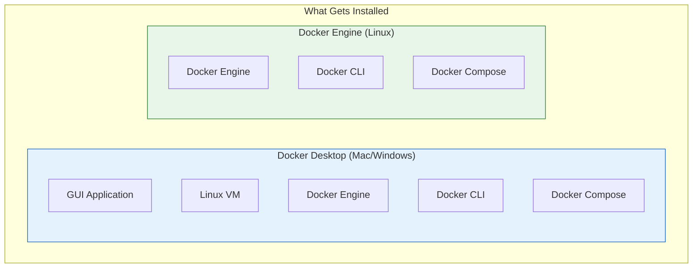
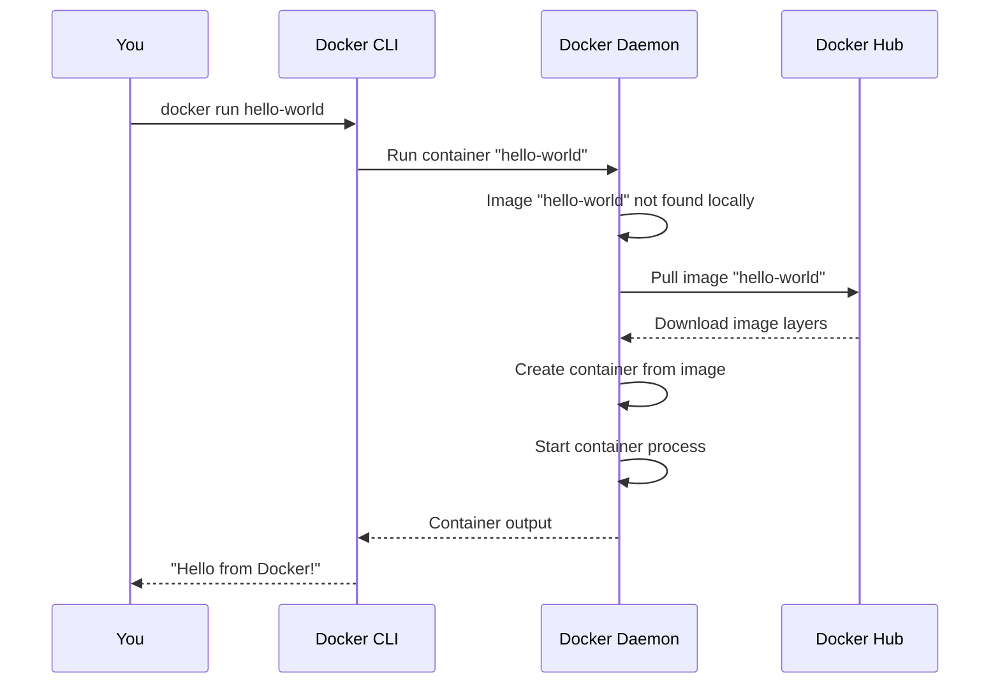

# Lesson 5.3: Installing Docker

> **Duration**: 15 min | **Section**: A - What IS Docker?

## 🎯 The Problem

You understand what Docker is. Now you need to install it and verify it works.

> **Scenario**: You want to start using Docker, but there are multiple installation options: Docker Desktop, Docker Engine, Docker CLI. Which do you need?

## 🔍 Docker Components



| Your OS | Install | What It Does |
|---------|---------|--------------|
| **Mac** | Docker Desktop | Runs Linux VM behind the scenes |
| **Windows** | Docker Desktop | Runs Linux VM (WSL2 recommended) |
| **Linux** | Docker Engine | Native containers, no VM needed |

## ✅ Installation Steps

### macOS

```bash
# Option 1: Download from website
# https://www.docker.com/products/docker-desktop/

# Option 2: Homebrew
brew install --cask docker
```

After installation:
1. Open Docker Desktop from Applications
2. Wait for "Docker is running" status
3. Accept the license agreement

### Windows

1. Install WSL2 (Windows Subsystem for Linux)
2. Download Docker Desktop from docker.com
3. Run the installer
4. Restart if prompted
5. Open Docker Desktop

### Linux (Ubuntu/Debian)

```bash
# Remove old versions
sudo apt-get remove docker docker-engine docker.io containerd runc

# Add Docker's GPG key
sudo apt-get update
sudo apt-get install ca-certificates curl gnupg
sudo install -m 0755 -d /etc/apt/keyrings
curl -fsSL https://download.docker.com/linux/ubuntu/gpg | sudo gpg --dearmor -o /etc/apt/keyrings/docker.gpg

# Add the repository
echo \
  "deb [arch=$(dpkg --print-architecture) signed-by=/etc/apt/keyrings/docker.gpg] https://download.docker.com/linux/ubuntu \
  $(. /etc/os-release && echo "$VERSION_CODENAME") stable" | \
  sudo tee /etc/apt/sources.list.d/docker.list > /dev/null

# Install Docker
sudo apt-get update
sudo apt-get install docker-ce docker-ce-cli containerd.io docker-buildx-plugin docker-compose-plugin

# Add your user to docker group (avoid sudo)
sudo usermod -aG docker $USER
newgrp docker
```

## ✅ Verify Installation

```bash
# Check Docker version
docker --version
# Docker version 24.0.7, build afdd53b

# Check Docker Compose version
docker compose version
# Docker Compose version v2.23.0

# Run hello-world test
docker run hello-world
```

If `docker run hello-world` works, you should see:

```
Hello from Docker!
This message shows that your installation appears to be working correctly.

To generate this message, Docker took the following steps:
 1. The Docker client contacted the Docker daemon.
 2. The Docker daemon pulled the "hello-world" image from the Docker Hub.
 3. The Docker daemon created a new container from that image which runs the
    executable that produces the output you are currently reading.
 4. The Docker daemon streamed that output to the Docker client, which sent it
    to your terminal.
```

## 🔍 What Just Happened?



## 💥 Common Installation Issues

### "Cannot connect to Docker daemon"

```bash
# Check if Docker is running
docker info

# Error: Cannot connect to the Docker daemon
# Solution 1: Start Docker Desktop (Mac/Windows)
# Solution 2: Start Docker service (Linux)
sudo systemctl start docker
```

### "Permission denied" (Linux)

```bash
# Error: permission denied while trying to connect
# Solution: Add user to docker group
sudo usermod -aG docker $USER

# Then log out and back in, or:
newgrp docker
```

### "WSL2 installation incomplete" (Windows)

```bash
# Run in PowerShell as Administrator
wsl --install
# Restart computer
```

## 🎯 Practice

Run these commands and verify the output:

```bash
# 1. Check versions
docker --version
docker compose version

# 2. Get system info
docker info | head -20

# 3. List running containers (should be empty)
docker ps

# 4. List all containers including stopped
docker ps -a

# 5. List images
docker images
```

## 🔑 Key Takeaways

- **Docker Desktop**: GUI for Mac/Windows (includes everything)
- **Docker Engine**: Server-side component (Linux native)
- **Docker CLI**: Command-line tool you interact with
- **Docker Daemon**: Background service managing containers
- **Verify**: `docker run hello-world` confirms working installation

## ❓ Common Questions

| Question | Answer |
|----------|--------|
| Is Docker Desktop free? | Free for personal use, small businesses. Large companies need subscription. |
| Do I need Docker Desktop on Linux? | No, Docker Engine is native. Desktop is optional GUI. |
| How much disk space does Docker use? | Minimal initially, but images/containers can use GBs over time. |

## 📚 Further Reading

- [Install Docker Desktop](https://docs.docker.com/desktop/)
- [Install Docker Engine on Linux](https://docs.docker.com/engine/install/)
- [Post-installation steps for Linux](https://docs.docker.com/engine/install/linux-postinstall/)

---

**Next Lesson**: [5.4 Running Containers](./Lesson-05-04-Running-Containers.md) - Your first real container
