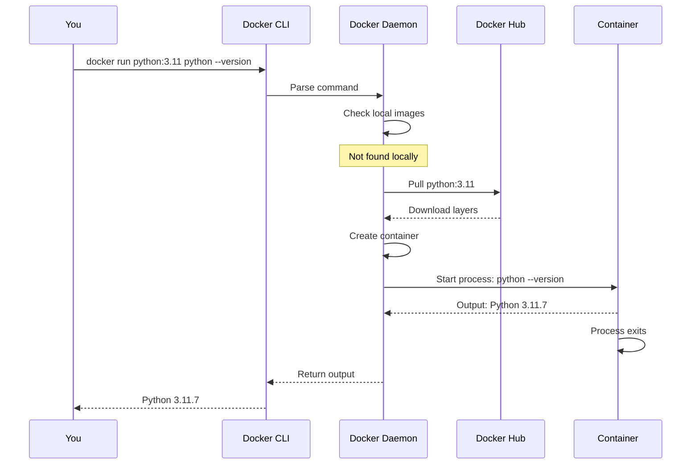
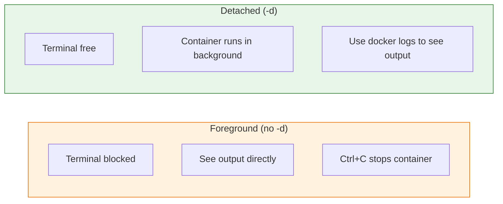
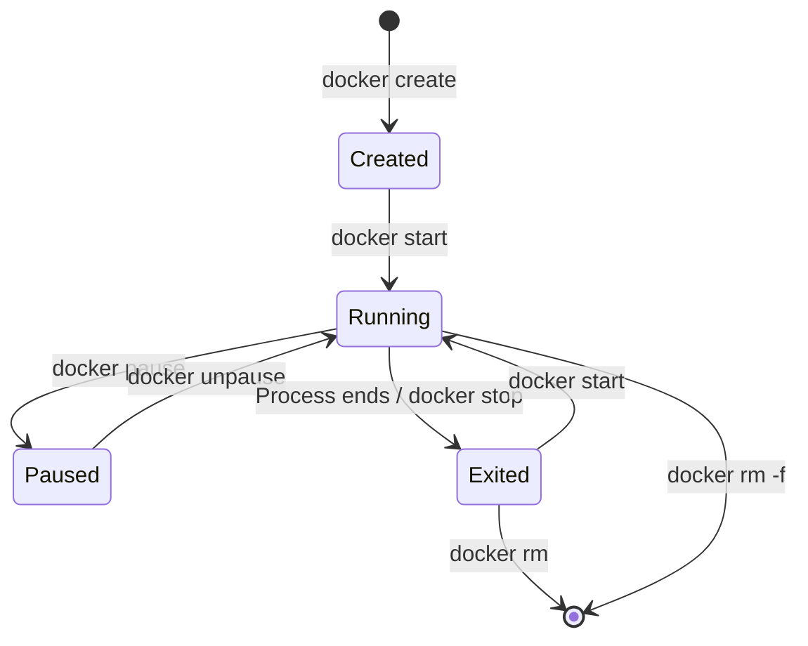

# Lesson 5.4: Running Containers

> **Duration**: 20 min | **Section**: A - What IS Docker?

## 🎯 The Problem

Docker is installed. Now you want to actually run something. What happens when you type `docker run`?

## 🧪 Try It: Your First Real Container

Let's run a Python container:

```bash
docker run python:3.11 python --version
```

Output:
```
Unable to find image 'python:3.11' locally
3.11: Pulling from library/python
... (downloading layers) ...
Python 3.11.7
```

What just happened?

## 🔍 Under the Hood: docker run



## 📊 Anatomy of docker run

```bash
docker run [OPTIONS] IMAGE [COMMAND] [ARGS]
```

| Part | Example | Meaning |
|------|---------|---------|
| `docker run` | - | Run a container |
| `OPTIONS` | `-it`, `-d`, `-p` | Behavior modifiers |
| `IMAGE` | `python:3.11` | Which image to use |
| `COMMAND` | `python` | What to run inside |
| `ARGS` | `--version` | Arguments to command |

## 🧪 Explore: Different Run Modes

### Run and Exit

```bash
# Run command and exit
docker run python:3.11 python -c "print('Hello from container!')"
# Output: Hello from container!
# Container stops after command finishes
```

### Interactive Mode (-it)

```bash
# Get a shell inside the container
docker run -it python:3.11 bash
```

```
root@abc123:/# python --version
Python 3.11.7
root@abc123:/# ls
bin  boot  dev  etc  home  lib  ...
root@abc123:/# exit
```

The `-it` flags:
- `-i` = Keep STDIN open (interactive)
- `-t` = Allocate a pseudo-TTY (terminal)

### Detached Mode (-d)

```bash
# Run in background
docker run -d python:3.11 python -c "import time; time.sleep(3600)"
# Returns: 8f3a2b1c... (container ID)
```



## 🔍 Checking Running Containers

```bash
# List running containers
docker ps

# Output:
CONTAINER ID   IMAGE         COMMAND                  STATUS          NAMES
8f3a2b1c...    python:3.11   "python -c 'import..."   Up 2 minutes    jovial_einstein
```

```bash
# List ALL containers (including stopped)
docker ps -a

# Output includes stopped containers:
CONTAINER ID   IMAGE         COMMAND                  STATUS                     NAMES
8f3a2b1c...    python:3.11   "python -c 'import..."   Up 2 minutes               jovial_einstein
abc123def...   python:3.11   "python --version"       Exited (0) 5 minutes ago   brave_darwin
```

## 📊 Container Naming

Docker auto-generates random names like `jovial_einstein`. You can set your own:

```bash
# Custom name
docker run -d --name my-python-app python:3.11 python -c "import time; time.sleep(3600)"

# Now you can reference by name
docker ps
# NAMES: my-python-app

docker stop my-python-app
docker rm my-python-app
```

## 🔍 Container States



| State | Meaning |
|-------|---------|
| **Created** | Container exists but never started |
| **Running** | Process is executing |
| **Paused** | Process frozen (memory preserved) |
| **Exited** | Process finished, container preserved |
| **Removed** | Container deleted |

## 🎯 Practice

Run these commands in order:

```bash
# 1. Run Ubuntu and get a shell
docker run -it ubuntu bash
# Inside: apt update && apt install -y curl
# Inside: exit

# 2. Run a Python one-liner
docker run python:3.11 python -c "import sys; print(sys.version)"

# 3. Run detached and check status
docker run -d --name sleeper python:3.11 python -c "import time; time.sleep(60)"
docker ps
docker logs sleeper

# 4. Stop and remove
docker stop sleeper
docker rm sleeper

# 5. Verify it's gone
docker ps -a | grep sleeper
```

## 🔑 Key Takeaways

- `docker run IMAGE` - Run container from image
- `-it` - Interactive terminal (for shells)
- `-d` - Detached mode (background)
- `--name NAME` - Give container a name
- `docker ps` - List running containers
- `docker ps -a` - List ALL containers (including stopped)

## ❓ Common Questions

| Question | Answer |
|----------|--------|
| Why did my container stop immediately? | The main process exited. Containers live as long as their main process. |
| Where's my output from -d container? | Use `docker logs CONTAINER_NAME` to see it. |
| How do I get into a running container? | `docker exec -it CONTAINER_NAME bash` |

## 📚 Further Reading

- [docker run reference](https://docs.docker.com/engine/reference/run/)
- [Docker CLI reference](https://docs.docker.com/engine/reference/commandline/cli/)

---

**Next Lesson**: [5.5 Docker Basics Q&A](./Lesson-05-05-Docker-Basics-QA.md) - Common questions about Docker fundamentals
