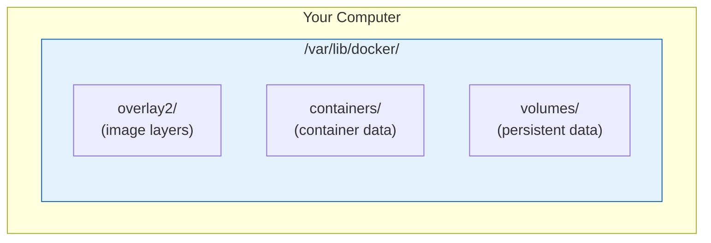
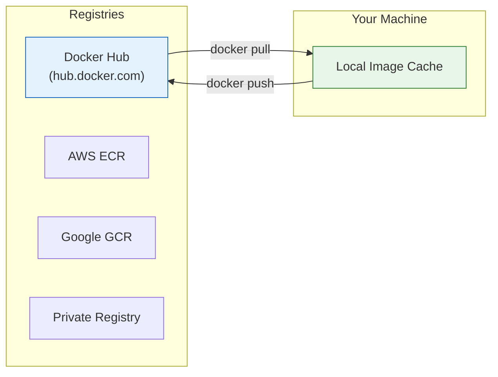
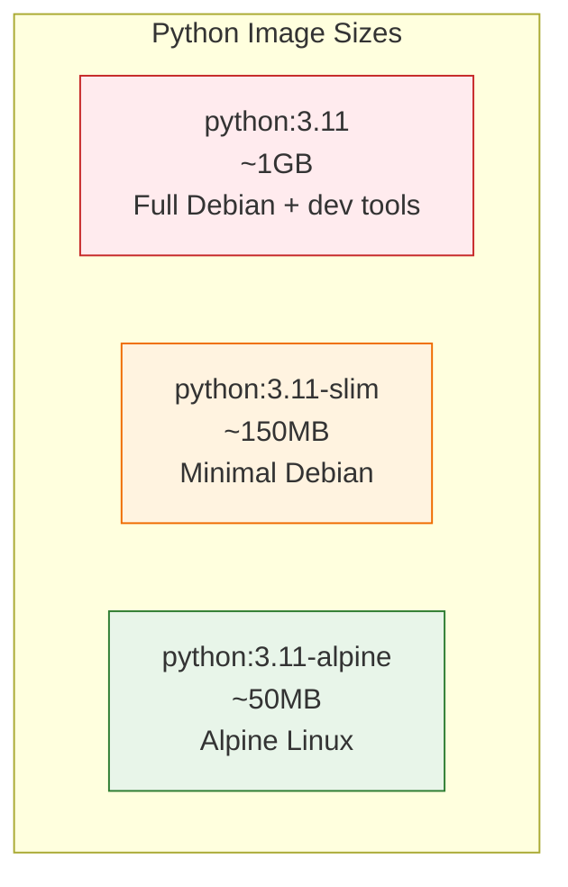
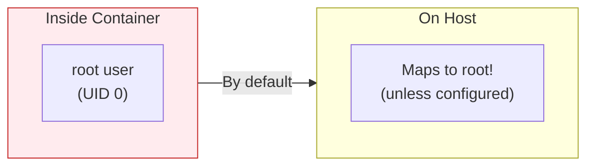
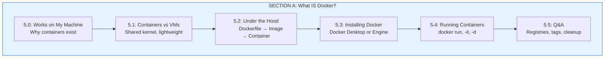

# Lesson 5.5: Docker Basics Q&A

> **Duration**: 10 min | **Section**: A - What IS Docker?

## 🎯 Section A Wrap-up

You've learned Docker fundamentals:
- Containers vs VMs
- Images, layers, and containers
- Installing and running Docker

Let's answer the most common questions.

## ❓ Common Questions

### Q1: "Where do containers actually live on disk?"



```bash
# See Docker disk usage
docker system df

TYPE            TOTAL     ACTIVE    SIZE      RECLAIMABLE
Images          5         2         1.2GB     800MB
Containers      3         1         50MB      40MB
Local Volumes   2         1         100MB     50MB
```

---

### Q2: "What's a registry? Where do images come from?"

A **registry** is a storage and distribution system for Docker images.



| Registry | URL | Use Case |
|----------|-----|----------|
| **Docker Hub** | hub.docker.com | Default, public images |
| **AWS ECR** | aws.amazon.com/ecr | Private images on AWS |
| **Google GCR** | cloud.google.com/container-registry | Private images on GCP |
| **Self-hosted** | Your server | Full control, air-gapped |

```bash
# Pull from Docker Hub (default)
docker pull python:3.11

# Pull from other registry
docker pull gcr.io/my-project/my-image:1.0
docker pull 123456789.dkr.ecr.us-east-1.amazonaws.com/my-image:1.0
```

---

### Q3: "What's the difference between image tags?"

Tags identify specific versions of images:

```bash
# Different tags for Python
docker pull python          # Latest (dangerous!)
docker pull python:3        # Python 3.x (latest 3.x)
docker pull python:3.11     # Python 3.11.x
docker pull python:3.11.7   # Exactly 3.11.7
docker pull python:3.11-slim      # Smaller image
docker pull python:3.11-alpine    # Even smaller (Alpine Linux)
```

| Tag Pattern | Example | Trade-off |
|-------------|---------|-----------|
| `latest` | `python` | Convenient but unpredictable |
| Major version | `python:3` | Stable-ish |
| Minor version | `python:3.11` | Good balance |
| Exact version | `python:3.11.7` | Most reproducible |
| `-slim` | `python:3.11-slim` | Smaller, fewer packages |
| `-alpine` | `python:3.11-alpine` | Smallest, may have issues |

**Best Practice**: Use specific versions in production (`python:3.11.7-slim`)

---

### Q4: "Why are there different base images (slim, alpine)?"



| Image | Size | Pros | Cons |
|-------|------|------|------|
| `python:3.11` | ~1GB | Everything included | Large |
| `python:3.11-slim` | ~150MB | Good balance | Some packages missing |
| `python:3.11-alpine` | ~50MB | Tiny | Uses musl libc, some packages fail |

**Recommendation**: Start with `-slim`. Only use `-alpine` if you know what you're doing.

---

### Q5: "How do I clean up Docker disk space?"

```bash
# See what's using space
docker system df

# Remove stopped containers
docker container prune

# Remove unused images
docker image prune

# Remove unused volumes (careful!)
docker volume prune

# Nuclear option: remove everything unused
docker system prune -a --volumes
```

**Warning**: `docker system prune -a` removes ALL unused images, not just dangling ones!

---

### Q6: "Is it safe to run containers as root?"

Containers run as root by default, but:



**Security Practice**: Run containers as non-root user:

```dockerfile
FROM python:3.11-slim

# Create non-root user
RUN useradd --create-home appuser
USER appuser

WORKDIR /home/appuser
COPY --chown=appuser:appuser . .

CMD ["python", "main.py"]
```

---

## 🧠 Mental Model Check

| Question | Your Answer |
|----------|-------------|
| What's the difference between an image and a container? | |
| Where are images stored? | |
| What does `docker pull` do? | |
| Why use `-slim` or `-alpine` images? | |
| How do you clean up disk space? | |

## � Common Pitfalls

| Pitfall | Why It Happens | Fix |
|---------|---------------|-----|
| Using `latest` tag in production | Seems convenient, but version changes unexpectedly | Use specific version tags like `python:3.11.7-slim` |
| Running `docker system prune -a` carelessly | Removes ALL unused images, not just dangling | Use `docker image prune` for safer cleanup |
| Not cleaning up after experimenting | Images and containers accumulate quickly | Run `docker system df` regularly, prune unused resources |
| Using `-alpine` without testing | Some Python packages require glibc (Alpine uses musl) | Start with `-slim`, only use `-alpine` if tested |
| Pulling images without checking size | Large images slow down CI/CD and deployments | Check image size on Docker Hub before pulling |

## 🔑 Key Takeaways

1. **Images are stored in registries** - Docker Hub is the default, but ECR/GCR exist for private images
2. **Tags identify versions** - Use specific versions in production (`3.11.7`), not `latest`
3. **Image variants have trade-offs** - `-slim` balances size and compatibility; `-alpine` is smallest but may break packages
4. **Clean up regularly** - Use `docker system df` to check usage, `docker system prune` to reclaim space
5. **Security matters** - Run containers as non-root users when possible

---

## �🔑 Section A Summary



**You now understand:**
- ✅ Why containers exist (environment consistency)
- ✅ How containers differ from VMs (shared kernel)
- ✅ The Dockerfile → Image → Container workflow
- ✅ How to run containers with `docker run`
- ✅ Where images come from (registries)

---

**Next Lesson**: [5.6 Container Lifecycle](./Lesson-05-06-Container-Lifecycle.md) - Managing container states
