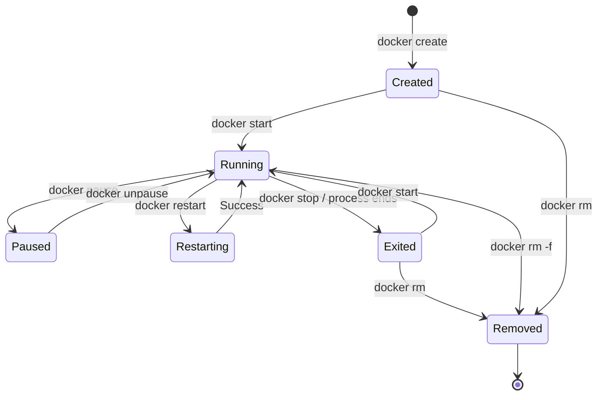
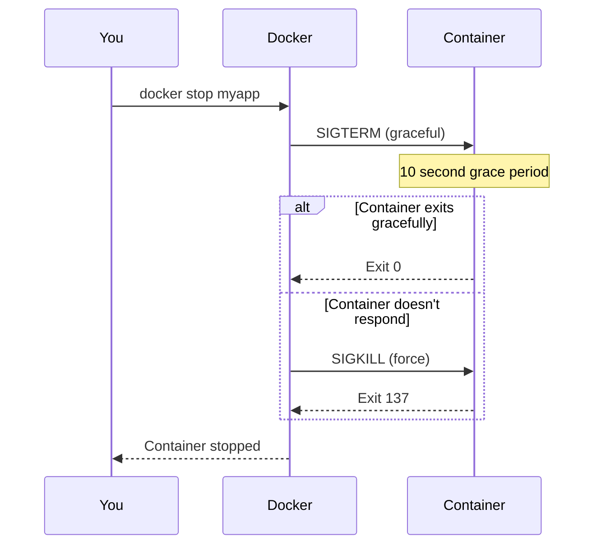
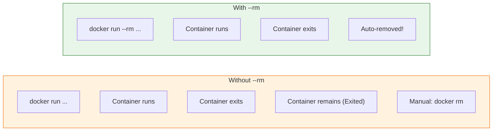

# Lesson 5.6: Container Lifecycle

> **Duration**: 25 min | **Section**: B - Working with Containers

## 🎯 The Problem

You've run containers with `docker run`. But containers can be stopped, started, restarted, and removed. How do you manage their lifecycle?

> **Scenario**: You have an app running in a container. You need to stop it for maintenance, then restart it. Or you want to clean up old containers taking disk space.

## 🔍 Container States

A container can be in one of several states:



| State | Description |
|-------|-------------|
| **Created** | Container exists but never started |
| **Running** | Main process is executing |
| **Paused** | Process frozen, memory preserved |
| **Exited** | Process ended, container preserved |
| **Removed** | Container deleted |

## 🔍 Lifecycle Commands

### Create (without starting)

```bash
# Create container but don't start it
docker create --name myapp python:3.11 python -c "print('Hello')"

# Check status
docker ps -a
# STATUS: Created

# Start it later
docker start myapp
```

**Use Case**: Prepare containers ahead of time for fast startup.

### Run = Create + Start

```bash
# This is what docker run actually does
docker run --name myapp python:3.11 python -c "print('Hello')"

# Equivalent to:
docker create --name myapp python:3.11 python -c "print('Hello')"
docker start -a myapp  # -a attaches to see output
```

### Stop a Running Container

```bash
# Graceful stop (sends SIGTERM, waits 10s, then SIGKILL)
docker stop myapp

# Force stop (sends SIGKILL immediately)
docker kill myapp
```



### Start a Stopped Container

```bash
# Start a stopped container
docker start myapp

# Start and attach to see output
docker start -a myapp

# Start and attach interactive
docker start -ai myapp
```

### Restart a Container

```bash
# Stop and start (useful for picking up config changes)
docker restart myapp

# Restart with custom timeout
docker restart -t 5 myapp  # 5 second timeout
```

### Remove a Container

```bash
# Remove stopped container
docker rm myapp

# Force remove (even if running)
docker rm -f myapp

# Remove and delete volumes
docker rm -v myapp
```

## 📊 Listing and Filtering Containers

```bash
# Running containers only
docker ps

# All containers (including stopped)
docker ps -a

# Just container IDs
docker ps -q

# Filter by status
docker ps -a -f status=exited

# Filter by name
docker ps -a -f name=myapp

# Format output
docker ps --format "table {{.Names}}\t{{.Status}}\t{{.Image}}"
```

## 🧹 Cleanup Patterns

### Remove All Stopped Containers

```bash
# Safe: only removes stopped containers
docker container prune

# Or manually
docker rm $(docker ps -a -q -f status=exited)
```

### Remove Specific Containers

```bash
# Remove multiple by name
docker rm app1 app2 app3

# Remove by ID prefix
docker rm 8f3a2b
```

### Auto-Remove on Exit

```bash
# Container automatically removed when it stops
docker run --rm python:3.11 python --version
# After command finishes, container is gone
```



## 🔍 Inspecting Container State

```bash
# Detailed container info (JSON)
docker inspect myapp

# Get specific field
docker inspect --format '{{.State.Status}}' myapp
# running

# Get IP address
docker inspect --format '{{.NetworkSettings.IPAddress}}' myapp
# 172.17.0.2
```

## 🎯 Practice

Run this complete lifecycle:

```bash
# 1. Create a container
docker create --name lifecycle-test python:3.11 python -c "import time; time.sleep(300)"

# 2. Check status (should be Created)
docker ps -a -f name=lifecycle-test

# 3. Start it
docker start lifecycle-test

# 4. Check status (should be Running)
docker ps -f name=lifecycle-test

# 5. Pause it
docker pause lifecycle-test

# 6. Check status (should be Paused)
docker ps -f name=lifecycle-test

# 7. Unpause it
docker unpause lifecycle-test

# 8. Stop it
docker stop lifecycle-test

# 9. Check status (should be Exited)
docker ps -a -f name=lifecycle-test

# 10. Remove it
docker rm lifecycle-test

# 11. Verify it's gone
docker ps -a -f name=lifecycle-test
```

## 🔑 Key Takeaways

- **docker create**: Create without starting
- **docker run**: Create and start (most common)
- **docker start/stop**: Control running state
- **docker rm**: Remove stopped containers
- **docker rm -f**: Force remove running containers
- **--rm flag**: Auto-remove on exit (for temporary containers)
- **docker container prune**: Remove all stopped containers

## ❓ Common Questions

| Question | Answer |
|----------|--------|
| What's the difference between stop and kill? | `stop` is graceful (SIGTERM + wait), `kill` is immediate (SIGKILL) |
| Can I start a removed container? | No, once removed it's gone. You need to `docker run` again. |
| What's the Paused state for? | Freeze process for debugging or to temporarily free CPU |

## 📚 Further Reading

- [docker container commands](https://docs.docker.com/engine/reference/commandline/container/)
- [Container lifecycle](https://docs.docker.com/get-started/overview/#container-lifecycle)

---

**Next Lesson**: [5.7 Interactive Containers](./Lesson-05-07-Interactive-Containers.md) - Getting a shell inside containers
