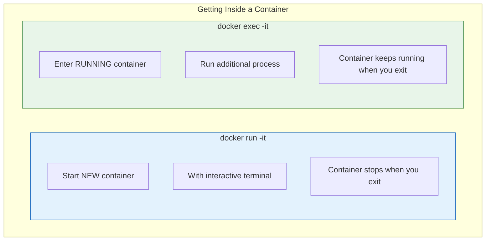
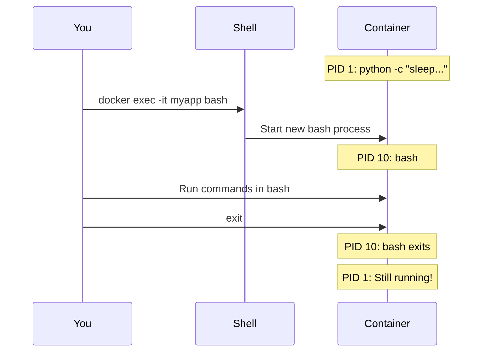

# Lesson 5.7: Interactive Containers

> **Duration**: 20 min | **Section**: B - Working with Containers

## 🎯 The Problem

You have a running container, but something's wrong. You need to look inside—check files, run commands, debug issues. How do you get a shell inside a container?

> **Scenario**: Your Python app container is failing. You want to:
> - Check if the config file is there
> - See what environment variables are set
> - Run Python interactively to test something

## 🔍 Two Ways In



## 🧪 Method 1: docker run -it

Start a new container with an interactive shell:

```bash
# Get a bash shell in a new Python container
docker run -it python:3.11 bash
```

```
root@abc123:/# whoami
root

root@abc123:/# python --version
Python 3.11.7

root@abc123:/# python
>>> import sys
>>> print(sys.version_info)
sys.version_info(major=3, minor=11, micro=7, releaselevel='final', serial=0)
>>> exit()

root@abc123:/# exit
```

### What -it Means

```bash
docker run -it python:3.11 bash
#          ^^
#          |+-- -t = Allocate pseudo-TTY (terminal)
#          +--- -i = Keep STDIN open (interactive)
```

Without `-t`: No terminal formatting, no prompt
Without `-i`: Can't type input

### Common Shells

```bash
# Bash (most common)
docker run -it python:3.11 bash

# Sh (always available)
docker run -it python:3.11 sh

# Python REPL directly
docker run -it python:3.11 python
```

## 🧪 Method 2: docker exec -it

Enter an **already running** container:

```bash
# First, start a container in background
docker run -d --name myapp python:3.11 python -c "import time; time.sleep(3600)"

# Now exec into it
docker exec -it myapp bash
```

```
root@xyz789:/# ps aux
USER       PID %CPU %MEM    VSZ   RSS TTY      STAT START   TIME COMMAND
root         1  0.0  0.0  12916  8888 ?        Ss   10:00   0:00 python -c import time; time.sleep(3600)
root        10  0.0  0.0   4184  3456 pts/0    Ss   10:05   0:00 bash
root        20  0.0  0.0   8596  3200 pts/0    R+   10:05   0:00 ps aux

root@xyz789:/# exit
# Container keeps running!
```



### Running Single Commands

```bash
# Don't need interactive for single commands
docker exec myapp python --version
# Python 3.11.7

# Check environment variables
docker exec myapp env
# PATH=/usr/local/bin:...
# PYTHON_VERSION=3.11.7
# ...

# Check files
docker exec myapp ls -la /app

# Run Python one-liner
docker exec myapp python -c "print('Hello from inside!')"
```

## 📊 run -it vs exec -it

| Aspect | `docker run -it` | `docker exec -it` |
|--------|------------------|-------------------|
| Container | Creates NEW | Uses EXISTING |
| Requirement | None | Container must be running |
| On exit | Container stops | Container keeps running |
| Use case | Testing, exploration | Debugging running apps |

## 🔍 Useful Debugging Commands

Once inside a container:

```bash
# What processes are running?
ps aux

# What's the filesystem look like?
ls -la /

# What environment variables are set?
env

# What's the network config?
cat /etc/hosts
hostname -i

# What OS is this?
cat /etc/os-release

# What packages are installed?
pip list  # For Python
apt list --installed  # For Debian/Ubuntu

# Check disk space
df -h

# Check memory
free -m
```

## 💥 Common Issues

### "bash: not found"

Some minimal images don't have bash:

```bash
# This fails on alpine
docker run -it python:3.11-alpine bash
# OCI runtime exec failed... "bash": executable file not found

# Use sh instead
docker run -it python:3.11-alpine sh
```

### "No such container"

```bash
docker exec -it myapp bash
# Error: No such container: myapp

# Container might be stopped or removed
docker ps -a | grep myapp
```

### Can't exit interactive Python

```python
>>> exit()   # or
>>> quit()   # or
# Ctrl+D
```

## 🎯 Practice

```bash
# 1. Start a background container
docker run -d --name debug-test python:3.11 python -c "import time; time.sleep(600)"

# 2. Check it's running
docker ps

# 3. Exec into it
docker exec -it debug-test bash

# Inside container:
# 4. Check Python version
python --version

# 5. Check what's installed
pip list

# 6. Check process list
ps aux

# 7. Exit (container should keep running)
exit

# 8. Verify container still running
docker ps

# 9. Run a single command without entering
docker exec debug-test python -c "print('Quick test')"

# 10. Cleanup
docker stop debug-test && docker rm debug-test
```

## 🔑 Key Takeaways

- **docker run -it**: Start new interactive container
- **docker exec -it**: Enter running container
- **-i**: Keep STDIN open (for typing)
- **-t**: Allocate terminal (for formatting)
- **exec doesn't stop container**: Main process keeps running
- **Use sh if bash unavailable**: Especially on Alpine images

## ❓ Common Questions

| Question | Answer |
|----------|--------|
| Can I exec into a stopped container? | No, use `docker start -ai container` instead |
| How do I exit without stopping? | With exec, just exit. With run, use Ctrl+P Ctrl+Q to detach. |
| Can I copy files instead of editing inside? | Yes, use `docker cp` (covered later) |

## 📚 Further Reading

- [docker exec reference](https://docs.docker.com/engine/reference/commandline/exec/)
- [docker run reference](https://docs.docker.com/engine/reference/run/)

---

**Next Lesson**: [5.8 Images: Pull & List](./Lesson-05-08-Images-Pull-List.md) - Working with pre-built images
