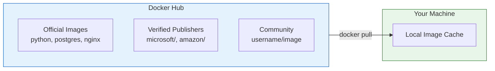
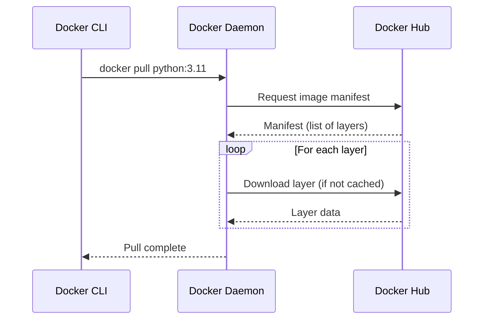
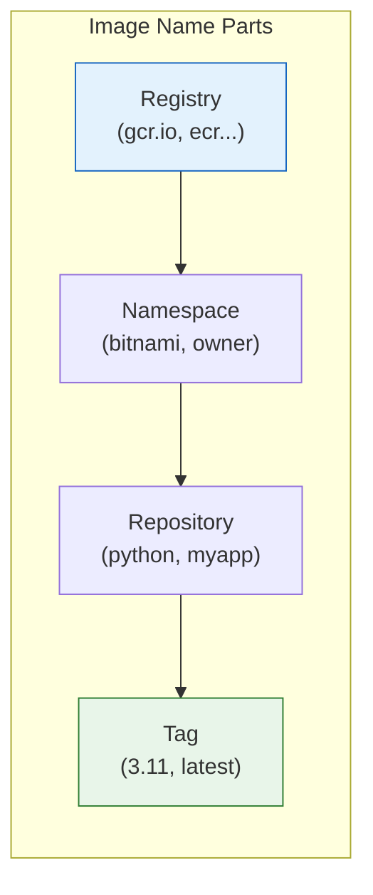

# Lesson 5.8: Images: Pull & List

> **Duration**: 20 min | **Section**: B - Working with Containers

## 🎯 The Problem

You want to run containers, but first you need images. Where do images come from? How do you find the right one?

> **Scenario**: You need a container with Python, PostgreSQL, and Redis. Do you build from scratch? No—millions of pre-built images are available on Docker Hub.

## 🔍 Docker Hub: The Image Library



### Official Images

Curated by Docker, no username prefix:
```bash
docker pull python         # Official Python
docker pull postgres       # Official PostgreSQL
docker pull nginx          # Official Nginx
docker pull redis          # Official Redis
```

### Verified Publisher Images

From verified organizations:
```bash
docker pull bitnami/postgresql
docker pull amazon/aws-cli
docker pull hashicorp/vault
```

### Community Images

From any user (be careful!):
```bash
docker pull someuser/their-app
```

## 🧪 Pulling Images

```bash
# Pull the latest Python image
docker pull python
# Using default tag: latest

# Pull a specific version
docker pull python:3.11

# Pull from specific registry
docker pull ghcr.io/owner/repo:tag
```

What happens during pull:



### Pull Output Explained

```bash
$ docker pull python:3.11-slim

3.11-slim: Pulling from library/python
a378f10b3218: Pull complete      # Layer 1
b1f0b5c5ee84: Pull complete      # Layer 2
7d85e6c31b2a: Already exists     # Cached from previous pull!
d4f91c4e8c9b: Pull complete      # Layer 3
Digest: sha256:abc123...         # Unique content hash
Status: Downloaded newer image for python:3.11-slim
```

## 📊 Listing Images

```bash
# List all local images
docker images
# or
docker image ls

REPOSITORY   TAG         IMAGE ID       CREATED        SIZE
python       3.11-slim   abc123def456   2 weeks ago    150MB
python       3.11        xyz789abc123   2 weeks ago    920MB
postgres     15          111222333444   3 weeks ago    380MB
```

### Understanding the Output

| Column | Meaning |
|--------|---------|
| REPOSITORY | Image name |
| TAG | Version/variant |
| IMAGE ID | Unique identifier (SHA256 prefix) |
| CREATED | When image was built |
| SIZE | Disk space used |

### Filtering Images

```bash
# Filter by name
docker images python

# Filter by name and tag
docker images python:3.11

# Show all images (including intermediate layers)
docker images -a

# Show only IDs
docker images -q
```

## 🔍 Image Naming Convention

```
[registry/][namespace/]repository[:tag][@digest]
```

Examples:
```bash
python                           # Official, latest
python:3.11                      # Official, specific tag
python:3.11-slim                 # Official, variant
bitnami/postgresql:15            # Verified publisher
ghcr.io/owner/repo:v1.0          # GitHub Container Registry
123456789.dkr.ecr.us-east-1.amazonaws.com/myapp:latest  # AWS ECR
```



## 🧪 Inspecting Images

```bash
# Detailed image info (JSON)
docker image inspect python:3.11

# Get specific info
docker image inspect python:3.11 --format '{{.Os}}'
# linux

docker image inspect python:3.11 --format '{{.Architecture}}'
# amd64

# See the build history (layers)
docker image history python:3.11-slim
```

History output shows what created each layer:
```
IMAGE          CREATED       CREATED BY                                      SIZE
abc123         2 weeks ago   CMD ["python3"]                                 0B
def456         2 weeks ago   RUN pip install --no-cache-dir ...              50MB
789abc         2 weeks ago   COPY . /app                                     5MB
...
```

## 🧹 Removing Images

```bash
# Remove specific image
docker image rm python:3.10
# or
docker rmi python:3.10

# Remove by ID
docker rmi abc123

# Remove unused images (not tagged, not referenced)
docker image prune

# Remove ALL unused images
docker image prune -a

# Force remove (even if container exists)
docker rmi -f python:3.10
```

### Dangling Images

Images without a tag (`<none>`), usually from rebuilds:

```bash
# Show dangling images
docker images -f "dangling=true"

# Remove them
docker image prune
```

## 🎯 Practice

```bash
# 1. Search Docker Hub (or use hub.docker.com)
docker search postgres

# 2. Pull official PostgreSQL
docker pull postgres:15

# 3. Pull Python slim variant
docker pull python:3.11-slim

# 4. List all images
docker images

# 5. Check image size difference
docker images python

# 6. Inspect the Python image
docker image inspect python:3.11-slim --format '{{.Size}}'

# 7. View image history
docker image history python:3.11-slim

# 8. Remove an image
docker rmi python:3.11-slim

# 9. Pull it back
docker pull python:3.11-slim
```

## 🔑 Key Takeaways

- **Docker Hub**: Default registry with millions of images
- **Official images**: No namespace prefix (e.g., `python`, `postgres`)
- **docker pull**: Download images to local cache
- **docker images**: List local images
- **Layers are shared**: Same base = stored once
- **Use specific tags**: Avoid `latest` in production

## ❓ Common Questions

| Question | Answer |
|----------|--------|
| What's the difference between `docker pull` and `docker run`? | `pull` only downloads; `run` downloads IF needed then creates and starts container |
| How do I know if an image is trustworthy? | Look for Official/Verified badges on Docker Hub; check download counts and stars |
| Can I use images from other registries? | Yes, include the registry URL: `docker pull gcr.io/image` |

## 📚 Further Reading

- [Docker Hub](https://hub.docker.com/)
- [docker pull reference](https://docs.docker.com/engine/reference/commandline/pull/)
- [docker images reference](https://docs.docker.com/engine/reference/commandline/images/)

---

**Next Lesson**: [5.9 The Custom Image Problem](./Lesson-05-09-The-Custom-Image-Problem.md) - Why you need to build your own images
