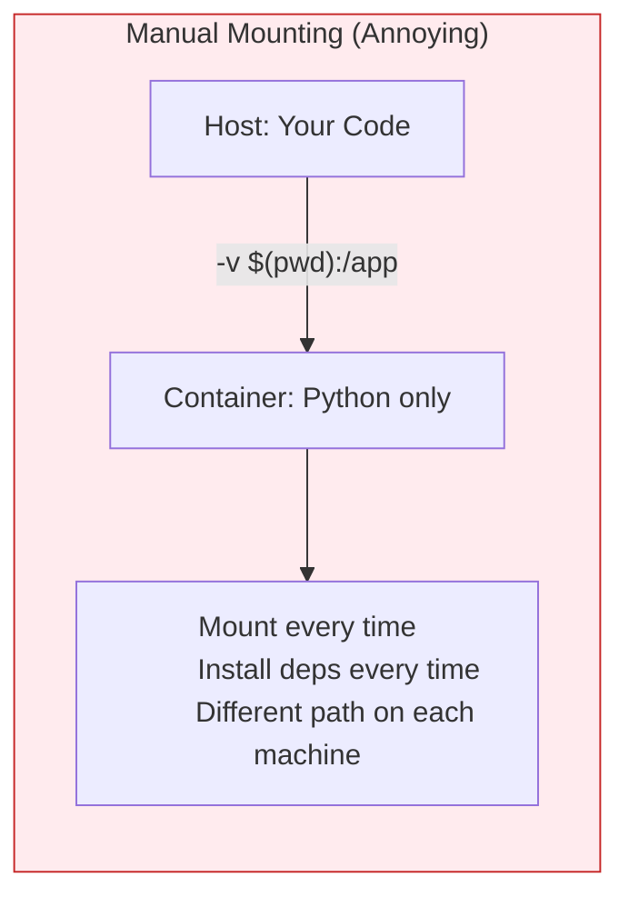
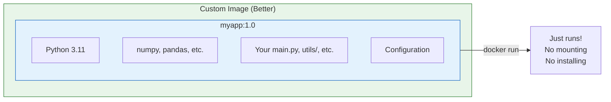

# Lesson 5.9: The Custom Image Problem

> **Duration**: 5 min | **Section**: C - Building Your Own Images

## 🎯 The Problem

Docker Hub has millions of pre-built images. But none of them contain **your code**.

> **Scenario**: You've built a Python application:
> 
> ```
> myapp/
> ├── main.py
> ├── requirements.txt
> ├── config/
> │   └── settings.py
> └── utils/
>     └── helpers.py
> ```
> 
> You pull `python:3.11`. Great—you have Python. But where's YOUR code?

## 🧪 The Manual Approach

You could mount your code every time:

```bash
# Run Python with your code mounted
docker run -v $(pwd):/app -w /app python:3.11 python main.py
```

But this requires:
- The code to exist on the host machine
- Remembering the mount path every time
- Installing dependencies every run



## 💡 The Solution: Custom Images

Instead of mounting code at runtime, **bake it into the image**:



**Benefits:**
- ✅ Everything packaged together
- ✅ Same image runs anywhere
- ✅ Fast startup (deps pre-installed)
- ✅ Version-controlled (tag images)
- ✅ Shareable (push to registry)

## 🔍 What We Need

To create a custom image, we need a **Dockerfile**—a text file with instructions:

```dockerfile
# Start from official Python
FROM python:3.11-slim

# Set working directory
WORKDIR /app

# Install dependencies
COPY requirements.txt .
RUN pip install -r requirements.txt

# Copy our code
COPY . .

# Define how to run
CMD ["python", "main.py"]
```

Then build it:

```bash
docker build -t myapp:1.0 .
```

And run it anywhere:

```bash
docker run myapp:1.0
# No mounting, no installing, just works!
```

## 🔑 Key Takeaways

- **Pre-built images**: Have the runtime, not YOUR code
- **Mounting at runtime**: Works but annoying, not portable
- **Custom images**: Bake code + deps together
- **Dockerfile**: Recipe for building your image
- **Result**: Portable, reproducible, shareable

## ❓ Preview Questions

| Question | Answered In |
|----------|-------------|
| How do I write a Dockerfile? | Lesson 5.10 |
| How do I build an image? | Lesson 5.11 |
| How do I make it smaller/faster? | Lesson 5.12 |

---

**Next Lesson**: [5.10 Dockerfile Under the Hood](./Lesson-05-10-Dockerfile-Under-The-Hood.md) - Writing your first Dockerfile
