# Lesson 5.10: Dockerfile Under the Hood

> **Duration**: 35 min | **Section**: C - Building Your Own Images

## 🎯 The Problem

You need to write a Dockerfile to package your Python application. What instructions do you use? What order? Why does it matter?

## 🔍 Dockerfile Anatomy

A Dockerfile is a text file with instructions that build an image layer by layer:

```dockerfile
# Every Dockerfile starts with FROM
FROM python:3.11-slim

# Set working directory inside container
WORKDIR /app

# Copy dependencies file first
COPY requirements.txt .

# Install dependencies
RUN pip install --no-cache-dir -r requirements.txt

# Copy application code
COPY . .

# Document which port the app uses
EXPOSE 8000

# Set environment variable
ENV PYTHONUNBUFFERED=1

# Default command to run
CMD ["python", "main.py"]
```



```mermaid
flowchart TB
    subgraph DOCKERFILE["Dockerfile Instructions"]
        FROM["FROM python:3.11-slim
        ← Start with this base"]
        WORKDIR["WORKDIR /app
        ← cd to this directory"]
        COPY1["COPY requirements.txt .
        ← Copy deps file"]
        RUN["RUN pip install ...
        ← Execute command"]
        COPY2["COPY . .
        ← Copy all code"]
        EXPOSE["EXPOSE 8000
        ← Document port"]
        ENV["ENV PYTHONUNBUFFERED=1
        ← Set env var"]
        CMD["CMD ['python', 'main.py']
        ← Default command"]
    end
    
    FROM --> WORKDIR --> COPY1 --> RUN --> COPY2 --> EXPOSE --> ENV --> CMD
    
    style FROM fill:#1565C0,color:#fff
    style RUN fill:#EF6C00,color:#fff
    style CMD fill:#2E7D32,color:#fff
```

## 📖 Instruction Reference

### FROM - The Base Image

```dockerfile
# Official Python slim
FROM python:3.11-slim

# Alpine (smallest)
FROM python:3.11-alpine

# Ubuntu base
FROM ubuntu:22.04

# Start from scratch (rare, for experts)
FROM scratch
```

Every Dockerfile MUST start with FROM.

### WORKDIR - Set Working Directory

```dockerfile
WORKDIR /app

# All subsequent commands run in /app
# Creates the directory if it doesn't exist
```

Prefer WORKDIR over `RUN cd /app` because it persists across instructions.

### COPY - Copy Files from Host

```dockerfile
# Copy single file
COPY requirements.txt .

# Copy directory
COPY src/ /app/src/

# Copy everything
COPY . .

# Copy with different ownership
COPY --chown=appuser:appuser . .
```

### RUN - Execute Commands

```dockerfile
# Install system packages
RUN apt-get update && apt-get install -y curl

# Install Python packages
RUN pip install --no-cache-dir -r requirements.txt

# Multiple commands (one layer)
RUN apt-get update && \
    apt-get install -y curl wget && \
    rm -rf /var/lib/apt/lists/*
```

**Important**: Each RUN creates a new layer. Combine related commands.

### ENV - Set Environment Variables

```dockerfile
# Single variable
ENV PYTHONUNBUFFERED=1

# Multiple variables
ENV PYTHONUNBUFFERED=1 \
    PYTHONDONTWRITEBYTECODE=1 \
    APP_ENV=production
```

These persist into the running container.

### EXPOSE - Document Ports

```dockerfile
EXPOSE 8000
EXPOSE 5432
```

**Note**: EXPOSE doesn't actually publish ports—it's documentation. You still need `-p 8000:8000` when running.

### CMD vs ENTRYPOINT

```dockerfile
# CMD - Default command (can be overridden)
CMD ["python", "main.py"]

# Running: docker run myapp
# Executes: python main.py

# Running: docker run myapp python other.py
# Executes: python other.py (CMD overridden)
```

```dockerfile
# ENTRYPOINT - Fixed command (args appended)
ENTRYPOINT ["python"]
CMD ["main.py"]

# Running: docker run myapp
# Executes: python main.py

# Running: docker run myapp other.py
# Executes: python other.py (main.py replaced)
```



```mermaid
flowchart TB
    subgraph CMD_ONLY["CMD Only"]
        C1["CMD ['python', 'main.py']"]
        C2["docker run myapp → python main.py"]
        C3["docker run myapp bash → bash"]
    end
    
    subgraph ENTRYPOINT["ENTRYPOINT + CMD"]
        E1["ENTRYPOINT ['python']
        CMD ['main.py']"]
        E2["docker run myapp → python main.py"]
        E3["docker run myapp other.py → python other.py"]
    end
    
    style CMD_ONLY fill:#E3F2FD,stroke:#1565C0
    style ENTRYPOINT fill:#E8F5E9,stroke:#2E7D32
```

### ARG - Build-Time Variables

```dockerfile
ARG PYTHON_VERSION=3.11
FROM python:${PYTHON_VERSION}-slim

# Use during build
ARG APP_ENV=development
RUN echo "Building for ${APP_ENV}"

# Note: ARG values don't persist into running container
# Use ENV for runtime variables
```

```bash
# Override at build time
docker build --build-arg PYTHON_VERSION=3.12 -t myapp .
```

## 🔍 Layer Caching Deep Dive

Docker caches each layer. Order matters for build speed:

```dockerfile
# ❌ BAD: Code changes invalidate everything
FROM python:3.11-slim
COPY . .                          # Layer 1: All files
RUN pip install -r requirements.txt  # Layer 2: Install deps
CMD ["python", "main.py"]

# Change main.py → BOTH layers rebuild!
```

```dockerfile
# ✅ GOOD: Dependencies cached separately
FROM python:3.11-slim
COPY requirements.txt .           # Layer 1: Just deps file
RUN pip install -r requirements.txt  # Layer 2: Install deps
COPY . .                          # Layer 3: All code
CMD ["python", "main.py"]

# Change main.py → Only Layer 3 rebuilds!
```



```mermaid
flowchart TB
    subgraph BAD["❌ Bad Order"]
        B1["COPY . . (all code)"]
        B2["RUN pip install"]
        B3["Code change? → BOTH rebuild"]
    end
    
    subgraph GOOD["✅ Good Order"]
        G1["COPY requirements.txt"]
        G2["RUN pip install"]
        G3["COPY . . (code)"]
        G4["Code change? → Only last step"]
    end
    
    style BAD fill:#FFEBEE,stroke:#C62828
    style GOOD fill:#E8F5E9,stroke:#2E7D32
```

## 🎯 Complete Example

Let's create a Dockerfile for a FastAPI application:

```dockerfile
# Use slim Python image
FROM python:3.11-slim

# Set working directory
WORKDIR /app

# Don't write .pyc files
ENV PYTHONDONTWRITEBYTECODE=1
# Don't buffer stdout/stderr
ENV PYTHONUNBUFFERED=1

# Install system dependencies (if needed)
RUN apt-get update && \
    apt-get install -y --no-install-recommends gcc && \
    rm -rf /var/lib/apt/lists/*

# Copy and install Python dependencies
COPY requirements.txt .
RUN pip install --no-cache-dir -r requirements.txt

# Create non-root user for security
RUN useradd --create-home appuser
USER appuser

# Copy application code
COPY --chown=appuser:appuser . .

# Document the port
EXPOSE 8000

# Run the application
CMD ["uvicorn", "main:app", "--host", "0.0.0.0", "--port", "8000"]
```

## 🎯 Practice

Create this project structure:

```
myapp/
├── Dockerfile
├── requirements.txt
└── main.py
```

**requirements.txt:**
```
fastapi
uvicorn
```

**main.py:**
```python
from fastapi import FastAPI

app = FastAPI()

@app.get("/")
def read_root():
    return {"message": "Hello from Docker!"}
```

**Dockerfile:**
Write it yourself using the patterns above!

## 🔑 Key Takeaways

- **FROM**: Base image (required first instruction)
- **WORKDIR**: Set working directory
- **COPY**: Add files from host to image
- **RUN**: Execute commands during build
- **ENV**: Set environment variables
- **EXPOSE**: Document ports (doesn't publish)
- **CMD**: Default command (overridable)
- **ENTRYPOINT**: Fixed command (args appended)
- **Layer order matters**: Put rarely-changing things first

## ❓ Common Questions

| Question | Answer |
|----------|--------|
| ADD vs COPY? | Use COPY unless you need ADD's features (URL download, tar extraction) |
| Why --no-cache-dir? | Saves space by not caching pip downloads |
| Why combine RUN commands? | Fewer layers, smaller image |

## 📚 Further Reading

- [Dockerfile reference](https://docs.docker.com/engine/reference/builder/)
- [Best practices for Dockerfiles](https://docs.docker.com/develop/develop-images/dockerfile_best-practices/)

---

**Next Lesson**: [5.11 Building Images](./Lesson-05-11-Building-Images.md) - Running docker build
