# Lesson 5.11: Building Images

> **Duration**: 25 min | **Section**: C - Building Your Own Images

## 🎯 The Problem

You've written a Dockerfile. Now what? How do you turn it into an image you can run?

## 🔍 The docker build Command

```bash
docker build [OPTIONS] PATH

# Common usage
docker build -t myapp:1.0 .
#          ^^^          ^
#          tag          build context (current directory)
```

## 🧪 Building Step by Step

Let's build a simple Python app:

```bash
# Project structure
myapp/
├── Dockerfile
├── requirements.txt
└── main.py
```

```bash
$ docker build -t myapp:1.0 .

[+] Building 45.2s (10/10) FINISHED
 => [internal] load build definition from Dockerfile                     0.0s
 => [internal] load .dockerignore                                        0.0s
 => [internal] load metadata for docker.io/library/python:3.11-slim      1.2s
 => [1/5] FROM docker.io/library/python:3.11-slim@sha256:abc123...       5.0s
 => [internal] load build context                                        0.1s
 => [2/5] WORKDIR /app                                                   0.1s
 => [3/5] COPY requirements.txt .                                        0.0s
 => [4/5] RUN pip install --no-cache-dir -r requirements.txt           35.0s
 => [5/5] COPY . .                                                       0.1s
 => exporting to image                                                   3.5s
 => => naming to docker.io/library/myapp:1.0                            0.0s
```


## 📊 Build Options

| Option | Example | Purpose |
|--------|---------|---------|
| `-t, --tag` | `-t myapp:1.0` | Name and tag the image |
| `-f, --file` | `-f Dockerfile.prod` | Use a different Dockerfile |
| `--no-cache` | `--no-cache` | Don't use layer cache |
| `--build-arg` | `--build-arg VERSION=1.0` | Pass build-time variables |
| `--target` | `--target builder` | Build specific stage (multi-stage) |

```bash
# Multiple tags
docker build -t myapp:1.0 -t myapp:latest .

# Different Dockerfile
docker build -f docker/Dockerfile.prod -t myapp:prod .

# Pass build arguments
docker build --build-arg APP_ENV=production -t myapp:prod .

# Force rebuild (no cache)
docker build --no-cache -t myapp:1.0 .
```

## 🔍 Understanding Build Context

The `.` at the end of `docker build -t myapp .` is the **build context**—the files Docker can access:


**Warning**: Everything in the context gets sent to the daemon. Large directories = slow builds!

## 🧹 .dockerignore

Like `.gitignore`, but for builds:

```dockerignore
# .dockerignore

# Version control
.git/
.gitignore

# Python
__pycache__/
*.pyc
*.pyo
*.pyd
.Python
venv/
.env

# IDE
.vscode/
.idea/

# Docker
Dockerfile*
docker-compose*

# Tests
tests/
*.test.py

# Misc
README.md
*.md
```

Benefits:
- **Faster builds**: Less data sent to daemon
- **Smaller images**: Less chance of accidentally copying junk
- **Security**: Don't include secrets

## 🔍 Watching Layer Cache

Second build (with cache):

```bash
$ docker build -t myapp:1.0 .

[+] Building 2.1s (10/10) FINISHED
 => [internal] load build definition from Dockerfile                     0.0s
 => [internal] load .dockerignore                                        0.0s
 => [internal] load metadata for docker.io/library/python:3.11-slim      0.5s
 => [1/5] FROM docker.io/library/python:3.11-slim@sha256:abc123...  CACHED
 => [2/5] WORKDIR /app                                              CACHED
 => [3/5] COPY requirements.txt .                                   CACHED
 => [4/5] RUN pip install --no-cache-dir -r requirements.txt       CACHED
 => [5/5] COPY . .                                                       0.1s
 => exporting to image                                                   0.5s
```

**CACHED** = Layer unchanged, skipped!

## 🔍 Cache Invalidation

When a layer changes, ALL subsequent layers rebuild:

```mermaid
flowchart TB
    subgraph SCENARIO["Changed requirements.txt"]
        L1["FROM python:3.11
        CACHED ✅"]
        L2["WORKDIR /app
        CACHED ✅"]
        L3["COPY requirements.txt
        CHANGED ⚠️"]
        L4["RUN pip install
        REBUILD 🔄"]
        L5["COPY . .
        REBUILD 🔄"]
    end
    
    L1 --> L2 --> L3 --> L4 --> L5
    
    style L3 fill:#FFF3E0,stroke:#EF6C00
    style L4 fill:#FFEBEE,stroke:#C62828
    style L5 fill:#FFEBEE,stroke:#C62828
```



This is why instruction order matters!

## 🎯 Practice

1. Create a project:

```bash
mkdir docker-build-practice && cd docker-build-practice
```

2. Create files:

**main.py:**
```python
print("Hello from my Docker image!")
print("Version: 1.0")
```

**requirements.txt:**
```
requests
```

**Dockerfile:**
```dockerfile
FROM python:3.11-slim
WORKDIR /app
COPY requirements.txt .
RUN pip install --no-cache-dir -r requirements.txt
COPY . .
CMD ["python", "main.py"]
```

**.dockerignore:**
```
.git/
__pycache__/
*.pyc
```

3. Build and observe:

```bash
# First build (slow - downloads everything)
docker build -t practice:1.0 .

# Run it
docker run practice:1.0

# Modify main.py
echo 'print("Modified!")' >> main.py

# Second build (fast - cache hit on pip install!)
docker build -t practice:1.1 .

# Check images
docker images practice
```

## 🔑 Key Takeaways

- `docker build -t name:tag .` - Build image from Dockerfile
- **Build context (`.`)**: Files Docker can access
- **.dockerignore**: Exclude files from context
- **Layer caching**: Unchanged layers skip rebuild
- **Cache invalidation**: Changed layer → all following rebuild
- **Order matters**: Put stable layers first

## ❓ Common Questions

| Question | Answer |
|----------|--------|
| Build fails "no such file"? | Check .dockerignore isn't excluding the file |
| Build is slow every time? | Check layer order; dependencies before code |
| "Sending build context" is slow? | Add large directories to .dockerignore |

## 📚 Further Reading

- [docker build reference](https://docs.docker.com/engine/reference/commandline/build/)
- [.dockerignore file](https://docs.docker.com/engine/reference/builder/#dockerignore-file)

---

**Next Lesson**: [5.12 Optimizing Dockerfiles](./Lesson-05-12-Optimizing-Dockerfiles.md) - Smaller, faster builds
