# Lesson 5.12: Optimizing Dockerfiles

> **Duration**: 30 min | **Section**: C - Building Your Own Images

## 🎯 The Problem

Your Docker image works, but it's 1.2GB. Build takes 5 minutes. Can you do better?

> **Scenario**: You're deploying to production. Large images mean:
> - Slow deployments
> - More storage costs
> - Longer pull times
> - Larger attack surface

## 🔍 Optimization Strategies


## 🧪 Strategy 1: Choose the Right Base Image


```dockerfile
# ❌ Full image (920MB)
FROM python:3.11

# ✅ Slim image (150MB)
FROM python:3.11-slim

# ✅ Alpine (50MB - but careful with compatibility!)
FROM python:3.11-alpine
```

**Alpine Gotchas:**
- Uses musl instead of glibc
- Some Python packages need modifications
- No bash by default (only sh)
- Great if it works, test thoroughly

## 🧪 Strategy 2: Combine RUN Commands

Each RUN creates a layer. Combine related operations:

```dockerfile
# ❌ Bad: 3 layers, cleanup doesn't help
RUN apt-get update
RUN apt-get install -y curl wget
RUN rm -rf /var/lib/apt/lists/*

# ✅ Good: 1 layer, cleanup actually reduces size
RUN apt-get update && \
    apt-get install -y --no-install-recommends curl wget && \
    rm -rf /var/lib/apt/lists/*
```

The first approach still contains the apt lists in an earlier layer!

```mermaid
flowchart TB
    subgraph BAD["❌ Multiple RUN"]
        B1["Layer 1: apt-get update (25MB)"]
        B2["Layer 2: install packages (50MB)"]
        B3["Layer 3: rm lists (0MB)
        Lists still in Layer 1!"]
        B4["Total: ~75MB"]
    end
    
    subgraph GOOD["✅ Combined RUN"]
        G1["Layer 1: update + install + cleanup
        Lists never persisted to layer"]
        G2["Total: ~50MB"]
    end
    
    style BAD fill:#FFEBEE,stroke:#C62828
    style GOOD fill:#E8F5E9,stroke:#2E7D32
```



## 🧪 Strategy 3: Layer Ordering for Cache

Put rarely-changing layers first:

```dockerfile
# ✅ Optimal order for Python apps
FROM python:3.11-slim

# 1. System dependencies (rarely change)
RUN apt-get update && apt-get install -y --no-install-recommends gcc

# 2. Python dependencies (change occasionally)
COPY requirements.txt .
RUN pip install --no-cache-dir -r requirements.txt

# 3. Application code (changes frequently)
COPY . .

CMD ["python", "main.py"]
```

## 🧪 Strategy 4: Multi-Stage Builds

The game-changer for small images:

```dockerfile
# ======== Stage 1: Builder ========
FROM python:3.11 AS builder

WORKDIR /app

# Install build dependencies
RUN pip install --user poetry

# Install project dependencies
COPY pyproject.toml poetry.lock ./
RUN poetry export -f requirements.txt > requirements.txt
RUN pip install --user -r requirements.txt

# ======== Stage 2: Runtime ========
FROM python:3.11-slim AS runtime

WORKDIR /app

# Copy only the installed packages from builder
COPY --from=builder /root/.local /root/.local

# Copy application code
COPY . .

# Make sure scripts in .local are usable
ENV PATH=/root/.local/bin:$PATH

CMD ["python", "main.py"]
```


**Multi-stage for compiled languages:**

```dockerfile
# Build stage: compile the binary
FROM golang:1.21 AS builder
WORKDIR /app
COPY . .
RUN go build -o myapp

# Runtime stage: just the binary!
FROM alpine:3.18
COPY --from=builder /app/myapp /myapp
CMD ["/myapp"]

# Final image is ~10MB instead of 800MB!
```

## 🧪 Strategy 5: Pip Best Practices

```dockerfile
# ❌ Bad
RUN pip install -r requirements.txt

# ✅ Good: No cache, no upgrade warnings
RUN pip install --no-cache-dir --no-warn-script-location -r requirements.txt

# ✅ Good: Use a specific pip version
RUN pip install --upgrade pip && \
    pip install --no-cache-dir -r requirements.txt
```

`--no-cache-dir` prevents pip from saving downloaded packages (saves space).

## 🧪 Strategy 6: Clean Up in Same Layer

```dockerfile
# ❌ Bad: junk remains in earlier layers
RUN apt-get update && apt-get install -y gcc
RUN pip install numpy
RUN apt-get remove -y gcc && apt-get autoremove -y

# ✅ Good: cleanup in same layer
RUN apt-get update && \
    apt-get install -y --no-install-recommends gcc && \
    pip install --no-cache-dir numpy && \
    apt-get remove -y gcc && \
    apt-get autoremove -y && \
    rm -rf /var/lib/apt/lists/*
```

## 📊 Before vs After

| Aspect | Unoptimized | Optimized |
|--------|-------------|-----------|
| Base image | `python:3.11` | `python:3.11-slim` |
| Image size | 1.2GB | 150MB |
| Build time | 5 min | 30 sec (cached) |
| Layers | 15 | 8 |

## 🎯 Practice

Start with this unoptimized Dockerfile:

```dockerfile
# ❌ Unoptimized
FROM python:3.11
WORKDIR /app
COPY . .
RUN apt-get update
RUN apt-get install -y gcc
RUN pip install -r requirements.txt
RUN apt-get remove -y gcc
CMD ["python", "main.py"]
```

Optimize it to:
1. Use slim base image
2. Combine RUN commands
3. Proper layer ordering
4. Cleanup in same layer

## 🔑 Key Takeaways

- **Use slim/alpine**: Save hundreds of MBs
- **Combine RUN commands**: Fewer layers, smaller size
- **Order for cache**: Stable layers first
- **Multi-stage builds**: Only ship what you need
- **Clean in same layer**: Otherwise, files persist in earlier layers
- **--no-cache-dir**: Don't save pip's download cache

## ❓ Common Questions

| Question | Answer |
|----------|--------|
| When to use multi-stage? | Compiled languages, apps with build-time-only dependencies |
| Alpine vs slim? | Start with slim; use alpine if it works and size matters |
| How small is "good enough"? | Under 200MB for Python apps is reasonable |

## 📚 Further Reading

- [Multi-stage builds](https://docs.docker.com/build/building/multi-stage/)
- [Dockerfile best practices](https://docs.docker.com/develop/develop-images/dockerfile_best-practices/)
- [Dive - tool for exploring image layers](https://github.com/wagoodman/dive)

---

**Next Lesson**: [5.13 Dockerfile Q&A](./Lesson-05-13-Dockerfile-QA.md) - Common questions about building images
