# Lesson 5.13: Dockerfile Q&A

> **Duration**: 10 min | **Section**: C - Building Your Own Images

## 🎯 Section C Wrap-up

You've learned to build custom images:
- Why you need custom images
- Dockerfile instructions
- Building and caching
- Optimization techniques

Let's answer the most common questions.

## ❓ Common Questions

### Q1: "ENTRYPOINT vs CMD - When to use which?"

```mermaid
flowchart TB
    subgraph CMD_STYLE["CMD Only"]
        C1["CMD ['python', 'main.py']"]
        C2["User can replace entirely"]
        C3["docker run myapp bash → runs bash"]
    end
    
    subgraph ENTRY_STYLE["ENTRYPOINT + CMD"]
        E1["ENTRYPOINT ['python']
        CMD ['main.py']"]
        E2["User can only add arguments"]
        E3["docker run myapp other.py → runs python other.py"]
    end
    
    style CMD_STYLE fill:#E3F2FD,stroke:#1565C0
    style ENTRY_STYLE fill:#E8F5E9,stroke:#2E7D32
```



| Pattern | Use When |
|---------|----------|
| **CMD only** | General-purpose containers, flexible usage |
| **ENTRYPOINT + CMD** | Single-purpose containers (e.g., "always runs Python") |
| **ENTRYPOINT only** | CLI tools where user provides all args |

**Example: CLI tool pattern**

```dockerfile
# Always runs aws command
ENTRYPOINT ["aws"]

# docker run aws-cli s3 ls → aws s3 ls
```

---

### Q2: "Shell form vs Exec form - What's the difference?"

```dockerfile
# Exec form (preferred)
CMD ["python", "main.py"]
ENTRYPOINT ["python", "main.py"]
RUN ["pip", "install", "flask"]

# Shell form (uses /bin/sh -c)
CMD python main.py
ENTRYPOINT python main.py
RUN pip install flask
```

| Aspect | Exec Form | Shell Form |
|--------|-----------|------------|
| Syntax | `["cmd", "arg1"]` | `cmd arg1` |
| PID 1 | Your process | `/bin/sh` (shell) |
| Signals | Received directly | May not propagate |
| Variables | No expansion | `$VAR` expanded |

**Use exec form for CMD and ENTRYPOINT** (proper signal handling).

```dockerfile
# ❌ Shell form: signals don't reach Python
CMD python main.py

# ✅ Exec form: Python receives SIGTERM
CMD ["python", "main.py"]
```

---

### Q3: "Why won't my container stay running?"

Containers run as long as PID 1 is alive:

```bash
# ❌ Exits immediately (no foreground process)
docker run myapp python script.py  # Script ends, container exits

# ✅ Stays running (foreground process)
docker run myapp python -c "import time; time.sleep(99999)"

# ✅ For servers, they naturally stay running
docker run myapp uvicorn main:app --host 0.0.0.0
```

Common causes of immediate exit:
- Script finishes
- Error occurs
- Process forks to background

---

### Q4: "ADD vs COPY - Which should I use?"

```dockerfile
# COPY: Simple file copy
COPY requirements.txt .
COPY src/ /app/src/

# ADD: Extra features
ADD https://example.com/file.txt /app/     # Download URL
ADD archive.tar.gz /app/                    # Auto-extract archives
```

**Best Practice**: Use COPY unless you need ADD's features. It's more explicit.

---

### Q5: "How do I debug a failed build?"

```bash
# Build with more output
docker build --progress=plain -t myapp .

# Build up to a specific stage
docker build --target builder -t myapp-builder .

# Run a container from the last successful layer
docker run -it <last-successful-image-id> bash
```

---

### Q6: "How do I pass secrets safely?"

```dockerfile
# ❌ Never do this - secrets in image history!
ENV API_KEY=sk-secret-123
COPY .env /app/.env

# ✅ Use build secrets (BuildKit)
RUN --mount=type=secret,id=api_key \
    cat /run/secrets/api_key | some-command

# ✅ Pass at runtime instead
ENV API_KEY=""  # Empty, set at runtime
# docker run -e API_KEY=sk-secret myapp
```

---

## 🧠 Mental Model Check

| Question | Your Answer |
|----------|-------------|
| What's the difference between CMD and ENTRYPOINT? | |
| Why use exec form `["cmd"]` over shell form `cmd`? | |
| How does layer caching work? | |
| What's the benefit of multi-stage builds? | |
| Why order Dockerfile instructions carefully? | |

## � Common Pitfalls

| Pitfall | Why It Happens | Fix |
|---------|---------------|-----|
| Using shell form for CMD/ENTRYPOINT | Signals don't propagate to your process | Use exec form: `CMD ["python", "main.py"]` |
| Secrets in Dockerfile (ENV, COPY .env) | Secrets end up in image history | Pass secrets at runtime with `-e` or use BuildKit secrets |
| COPY before RUN pip install | Every code change invalidates pip cache | Copy requirements.txt first, install, then copy code |
| Not using .dockerignore | Copies unnecessary files (venv, .git, __pycache__) | Create .dockerignore similar to .gitignore |
| Single-stage builds for production | Final image includes build tools and dev dependencies | Use multi-stage builds to keep final image small |
| Container exits immediately | No foreground process running | Ensure CMD runs a long-lived process or use `tail -f /dev/null` for debugging |

---

## �🔑 Section C Summary


**You now understand:**
- ✅ Why you need custom images
- ✅ All major Dockerfile instructions
- ✅ How to build and tag images
- ✅ Layer caching and optimization
- ✅ Multi-stage builds for smaller images

---

**Next Lesson**: [5.14 The Connection Problem](./Lesson-05-14-The-Connection-Problem.md) - How containers communicate
