# Lesson 5.14: The Connection Problem

> **Duration**: 5 min | **Section**: D - Networking & Data

## 🎯 The Problem

Your container is running. Now you need to connect to it—and it needs to connect to other things.

> **Scenario**: You have a FastAPI app in a container:
> 
> ```bash
> docker run -d myapp uvicorn main:app --host 0.0.0.0 --port 8000
> ```
> 
> You open your browser: `http://localhost:8000`
> 
> **Nothing.** The page doesn't load.
> 
> Your API also needs to connect to PostgreSQL in another container. How does that work?

## 🔍 Why Doesn't It Work?

Containers are **isolated by default**—including their network:

```mermaid
flowchart TB
    subgraph HOST["Your Computer"]
        BROWSER["Browser
        localhost:8000"]
        
        subgraph CONTAINER["Container (Isolated)"]
            APP["FastAPI
            listening on :8000"]
        end
    end
    
    BROWSER -.->|"❌ Can't reach"| APP
    
    style CONTAINER fill:#FFEBEE,stroke:#C62828
```



The container has its own network namespace. Port 8000 inside the container ≠ port 8000 on your host.

## 💡 Two Types of Connections

```mermaid
flowchart TB
    subgraph PROBLEMS["Connection Problems"]
        subgraph EXTERNAL["External Access"]
            E1["Browser → Container"]
            E2["Curl → Container"]
            E3["Outside world → Container"]
        end
        
        subgraph INTERNAL["Container ↔ Container"]
            I1["API → Database"]
            I2["App → Cache"]
            I3["Service → Service"]
        end
    end
    
    style EXTERNAL fill:#E3F2FD,stroke:#1565C0
    style INTERNAL fill:#E8F5E9,stroke:#2E7D32
```



| Problem | Solution |
|---------|----------|
| Host → Container | Port mapping (`-p`) |
| Container → Container | Docker networks |

## 🔍 And What About Data?

Another problem: containers are **ephemeral**.

```mermaid
flowchart LR
    subgraph PROBLEM["The Data Problem"]
        DB["PostgreSQL Container"]
        DATA["User data
        Posts, comments, etc."]
        
        DB --> DATA
    end
    
    STOP["docker stop db"] --> |"Container stops"| GONE["Data gone? 😱"]
    
    style PROBLEM fill:#FFEBEE,stroke:#C62828
```



If you store data inside the container, it disappears when the container is removed!

## ❓ Questions We'll Answer

| Question | Lesson |
|----------|--------|
| How do I access a container from my browser? | 5.15 Ports & Networking |
| How do containers talk to each other? | 5.15 Ports & Networking |
| How do I keep data after container stops? | 5.16 Volumes & Persistence |
| How do I configure without hardcoding? | 5.17 Environment Variables |

---

**Next Lesson**: [5.15 Ports & Networking](./Lesson-05-15-Ports-Networking.md) - Connecting to and between containers
