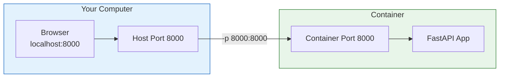
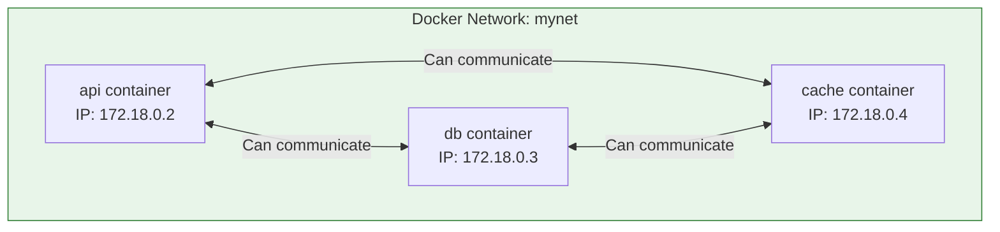
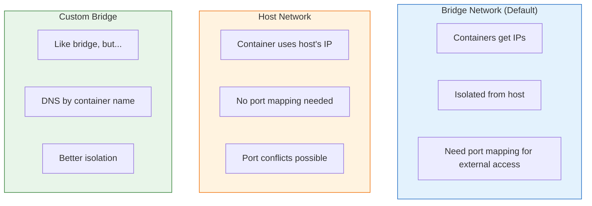
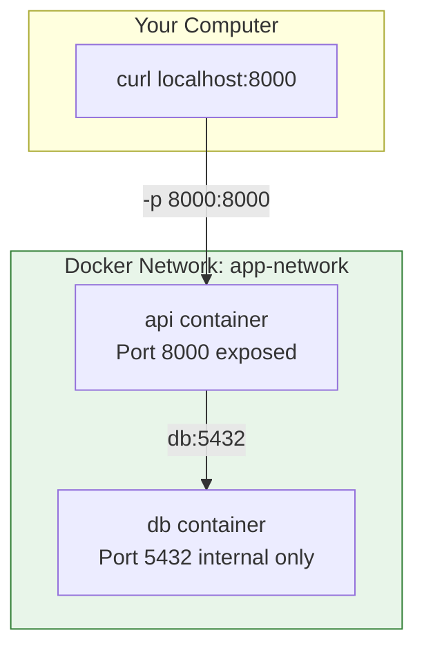

# Lesson 5.15: Ports & Networking

> **Duration**: 30 min | **Section**: D - Networking & Data

## 🎯 The Problem

Your container runs a web server on port 8000. You try to access `localhost:8000` from your browser—nothing works. How do you expose container ports to the host?

## 🔍 Port Mapping with -p

The `-p` flag maps host ports to container ports:

```bash
docker run -p HOST_PORT:CONTAINER_PORT image

# Example: Map host 8000 to container 8000
docker run -p 8000:8000 myapp
```



### Common Port Mappings

```bash
# Same port
docker run -p 8000:8000 myapp

# Different ports (host 80 → container 8000)
docker run -p 80:8000 myapp

# Bind to specific interface
docker run -p 127.0.0.1:8000:8000 myapp  # Only localhost

# Random host port
docker run -p 8000 myapp  # Docker picks an available port
docker port container_name  # See what port was assigned

# Multiple ports
docker run -p 8000:8000 -p 8001:8001 myapp
```

### Checking Port Mappings

```bash
# See exposed ports
docker ps
# PORTS column shows: 0.0.0.0:8000->8000/tcp

# Get detailed port info
docker port mycontainer
# 8000/tcp -> 0.0.0.0:8000
```

## 🔍 Container-to-Container Networking

Containers can't communicate by default. Docker networks enable this:



### Creating a Network

```bash
# Create a network
docker network create mynet

# Run containers on that network
docker run -d --name db --network mynet postgres:15
docker run -d --name api --network mynet myapp

# Containers can now reach each other by NAME!
# From api container: postgres://db:5432/mydb
```

### DNS Resolution

On a user-defined network, containers can reach each other by **name**:

```bash
# From api container
docker exec api ping db
# PING db (172.18.0.3): 56 data bytes
# Works!

# In your Python code
DATABASE_URL = "postgresql://user:pass@db:5432/mydb"
#                                      ^^
#                                      Container name as hostname!
```

### Network Types

```bash
# List networks
docker network ls

NETWORK ID     NAME      DRIVER    SCOPE
abc123         bridge    bridge    local   # Default network
def456         host      host      local   # Use host's network
789xyz         mynet     bridge    local   # Custom network
```

| Type | Description | Use Case |
|------|-------------|----------|
| **bridge** | Default, isolated network | Most containers |
| **host** | Container uses host's network directly | Performance-critical |
| **none** | No networking | Security-sensitive |
| **custom bridge** | User-defined, with DNS | Multi-container apps |



## 🧪 Complete Example

Let's run a Python API with PostgreSQL:

```bash
# 1. Create a network
docker network create app-network

# 2. Run PostgreSQL
docker run -d \
    --name db \
    --network app-network \
    -e POSTGRES_PASSWORD=secret \
    -e POSTGRES_DB=myapp \
    postgres:15

# 3. Run your API
docker run -d \
    --name api \
    --network app-network \
    -p 8000:8000 \
    -e DATABASE_URL=postgresql://postgres:secret@db:5432/myapp \
    myapp

# 4. Test
curl http://localhost:8000
```



## 🔍 Inspecting Networks

```bash
# List networks
docker network ls

# Inspect a network (see connected containers)
docker network inspect mynet

# See which network a container is on
docker inspect api --format '{{.NetworkSettings.Networks}}'
```

## 🧹 Network Cleanup

```bash
# Remove a network
docker network rm mynet

# Remove all unused networks
docker network prune
```

## 🎯 Practice

```bash
# 1. Create a network
docker network create practice-net

# 2. Run Redis on the network
docker run -d --name redis --network practice-net redis:7

# 3. Run a Python container on the same network
docker run -it --network practice-net python:3.11 bash

# Inside the Python container:
pip install redis
python
>>> import redis
>>> r = redis.Redis(host='redis', port=6379)  # Note: 'redis' is the container name!
>>> r.set('hello', 'world')
>>> r.get('hello')
b'world'

# 4. Cleanup
docker stop redis && docker rm redis
docker network rm practice-net
```

## 🔑 Key Takeaways

- **-p HOST:CONTAINER**: Expose container port to host
- **docker network create**: Create custom network
- **--network NAME**: Connect container to network
- **DNS by name**: Containers can reach each other by container name
- **Custom networks preferred**: Better isolation and DNS support

## ❓ Common Questions

| Question | Answer |
|----------|--------|
| Can I change ports after container starts? | No, you need to recreate the container |
| What if I forget -p? | Container runs but is inaccessible from host |
| Why use custom network over default bridge? | DNS resolution by name, better isolation |

## 📚 Further Reading

- [Docker networking overview](https://docs.docker.com/network/)
- [Bridge networks](https://docs.docker.com/network/bridge/)
- [docker network commands](https://docs.docker.com/engine/reference/commandline/network/)

---

**Next Lesson**: [5.16 Volumes & Persistence](./Lesson-05-16-Volumes-Persistence.md) - Data that survives container restarts
