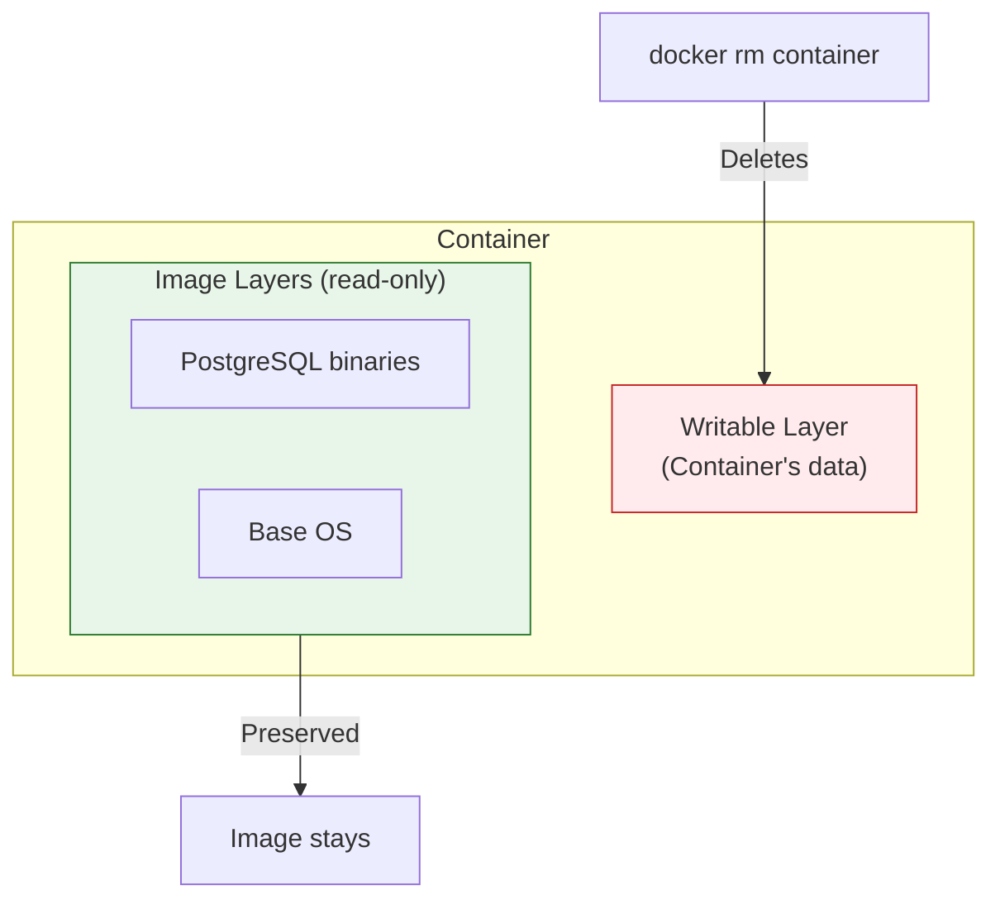
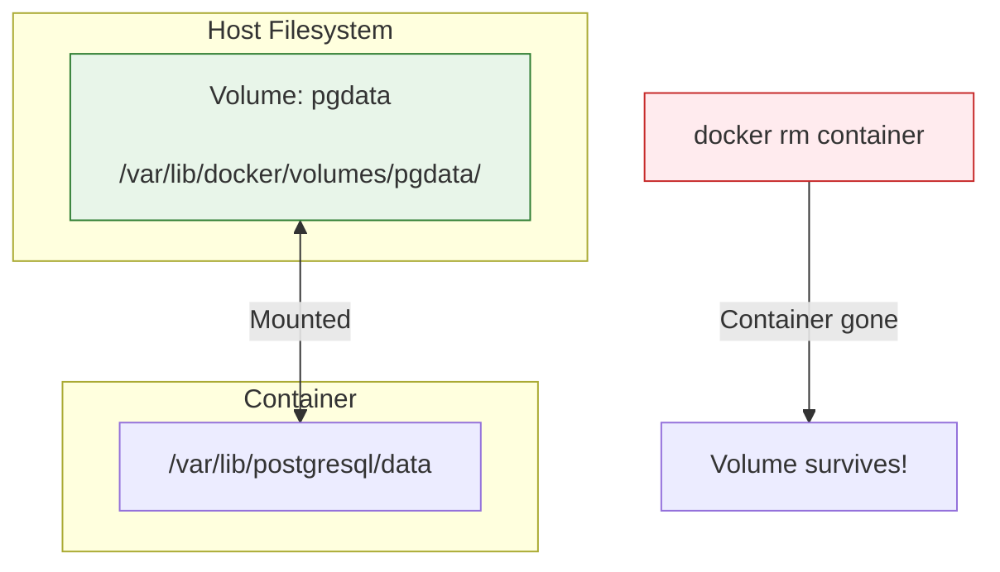
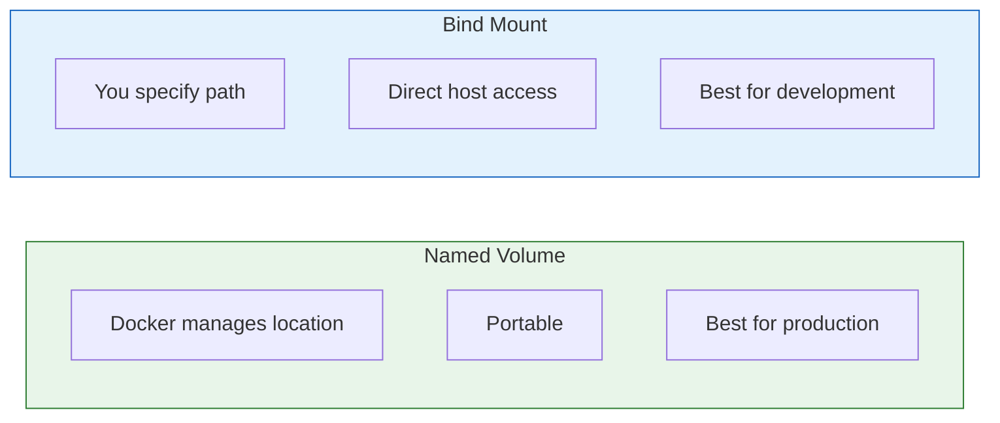
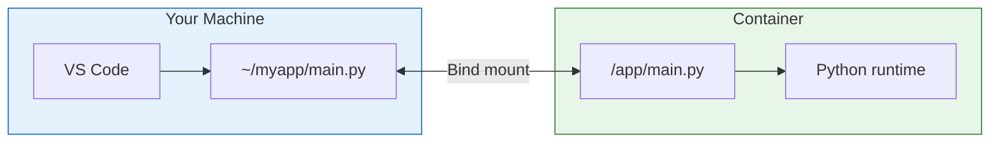

# Lesson 5.16: Volumes & Persistence

> **Duration**: 25 min | **Section**: D - Networking & Data

## 🎯 The Problem

Containers are ephemeral. When a container is removed, all data inside it is lost.

> **Scenario**: You run PostgreSQL in a container:
> 
> ```bash
> docker run -d --name db postgres:15
> # Insert 1000 users...
> docker rm -f db
> docker run -d --name db postgres:15
> # All users gone! 😱
> ```

## 🔍 Where Does Container Data Go?

Data written inside a container goes to its **writable layer**:



When container is removed, writable layer is deleted!

## 💡 The Solution: Volumes

Volumes store data **outside** the container:



## 📊 Two Types of Mounts

| Type | Command | Best For |
|------|---------|----------|
| **Named Volume** | `-v pgdata:/data` | Production data |
| **Bind Mount** | `-v /host/path:/container/path` | Development |



## 🧪 Named Volumes

Docker manages the storage location:

```bash
# Create a named volume
docker volume create pgdata

# Use it with a container
docker run -d \
    --name db \
    -v pgdata:/var/lib/postgresql/data \
    -e POSTGRES_PASSWORD=secret \
    postgres:15
```

```bash
# Volume persists after container removal
docker rm -f db

# Start new container with same volume
docker run -d \
    --name db \
    -v pgdata:/var/lib/postgresql/data \
    -e POSTGRES_PASSWORD=secret \
    postgres:15

# Data is still there!
```

### Managing Volumes

```bash
# List volumes
docker volume ls

# Inspect a volume
docker volume inspect pgdata
# Shows: Mountpoint, Created, Labels

# Remove a volume
docker volume rm pgdata

# Remove unused volumes
docker volume prune
```

## 🧪 Bind Mounts

Mount a specific host directory:

```bash
# Mount current directory into container
docker run -v $(pwd):/app python:3.11 python /app/main.py

# Mount with specific paths
docker run -v /home/user/config:/etc/myapp/config myapp
```

**Perfect for development** - edit code on host, run in container:

```bash
# Development workflow
docker run -v $(pwd):/app -w /app python:3.11 python main.py
# Edit main.py on your host
# Run again - changes reflected immediately!
```



### Bind Mount Options

```bash
# Read-only mount (container can't modify)
docker run -v $(pwd)/config:/app/config:ro myapp

# Note the :ro at the end
```

## 🔍 Volume vs Bind Mount: When to Use

| Use Case | Type | Example |
|----------|------|---------|
| Database data | Named Volume | `-v pgdata:/var/lib/postgresql/data` |
| App configuration | Named Volume | `-v config:/etc/myapp` |
| Development code | Bind Mount | `-v $(pwd):/app` |
| Log files | Either | Depends on access needs |

## 🧪 Complete Example: PostgreSQL with Persistent Data

```bash
# 1. Create volume
docker volume create postgres-data

# 2. Run PostgreSQL with volume
docker run -d \
    --name postgres \
    -v postgres-data:/var/lib/postgresql/data \
    -e POSTGRES_PASSWORD=secret \
    -e POSTGRES_DB=myapp \
    -p 5432:5432 \
    postgres:15

# 3. Create some data
docker exec -it postgres psql -U postgres -d myapp -c "
CREATE TABLE users (id SERIAL PRIMARY KEY, name TEXT);
INSERT INTO users (name) VALUES ('Alice'), ('Bob');
SELECT * FROM users;
"

# 4. Kill and remove the container
docker rm -f postgres

# 5. Start a new container with the same volume
docker run -d \
    --name postgres \
    -v postgres-data:/var/lib/postgresql/data \
    -e POSTGRES_PASSWORD=secret \
    -p 5432:5432 \
    postgres:15

# 6. Data survives!
docker exec -it postgres psql -U postgres -d myapp -c "SELECT * FROM users;"
# id | name
# ----+-------
#   1 | Alice
#   2 | Bob
```

## 🧹 Volume Cleanup

```bash
# List volumes
docker volume ls

# Remove specific volume
docker volume rm postgres-data

# Remove all unused volumes (careful!)
docker volume prune

# See volume size
docker system df -v | grep -A 20 "VOLUME NAME"
```

## 🎯 Practice

```bash
# 1. Create a volume
docker volume create test-data

# 2. Write data to it
docker run --rm -v test-data:/data alpine sh -c "echo 'Hello Volumes!' > /data/greeting.txt"

# 3. Read from another container
docker run --rm -v test-data:/data alpine cat /data/greeting.txt
# Hello Volumes!

# 4. Container is gone, but data persists
docker run --rm -v test-data:/data alpine cat /data/greeting.txt
# Still there!

# 5. Cleanup
docker volume rm test-data
```

## 🔑 Key Takeaways

- **Container data is ephemeral**: Removed with container
- **Named volumes**: Docker-managed, persist data
- **Bind mounts**: Map host directory to container
- **Use volumes for databases**: Data survives restarts/upgrades
- **Use bind mounts for development**: Edit locally, run in container

## ❓ Common Questions

| Question | Answer |
|----------|--------|
| Where are volumes stored? | `/var/lib/docker/volumes/` on Linux |
| Can I backup a volume? | Yes, mount it to another container and tar it |
| Can multiple containers share a volume? | Yes, but be careful with write conflicts |

## 📚 Further Reading

- [Docker volumes](https://docs.docker.com/storage/volumes/)
- [Bind mounts](https://docs.docker.com/storage/bind-mounts/)
- [Storage overview](https://docs.docker.com/storage/)

---

**Next Lesson**: [5.17 Environment Variables](./Lesson-05-17-Environment-Variables.md) - Configuration without hardcoding
