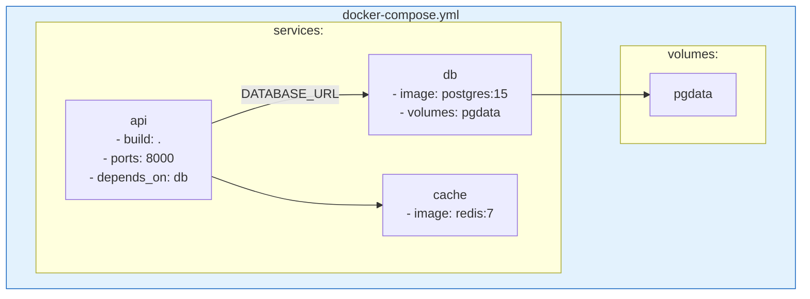
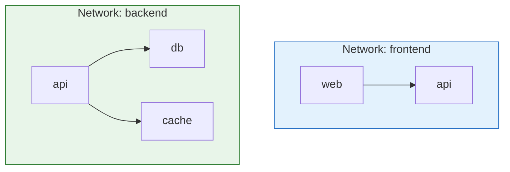
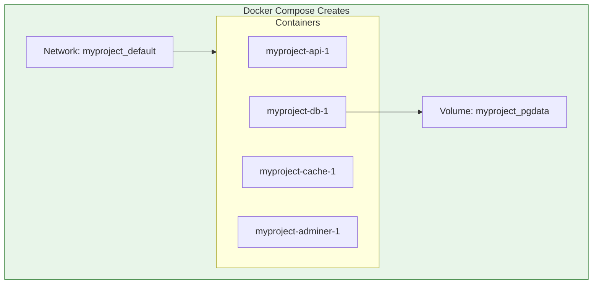

# Lesson 5.19: Docker Compose Under the Hood

> **Duration**: 35 min | **Section**: E - Docker Compose

## 🎯 The Problem

You need to define and run multi-container applications. Docker Compose uses a YAML file to configure all your services. Let's master it.

## 🔍 The docker-compose.yml File

```yaml
# docker-compose.yml

# Optional version (deprecated in newer Docker)
# version: "3.8"

services:
  # Service 1: Your API
  api:
    build: .
    ports:
      - "8000:8000"
    environment:
      - DATABASE_URL=postgresql://postgres:secret@db:5432/myapp
    depends_on:
      - db
    volumes:
      - ./src:/app/src  # Development: mount code

  # Service 2: PostgreSQL
  db:
    image: postgres:15
    environment:
      - POSTGRES_PASSWORD=secret
      - POSTGRES_DB=myapp
    volumes:
      - pgdata:/var/lib/postgresql/data
    ports:
      - "5432:5432"

  # Service 3: Redis
  cache:
    image: redis:7-alpine

# Named volumes
volumes:
  pgdata:
```



## 📖 Compose File Reference

### services: Your Containers

Each service becomes a container:

```yaml
services:
  # Service name (becomes container name prefix)
  myservice:
    # ... configuration ...
```

### image: vs build:

```yaml
services:
  # Use existing image from registry
  db:
    image: postgres:15

  # Build from Dockerfile
  api:
    build: .
    # or with more options:
    build:
      context: .
      dockerfile: Dockerfile.prod
      args:
        - APP_ENV=production
```

### ports: Expose to Host

```yaml
services:
  api:
    ports:
      - "8000:8000"      # HOST:CONTAINER
      - "8001:8001"
      - "127.0.0.1:9000:9000"  # Bind to localhost only
```

### environment: Configuration

```yaml
services:
  api:
    environment:
      # List format
      - DATABASE_URL=postgresql://db:5432/app
      - DEBUG=true
      
    # OR map format
    environment:
      DATABASE_URL: postgresql://db:5432/app
      DEBUG: "true"

  # From file
  api:
    env_file:
      - .env
      - .env.local
```

### volumes: Persistent Data

```yaml
services:
  db:
    volumes:
      # Named volume
      - pgdata:/var/lib/postgresql/data
      
      # Bind mount
      - ./init.sql:/docker-entrypoint-initdb.d/init.sql
      
      # Read-only mount
      - ./config:/app/config:ro

# Define named volumes at bottom
volumes:
  pgdata:
```

### depends_on: Startup Order

```yaml
services:
  api:
    depends_on:
      - db
      - cache
    # API starts after db and cache

  db:
    image: postgres:15
```

**Note**: `depends_on` only waits for container to start, not for service to be ready!

For true readiness, use healthchecks:

```yaml
services:
  api:
    depends_on:
      db:
        condition: service_healthy

  db:
    image: postgres:15
    healthcheck:
      test: ["CMD-SHELL", "pg_isready -U postgres"]
      interval: 5s
      timeout: 5s
      retries: 5
```

### networks: Custom Networking

```yaml
services:
  api:
    networks:
      - frontend
      - backend

  db:
    networks:
      - backend  # Not accessible from frontend!

networks:
  frontend:
  backend:
```



## 🧪 Complete Example: Python API + PostgreSQL + Redis

```yaml
# docker-compose.yml
services:
  api:
    build: 
      context: .
      dockerfile: Dockerfile
    ports:
      - "8000:8000"
    environment:
      - DATABASE_URL=postgresql://postgres:secret@db:5432/myapp
      - REDIS_URL=redis://cache:6379
      - DEBUG=true
    depends_on:
      db:
        condition: service_healthy
      cache:
        condition: service_started
    volumes:
      - ./app:/app/app  # Development: hot reload
    command: uvicorn app.main:app --host 0.0.0.0 --port 8000 --reload

  db:
    image: postgres:15
    environment:
      POSTGRES_USER: postgres
      POSTGRES_PASSWORD: secret
      POSTGRES_DB: myapp
    volumes:
      - pgdata:/var/lib/postgresql/data
      - ./init.sql:/docker-entrypoint-initdb.d/init.sql
    ports:
      - "5432:5432"
    healthcheck:
      test: ["CMD-SHELL", "pg_isready -U postgres"]
      interval: 5s
      timeout: 5s
      retries: 5

  cache:
    image: redis:7-alpine
    ports:
      - "6379:6379"

  # Optional: Database admin UI
  adminer:
    image: adminer
    ports:
      - "8080:8080"
    depends_on:
      - db

volumes:
  pgdata:
```

Project structure:
```
myproject/
├── docker-compose.yml
├── Dockerfile
├── requirements.txt
├── init.sql
└── app/
    └── main.py
```

## 🔍 What Compose Creates

When you run `docker compose up`:



- **Network**: `<project>_default` (auto-created)
- **Containers**: `<project>-<service>-<number>`
- **Volumes**: `<project>_<volume>`

## 🎯 Practice

Create a simple compose file:

```yaml
# docker-compose.yml
services:
  web:
    image: nginx:alpine
    ports:
      - "80:80"
    volumes:
      - ./html:/usr/share/nginx/html:ro
    depends_on:
      - api

  api:
    image: python:3.11-slim
    command: python -m http.server 8000
    working_dir: /app
    volumes:
      - ./api:/app
```

```bash
# Create the directories
mkdir -p html api

# Add content
echo "<h1>Hello from Nginx!</h1>" > html/index.html
echo "print('Hello from Python!')" > api/app.py

# Start
docker compose up -d

# Test
curl http://localhost
curl http://localhost:8000

# Stop
docker compose down
```

## 🔑 Key Takeaways

- **docker-compose.yml**: Define all services in one file
- **services**: Each service = one container
- **build/image**: Build from Dockerfile or use existing image
- **ports, volumes, environment**: Same as docker run flags
- **depends_on**: Control startup order
- **networks**: Isolate service groups
- **Compose creates**: Network, containers, volumes with project prefix

## ❓ Common Questions

| Question | Answer |
|----------|--------|
| Where should docker-compose.yml go? | Project root directory |
| What's the project name? | Directory name by default, or `-p` flag |
| Can I have multiple compose files? | Yes, use `-f file1.yml -f file2.yml` |

## 📚 Further Reading

- [Compose file reference](https://docs.docker.com/compose/compose-file/)
- [Compose specification](https://docs.docker.com/compose/compose-file/compose-file-v3/)

---

**Next Lesson**: [5.20 Compose Commands](./Lesson-05-20-Compose-Commands.md) - Managing your stack
