# Lesson 5.20: Compose Commands

> **Duration**: 25 min | **Section**: E - Docker Compose

## 🎯 The Problem

You have a `docker-compose.yml`. Now how do you start, stop, debug, and manage your services?

## 🔍 Essential Commands


## 🧪 Starting Services

### docker compose up

```bash
# Start all services (attached - see logs)
docker compose up

# Start in background (detached)
docker compose up -d

# Start specific services
docker compose up -d api db

# Rebuild images before starting
docker compose up -d --build

# Force recreate containers (even if unchanged)
docker compose up -d --force-recreate

# Remove orphan containers (from old compose file)
docker compose up -d --remove-orphans
```

### What Happens on `up`?


## 🧪 Stopping Services

### docker compose down

```bash
# Stop and remove containers, networks
docker compose down

# Also remove volumes (careful - data loss!)
docker compose down -v

# Also remove images
docker compose down --rmi all
```



```mermaid
flowchart LR
    subgraph DOWN["docker compose down"]
        D1["Stops containers"]
        D2["Removes containers"]
        D3["Removes networks"]
    end
    
    subgraph DOWN_V["docker compose down -v"]
        V1["All of the above"]
        V2["+ Removes volumes
        ⚠️ Data deleted!"]
    end
    
    style DOWN fill:#FFF3E0,stroke:#EF6C00
    style DOWN_V fill:#FFEBEE,stroke:#C62828
```

### docker compose stop (without remove)

```bash
# Stop containers but keep them
docker compose stop

# Stop specific service
docker compose stop api

# Later, start them again
docker compose start
```

## 🔍 Viewing Status

### docker compose ps

```bash
docker compose ps

NAME                 SERVICE   STATUS    PORTS
myproject-api-1      api       running   0.0.0.0:8000->8000/tcp
myproject-db-1       db        running   0.0.0.0:5432->5432/tcp
myproject-cache-1    cache     running   
```

```bash
# Include stopped services
docker compose ps -a

# Just service names
docker compose ps --services
```

### docker compose logs

```bash
# All service logs
docker compose logs

# Follow logs (like tail -f)
docker compose logs -f

# Specific service
docker compose logs api

# Last N lines
docker compose logs --tail 100

# With timestamps
docker compose logs -t

# Common pattern: follow one service
docker compose logs -f api
```

## 🧪 Running Commands

### docker compose exec

Run command in **running** container:

```bash
# Get a shell
docker compose exec api bash

# Run Python
docker compose exec api python

# Run database commands
docker compose exec db psql -U postgres

# Run as different user
docker compose exec --user root api bash
```

### docker compose run

Run **one-off** command (creates new container):

```bash
# Run migrations
docker compose run api alembic upgrade head

# Run tests
docker compose run api pytest

# Run with different command
docker compose run api python manage.py shell

# Don't create dependency containers
docker compose run --no-deps api python --version
```


## 🧪 Building and Pulling

### docker compose build

```bash
# Build all services with build: config
docker compose build

# Build specific service
docker compose build api

# Build with no cache
docker compose build --no-cache

# Build and start
docker compose up -d --build
```

### docker compose pull

```bash
# Pull latest images
docker compose pull

# Pull specific service
docker compose pull db
```

## 🔍 Other Useful Commands

### docker compose config

Validate and view merged config:

```bash
# Validate compose file
docker compose config

# Show resolved compose file
docker compose config --format yaml
```

### docker compose top

Show running processes:

```bash
docker compose top

myproject-api-1
UID    PID    PPID   C   TIME     CMD
root   1234   1233   0   10:00    python main.py

myproject-db-1
UID    PID    PPID   C   TIME     CMD
999    5678   5677   0   10:00    postgres
```

### docker compose images

List images used:

```bash
docker compose images

CONTAINER           REPOSITORY   TAG      IMAGE ID       SIZE
myproject-api-1     myproject    latest   abc123         200MB
myproject-db-1      postgres     15       def456         380MB
```

## 📊 Command Quick Reference

| Command | Purpose |
|---------|---------|
| `up -d` | Start services in background |
| `down` | Stop and remove |
| `down -v` | Stop, remove, delete volumes |
| `ps` | List running services |
| `logs -f` | Follow logs |
| `exec SERVICE CMD` | Run in running container |
| `run SERVICE CMD` | Run one-off command |
| `build` | Rebuild images |
| `restart` | Restart services |

## 🎯 Practice

```bash
# 1. Start stack
docker compose up -d

# 2. Check status
docker compose ps

# 3. View logs
docker compose logs -f

# 4. Run a command in API container
docker compose exec api python --version

# 5. Run one-off command
docker compose run --rm api python -c "print('Hello!')"

# 6. Restart a service
docker compose restart api

# 7. Stop one service
docker compose stop cache

# 8. View what's still running
docker compose ps

# 9. Bring everything down
docker compose down

# 10. Verify everything is gone
docker compose ps -a
```

## 🔑 Key Takeaways

- **up -d**: Start services detached
- **down**: Stop and remove everything
- **logs -f**: Follow service logs
- **exec**: Run in running container
- **run**: Create new container for one-off command
- **build**: Rebuild images
- **Always use -d**: Unless you want to see all logs

## ❓ Common Questions

| Question | Answer |
|----------|--------|
| How to restart just one service? | `docker compose restart api` |
| How to see only API logs? | `docker compose logs -f api` |
| Run command without dependencies? | `docker compose run --no-deps api python` |

## 📚 Further Reading

- [docker compose CLI reference](https://docs.docker.com/compose/reference/)
- [docker compose up](https://docs.docker.com/engine/reference/commandline/compose_up/)
- [docker compose down](https://docs.docker.com/engine/reference/commandline/compose_down/)

---

**Next Lesson**: [5.21 Docker Q&A](./Lesson-05-21-Docker-QA.md) - Production tips and common patterns
