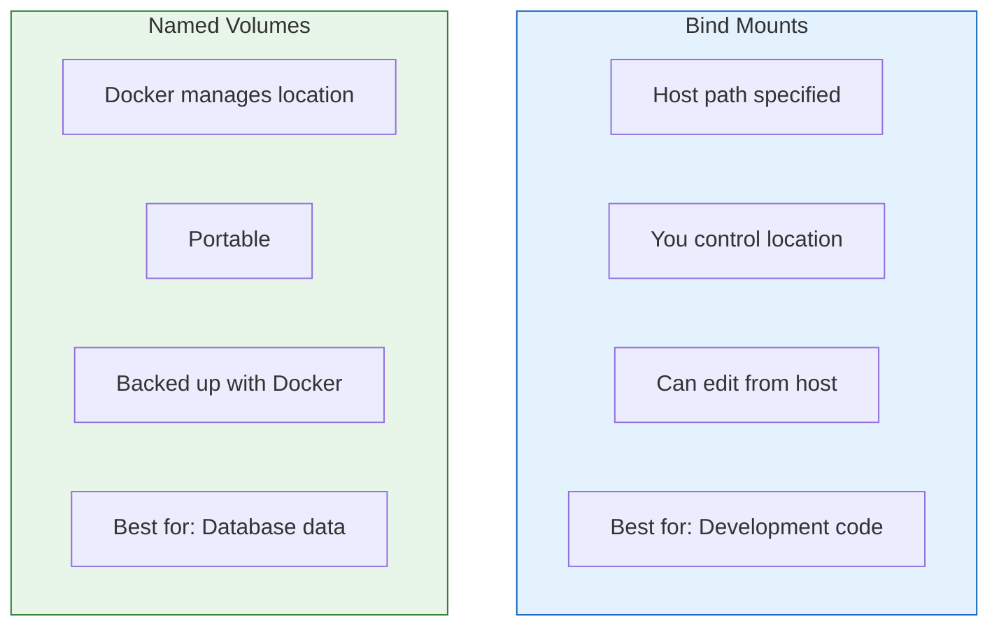
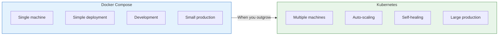

# Lesson 5.21: Docker Q&A

> **Duration**: 10 min | **Section**: E - Docker Compose

## 🎯 Section E Wrap-up

You've learned Docker Compose:
- Multi-service definition in YAML
- Service configuration options
- All essential commands

Let's answer common questions about production use and patterns.

## ❓ Common Questions

### Q1: "Development vs Production Compose files?"

Use multiple compose files:

```yaml
# docker-compose.yml (base)
services:
  api:
    build: .
    environment:
      - DATABASE_URL=postgresql://db:5432/app

  db:
    image: postgres:15
    volumes:
      - pgdata:/var/lib/postgresql/data

volumes:
  pgdata:
```

```yaml
# docker-compose.override.yml (dev - auto-loaded)
services:
  api:
    volumes:
      - ./app:/app/app  # Hot reload
    command: uvicorn app.main:app --reload --host 0.0.0.0
    environment:
      - DEBUG=true

  db:
    ports:
      - "5432:5432"  # Expose for local tools
```

```yaml
# docker-compose.prod.yml (production)
services:
  api:
    environment:
      - DEBUG=false
    deploy:
      replicas: 3
      resources:
        limits:
          memory: 512M
```

```bash
# Development (uses base + override automatically)
docker compose up -d

# Production (explicit files)
docker compose -f docker-compose.yml -f docker-compose.prod.yml up -d
```

---

### Q2: "How do I use Docker in CI/CD?"

```yaml
# .github/workflows/docker.yml
name: Docker Build

on: push

jobs:
  build:
    runs-on: ubuntu-latest
    steps:
      - uses: actions/checkout@v4
      
      - name: Build and test
        run: |
          docker compose build
          docker compose run --rm api pytest
          
      - name: Push to registry
        if: github.ref == 'refs/heads/main'
        run: |
          docker login -u ${{ secrets.DOCKER_USER }} -p ${{ secrets.DOCKER_TOKEN }}
          docker compose push
```

---

### Q3: "How do I wait for database to be ready?"

`depends_on` alone isn't enough—use healthchecks:

```yaml
services:
  api:
    depends_on:
      db:
        condition: service_healthy

  db:
    image: postgres:15
    healthcheck:
      test: ["CMD-SHELL", "pg_isready -U postgres"]
      interval: 5s
      timeout: 5s
      retries: 5
      start_period: 10s
```

Or use a wait script:

```dockerfile
# In Dockerfile
COPY wait-for-it.sh /wait-for-it.sh
RUN chmod +x /wait-for-it.sh

CMD ["/wait-for-it.sh", "db:5432", "--", "uvicorn", "main:app"]
```

---

### Q4: "Bind mounts vs Named volumes?"



```yaml
services:
  api:
    volumes:
      # Bind mount for code (development)
      - ./app:/app/app

  db:
    volumes:
      # Named volume for data (production)
      - pgdata:/var/lib/postgresql/data

volumes:
  pgdata:  # Named volume definition
```

---

### Q5: "How do I backup database volumes?"

```bash
# Create backup
docker compose exec db pg_dump -U postgres mydb > backup.sql

# Or with compression
docker compose exec db pg_dump -U postgres mydb | gzip > backup.sql.gz

# Restore
docker compose exec -T db psql -U postgres mydb < backup.sql
```

Or backup the volume directly:

```bash
# Backup volume to tar
docker run --rm \
    -v myproject_pgdata:/data \
    -v $(pwd):/backup \
    alpine tar czf /backup/pgdata-backup.tar.gz /data

# Restore
docker run --rm \
    -v myproject_pgdata:/data \
    -v $(pwd):/backup \
    alpine tar xzf /backup/pgdata-backup.tar.gz -C /
```

---

### Q6: "Docker Compose vs Kubernetes?"



| Aspect | Docker Compose | Kubernetes |
|--------|----------------|------------|
| Complexity | Simple | Complex |
| Scale | Single host | Cluster |
| Learning curve | Hours | Weeks |
| Use when | Dev, small prod | Large prod |

---

## 🧠 Mental Model Check

| Question | Your Answer |
|----------|-------------|
| What does `docker compose up -d` do? | |
| How do you see logs for one service? | |
| Difference between `exec` and `run`? | |
| How to wait for database to be ready? | |
| When to use named volumes vs bind mounts? | |

## � Common Pitfalls

| Pitfall | Why It Happens | Fix |
|---------|---------------|-----|
| Using `depends_on` alone for database waits | Only waits for container start, not service readiness | Add healthchecks with `condition: service_healthy` |
| Bind mounts for database data | Data tied to host path, not portable | Use named volumes for persistent data |
| Not using `.env` file | Hardcoding environment variables in compose file | Create `.env` file, reference with `${VARIABLE}` |
| Running `docker compose down -v` carelessly | The `-v` flag deletes volumes and all data | Only use `-v` when you want to reset data |
| Same compose file for dev and prod | Dev needs hot reload, prod needs optimization | Use override files: `docker-compose.override.yml` for dev |
| Not backing up volumes before updates | Volume data lost if something goes wrong | Use `pg_dump` or volume tar backup before major changes |

## 🔑 Key Takeaways

1. **Use override files** - Base config in `docker-compose.yml`, dev overrides in `docker-compose.override.yml`
2. **Healthchecks are essential** - `depends_on` alone doesn't ensure service readiness
3. **Named volumes for data** - Bind mounts for code (dev), named volumes for databases
4. **Backup before changes** - Use `pg_dump` or volume tar backups regularly
5. **Compose is for single-host** - When you need multi-host, auto-scaling, consider Kubernetes

---

✅ **Section E Complete!** You've mastered Docker Compose for multi-container applications.

---

## �🔑 Section E Summary


**You now understand:**
- ✅ Why multi-container apps need Compose
- ✅ How to write docker-compose.yml
- ✅ All essential Compose commands
- ✅ Dev vs production patterns
- ✅ Database healthchecks and backups

---

**Next Lesson**: [5.22 Module Review](./Lesson-05-22-Module-Review.md) - Complete Docker mental model
