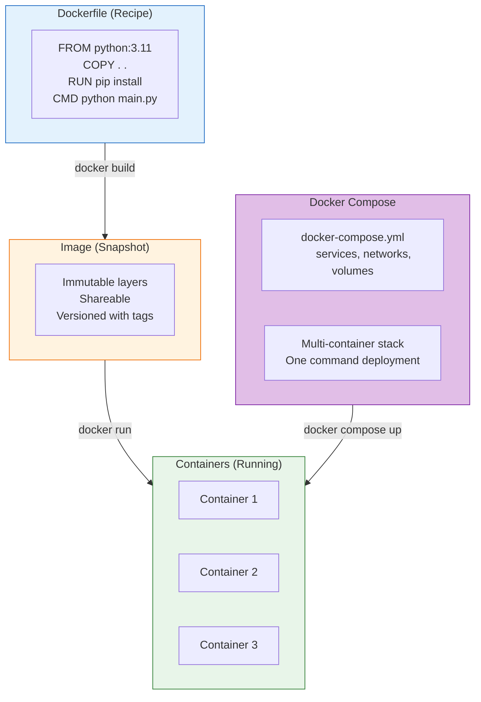

# Lesson 5.22: Module 5 Review

> **Duration**: 15 min | **Section**: Module Review

## 🎯 Module 5 Complete!

You've mastered Docker—from understanding why containers exist to orchestrating multi-container applications with Compose.

## 🧠 The Complete Mental Model



## 📚 What You Learned

### Section A: What IS Docker?

| Lesson | Key Concept |
|--------|-------------|
| 5.0 | **Works on My Machine** - Environment inconsistency problem |
| 5.1 | **Containers vs VMs** - Shared kernel, lightweight processes |
| 5.2 | **Under the Hood** - Images, layers, containers |
| 5.3 | **Installing Docker** - Docker Desktop vs Engine |
| 5.4 | **Running Containers** - docker run, -it, -d |
| 5.5 | **Q&A** - Registries, tags, cleanup |

### Section B: Working with Containers

| Lesson | Key Concept |
|--------|-------------|
| 5.6 | **Lifecycle** - Create, start, stop, remove |
| 5.7 | **Interactive** - exec vs run, debugging |
| 5.8 | **Images** - Pull, list, Docker Hub |

### Section C: Building Images

| Lesson | Key Concept |
|--------|-------------|
| 5.9 | **Custom Image Problem** - Packaging your code |
| 5.10 | **Dockerfile** - FROM, COPY, RUN, CMD |
| 5.11 | **Building** - docker build, layer caching |
| 5.12 | **Optimization** - Multi-stage, slim images |
| 5.13 | **Q&A** - ENTRYPOINT vs CMD, best practices |

### Section D: Networking & Data

| Lesson | Key Concept |
|--------|-------------|
| 5.14 | **Connection Problem** - Isolated by default |
| 5.15 | **Ports & Networking** - -p mapping, custom networks |
| 5.16 | **Volumes** - Data persistence |
| 5.17 | **Environment Variables** - Runtime configuration |

### Section E: Docker Compose

| Lesson | Key Concept |
|--------|-------------|
| 5.18 | **Multi-Service Problem** - Manual management nightmare |
| 5.19 | **Compose Under the Hood** - YAML file structure |
| 5.20 | **Compose Commands** - up, down, logs, exec |
| 5.21 | **Q&A** - Dev vs prod, CI/CD patterns |

## ✅ Independence Check

Can you do these WITHOUT looking anything up?

### Know (Definitions)

| Question | ✓ |
|----------|---|
| What's the difference between an image and a container? | |
| What are layers in a Docker image? | |
| What does -p 8000:80 mean? | |
| What's a named volume? | |
| What does depends_on do in Compose? | |

### Understand (Concepts)

| Question | ✓ |
|----------|---|
| Why are containers smaller than VMs? | |
| Why does Dockerfile instruction order matter? | |
| Why use multi-stage builds? | |
| How do containers on a custom network communicate? | |
| Why use volumes for database data? | |

### Apply (Skills)

| Task | ✓ |
|------|---|
| Write a Dockerfile for a Python app | |
| Build and tag an image | |
| Create docker-compose.yml for multi-service app | |
| Debug a container that exits immediately | |
| Connect to a database in another container | |

### Analyze (Debugging)

| Question | ✓ |
|----------|---|
| Container exits immediately - how to debug? | |
| Can't connect to container port - what to check? | |
| Build is slow every time - what's wrong? | |
| Container can't reach database - why? | |

### Create (Projects)

| Task | ✓ |
|------|---|
| Containerize an existing Python project | |
| Set up dev environment with hot reload | |
| Create production-ready docker-compose.yml | |
| Implement health checks for services | |

## 🎯 Module Project

**Containerize a Python API with PostgreSQL:**

**Dockerfile:**
```dockerfile
FROM python:3.11-slim

WORKDIR /app

ENV PYTHONDONTWRITEBYTECODE=1
ENV PYTHONUNBUFFERED=1

COPY requirements.txt .
RUN pip install --no-cache-dir -r requirements.txt

COPY . .

EXPOSE 8000

CMD ["uvicorn", "main:app", "--host", "0.0.0.0", "--port", "8000"]
```

**docker-compose.yml:**
```yaml
services:
  api:
    build: .
    ports:
      - "8000:8000"
    environment:
      - DATABASE_URL=postgresql://postgres:secret@db:5432/myapp
    depends_on:
      db:
        condition: service_healthy
    volumes:
      - ./app:/app/app

  db:
    image: postgres:15
    environment:
      POSTGRES_PASSWORD: secret
      POSTGRES_DB: myapp
    volumes:
      - pgdata:/var/lib/postgresql/data
    healthcheck:
      test: ["CMD-SHELL", "pg_isready -U postgres"]
      interval: 5s
      timeout: 5s
      retries: 5

volumes:
  pgdata:
```

## 🔗 Quick Reference

### Essential Commands

```bash
# Images
docker build -t myapp:1.0 .
docker images
docker pull python:3.11
docker rmi myapp:1.0

# Containers
docker run -d -p 8000:8000 --name api myapp
docker ps
docker logs -f api
docker exec -it api bash
docker stop api && docker rm api

# Compose
docker compose up -d
docker compose down
docker compose logs -f api
docker compose exec api bash
docker compose run api pytest

# Cleanup
docker system prune -a
docker volume prune
```

### Dockerfile Template

```dockerfile
FROM python:3.11-slim
WORKDIR /app
COPY requirements.txt .
RUN pip install --no-cache-dir -r requirements.txt
COPY . .
EXPOSE 8000
CMD ["python", "main.py"]
```

### docker-compose.yml Template

```yaml
services:
  api:
    build: .
    ports:
      - "8000:8000"
    environment:
      - DATABASE_URL=postgresql://db:5432/app
    depends_on:
      - db

  db:
    image: postgres:15
    environment:
      POSTGRES_PASSWORD: secret
    volumes:
      - pgdata:/var/lib/postgresql/data

volumes:
  pgdata:
```

## 🔗 Next Module

You now have containerization mastered. But how do you:
- Build REST APIs that talk to your database?
- Validate request/response data?
- Handle authentication?

→ [Module 6: FastAPI & Pydantic](../Module-06-FastAPI/) - Building production APIs

## 🔗 References

- [Docker Documentation](https://docs.docker.com/)
- [Dockerfile Reference](https://docs.docker.com/engine/reference/builder/)
- [Docker Compose Reference](https://docs.docker.com/compose/compose-file/)
- [Docker Hub](https://hub.docker.com/)
- [Docker Best Practices](https://docs.docker.com/develop/develop-images/dockerfile_best-practices/)
- [Play with Docker](https://www.docker.com/play-with-docker/)
