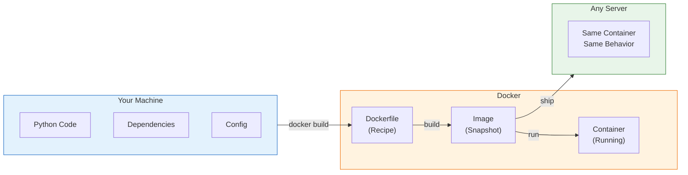

# Module 5: Docker

> **Duration**: 1 Week | **Lessons**: 23

## 🎯 Module Overview

Docker solves the "works on my machine" problem by packaging your application with all its dependencies into a portable container. Instead of saying "install Python 3.11, then pip install these packages, then set these environment variables," you say "run this container." Same result, everywhere, every time.

## 🧠 Mental Model

## 📋 Prerequisites

- Linux command line basics (Module 1)
- Python project structure (Module 3)
- PostgreSQL fundamentals (Module 4)
- Understanding of environment variables

## 🗂️ Module Structure

| Section | Lessons | Focus |
|---------|:-------:|-------|
| The Problem | 5.0 | Why containerization exists |
| A: What IS Docker? | 5.1 - 5.5 | Containers, images, basic commands |
| B: Working with Containers | 5.6 - 5.8 | Lifecycle, interactive mode, images |
| C: Building Images | 5.9 - 5.13 | Dockerfiles, building, optimization |
| D: Networking & Data | 5.14 - 5.17 | Ports, volumes, environment variables |
| E: Docker Compose | 5.18 - 5.22 | Multi-container applications |

## 📚 Lessons

### The Problem

| # | Lesson | Duration | What We're Solving |
|:-:|--------|:--------:|-------------------|
| 5.0 | The "Works on My Machine" Problem | 10 min | Why your code crashes on other machines |

### Section A: What IS Docker?

| # | Lesson | Duration | What We're Solving |
|:-:|--------|:--------:|-------------------|
| 5.1 | Containers vs VMs | 25 min | Full OS virtualization vs isolated processes |
| 5.2 | Docker Under the Hood | 30 min | Images, containers, and layers explained |
| 5.3 | Installing Docker | 15 min | Docker Desktop, daemon, verification |
| 5.4 | Running Containers | 20 min | `docker run hello-world` - what happens? |
| 5.5 | Docker Basics Q&A | 10 min | Registries, storage, common questions |

### Section B: Working with Containers

| # | Lesson | Duration | What We're Solving |
|:-:|--------|:--------:|-------------------|
| 5.6 | Container Lifecycle | 25 min | Run, stop, start, remove - states explained |
| 5.7 | Interactive Containers | 20 min | Getting a shell inside containers |
| 5.8 | Images: Pull & List | 20 min | Docker Hub, pre-built images |

### Section C: Building Your Own Images

| # | Lesson | Duration | What We're Solving |
|:-:|--------|:--------:|-------------------|
| 5.9 | The Custom Image Problem | 5 min | Why you need YOUR own images |
| 5.10 | Dockerfile Under the Hood | 35 min | FROM, COPY, RUN, CMD explained |
| 5.11 | Building Images | 25 min | `docker build` and watching layers |
| 5.12 | Optimizing Dockerfiles | 30 min | Multi-stage builds, caching, .dockerignore |
| 5.13 | Dockerfile Q&A | 10 min | ENTRYPOINT vs CMD, slim images |

### Section D: Networking & Data

| # | Lesson | Duration | What We're Solving |
|:-:|--------|:--------:|-------------------|
| 5.14 | The Connection Problem | 5 min | How containers talk to each other and the world |
| 5.15 | Ports & Networking | 30 min | Port mapping, container networks |
| 5.16 | Volumes & Persistence | 25 min | Data that survives container death |
| 5.17 | Environment Variables | 20 min | Configuration without hardcoding |

### Section E: Docker Compose

| # | Lesson | Duration | What We're Solving |
|:-:|--------|:--------:|-------------------|
| 5.18 | The Multi-Service Problem | 5 min | Managing multiple containers together |
| 5.19 | Docker Compose Under the Hood | 35 min | YAML configuration, services, networks |
| 5.20 | Compose Commands | 25 min | up, down, logs, exec - managing the stack |
| 5.21 | Docker Q&A | 10 min | Production vs dev, CI/CD integration |
| 5.22 | Module Review | 15 min | Complete Docker mental model |

## 🎯 Module Project

**Containerize your Python CLI tool:**
1. Write a Dockerfile for your Python application
2. Add PostgreSQL with docker-compose
3. Configure persistent volumes for database data
4. Set up environment variables for configuration
5. Verify data persists across container restarts

## ✅ Independence Check

After this module, you should be able to:

| Level | Question |
|-------|----------|
| **Know** | What's the difference between an image and a container? |
| **Understand** | Why does layer ordering in Dockerfiles matter for caching? |
| **Apply** | Can you write a Dockerfile from scratch for a Python app? |
| **Analyze** | How would you debug "container exited with code 1"? |
| **Create** | Can you design a docker-compose.yml for a multi-service app? |

## 🔗 Next Module

→ [Module 6: FastAPI & Pydantic](../Module-06-FastAPI/README.md)

## 🔗 References

- [Docker Official Documentation](https://docs.docker.com/)
- [Docker Hub](https://hub.docker.com/)
- [Dockerfile Best Practices](https://docs.docker.com/develop/develop-images/dockerfile_best-practices/)
- [Docker Compose Documentation](https://docs.docker.com/compose/)
- [Docker Python Guide](https://docs.docker.com/language/python/)
- [Play with Docker (Interactive Tutorial)](https://www.docker.com/play-with-docker/)
