# Lesson 6.0: The Communication Problem

> **Duration**: 10 min | **Section**: A - HTTP Under the Hood

## 🎯 The Problem (3-5 min)

You've built something amazing in Python. A sentiment analyzer. A chatbot. A recommendation engine. It works perfectly—when YOU run it on YOUR computer.

But here's the reality:
- Your **React frontend** is JavaScript
- Your **mobile app** is Swift or Kotlin
- Your **data science team** uses Jupyter notebooks
- Your **partner company** uses .NET

Python can't run in browsers. Swift can't import your Python modules. How do they use your amazing code?

> **Scenario**: You built an AI chat backend in Python. It's incredible. Now the frontend team (React), mobile team (Swift), and a partner company (unknown stack) all need to send messages to your AI and get responses. They can't run Python. Your Python can't run in their environments. What now?

## 🧪 Try It: The Naive Approach (5-10 min)

**Naive Idea #1**: "Just share the Python files!"

```python
# my_amazing_ai.py
def chat(message: str) -> str:
    # Your incredible AI logic
    return f"AI says: {message} received!"
```

Problems:
- React can't import `.py` files
- Swift can't run Python
- Partner needs Python installed, your dependencies, your version...
- Security? You're giving away your code!

**Naive Idea #2**: "Just use a database in the middle!"

```
React → writes to DB → Python reads → processes → writes to DB → React reads
```

Problems:
- Constant polling (inefficient)
- No real-time response
- Complex coordination
- Both need DB access (security nightmare)

**Naive Idea #3**: "Just rewrite everything in JavaScript!"

Problems:
- ML libraries are Python-first
- Months of rewriting
- Maintaining two codebases
- What about Swift? .NET? Do you rewrite for each?

## 🔍 Under the Hood: What We Really Need (5 min)

We need a **universal language** that:

1. ✅ Every language can speak (JavaScript, Swift, Python, .NET, Go...)
2. ✅ Works over the internet (no file sharing)
3. ✅ Has a clear contract ("send THIS, get THAT")
4. ✅ Keeps your code private (they call your code, don't see it)


This universal protocol exists. It's called **HTTP** (HyperText Transfer Protocol).

The pattern of using HTTP to expose your code's functionality is called an **API** (Application Programming Interface).

## 💥 The Revelation

Every time you:
- Load a webpage → HTTP
- Use a mobile app → HTTP (to its backend)
- Ask ChatGPT a question → HTTP
- See weather in your phone widget → HTTP

The entire internet runs on this pattern:

```
CLIENT sends REQUEST → SERVER processes → SERVER sends RESPONSE
```

Your Python code can become a **server** that:
1. Listens for HTTP requests
2. Runs your Python logic
3. Sends back HTTP responses

Then ANY language, ANY device, ANYWHERE can use your code—as long as they can speak HTTP (spoiler: they all can).

## ✅ What You'll Build in This Module

```mermaid
sequenceDiagram
    participant C as Any Client
    participant F as FastAPI Server
    participant AI as Your Python Logic
    
    C->>F: POST /api/chat {"message": "Hello"}
    F->>F: Validate input (Pydantic)
    F->>AI: chat("Hello")
    AI->>F: "AI says: Hello!"
    F->>C: 200 OK {"reply": "AI says: Hello!"}
    
    Note over C,AI: React, Swift, .NET—all use the SAME interface
```



By the end of this module, you'll:
- Understand HTTP deeply (not just use it)
- Validate incoming data with Pydantic
- Build production APIs with FastAPI
- Add authentication, error handling, streaming
- Connect to databases

## 🔑 Key Takeaways

- Your Python code is **trapped** on one machine until you expose it via HTTP
- **APIs** are contracts: "Send me THIS format, I'll give you THAT format"
- **HTTP** is the universal language every programming language speaks
- **FastAPI** makes building HTTP servers in Python fast and safe
- **Pydantic** ensures garbage data never reaches your logic

## ❓ Common Questions

| Question | Answer |
|----------|--------|
| "Can't I just use Flask?" | Yes! But FastAPI is faster, has automatic docs, and built-in validation |
| "Is HTTP only for web browsers?" | No—mobile apps, IoT devices, servers, CLIs all use HTTP |
| "Why not just use WebSockets?" | WebSockets are for real-time bidirectional. HTTP is simpler for request/response |
| "What about gRPC or GraphQL?" | Great alternatives! But REST over HTTP is most common and a great starting point |

## 📚 Further Reading

- [What is HTTP? - MDN Web Docs](https://developer.mozilla.org/en-US/docs/Web/HTTP/Overview)
- [What is an API? - AWS](https://aws.amazon.com/what-is/api/)
- [REST API Tutorial](https://restfulapi.net/)

---

**Next**: [Lesson 6.1: What IS an API?](./Lesson-01-What-IS-An-API.md) — We'll break down exactly what "API" means and why it's more than just "web stuff."
