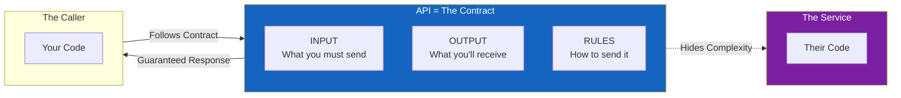
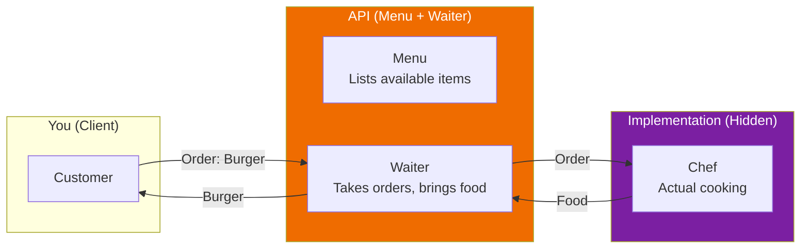
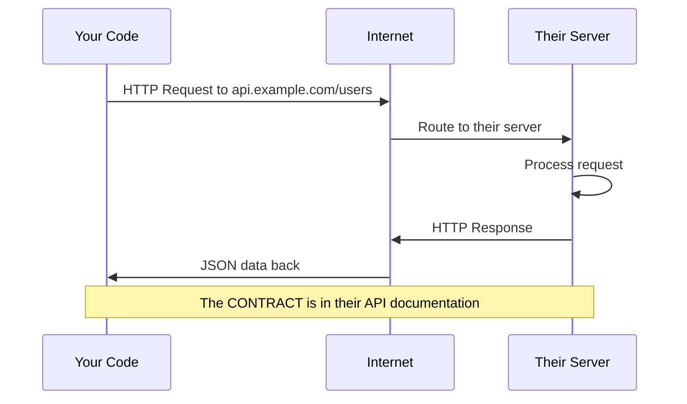

# Lesson 6.1: What IS an API?

> **Duration**: 20 min | **Section**: A - HTTP Under the Hood

## 🎯 The Problem (3-5 min)

Everyone throws around "API" like it's obvious. "We'll expose an API." "Just call the API." "Check the API docs."

But what *actually* IS an API? Is it:
- A URL?
- A server?
- Documentation?
- Code?

> **Scenario**: Your manager says "We need to provide an API for the mobile team." You nod confidently. But... what exactly are you supposed to build? A website? A function? A document describing something?

## 🧪 Try It: The Naive Understanding (5-10 min)

**Common misconceptions**:

1. **"An API is a URL"** — `api.example.com/users`
   - Partially true, but the URL is just an *address*
   
2. **"An API is a server"** — "Our API is running on port 8000"
   - The server *hosts* an API, but isn't the API itself
   
3. **"An API is JSON"** — `{"name": "Bob", "age": 25}`
   - JSON is a *format*, not an API

Let's trace what "API" really means by going back to basics.

## 🔍 Under the Hood (10-15 min)

### API = Application Programming Interface

Break it down:

| Word | Meaning |
|------|---------|
| **Application** | A piece of software (your Python code, a database, a service) |
| **Programming** | Code is talking to code (not humans clicking buttons) |
| **Interface** | The **contract** between two systems |

**An API is a CONTRACT.**

It says: "If you send me THIS, I'll give you THAT."



### The Restaurant Analogy

Think of a restaurant:



- **Menu** = The contract (what you can order, in what format)
- **Waiter** = The interface (takes requests, returns responses)
- **Kitchen** = The implementation (you don't see HOW the food is made)

You don't:
- Walk into the kitchen
- Tell the chef how to cook
- See the recipes

You just:
- Read the menu (the contract)
- Place an order (following the format)
- Get your food (the response)

### APIs Are EVERYWHERE

You use APIs constantly without realizing:

| When You... | You're Calling... |
|-------------|-------------------|
| `len("hello")` | Python's built-in API for sequences |
| `import pandas` | Pandas' API for data manipulation |
| `open("file.txt")` | OS file system API |
| `requests.get(url)` | HTTP library's API |
| Click "Login with Google" | Google's OAuth API |
| Ask ChatGPT | OpenAI's HTTP API |

### Web APIs: APIs Over HTTP

When people say "API" in web development, they usually mean:

**An API exposed over HTTP** — meaning you call it by sending HTTP requests to a URL.



**Example Contract (OpenAI API)**:

```
ENDPOINT: POST https://api.openai.com/v1/chat/completions

INPUT (what you must send):
- Header: Authorization: Bearer YOUR_API_KEY
- Body: {"model": "gpt-4", "messages": [...]}

OUTPUT (what you get back):
- Body: {"choices": [{"message": {"content": "..."}}]}

RULES:
- Must have valid API key
- Rate limited to X requests/minute
- Messages must be array of {role, content}
```

If you follow the contract, it works. If you don't, you get an error.

## 💥 Where It Breaks (3-5 min)

APIs break when the **contract is violated**:

```python
# Contract says: age must be integer
# You send:
{"name": "Bob", "age": "twenty"}  # ❌ String, not int

# Contract says: Authorization header required
# You send:
# (no header)  # ❌ 401 Unauthorized

# Contract says: endpoint is /users
# You request:
GET /user  # ❌ 404 Not Found (singular, not plural)
```

The contract is law. Break it, and things fail.

## ✅ The Fix: Understanding the Contract (10-15 min)

When working with any API, find the contract:

### 1. **What endpoints exist?**
```
GET  /users        → List all users
GET  /users/{id}   → Get one user
POST /users        → Create a user
PUT  /users/{id}   → Update a user
DELETE /users/{id} → Delete a user
```

### 2. **What input is required?**
```
POST /users
Body: {
  "name": string (required),
  "email": string (required),
  "age": integer (optional)
}
```

### 3. **What output will I receive?**
```
Success: 201 Created
{
  "id": 1,
  "name": "Bob",
  "email": "bob@example.com"
}

Error: 400 Bad Request
{
  "error": "email already exists"
}
```

### 4. **What are the rules?**
- Authentication required? (API key, token?)
- Rate limits?
- Pagination for large lists?

## 🎯 Practice

### Exercise 1: Identify the APIs

List 3 APIs you've used today (hint: any library, any service):

1. _________________
2. _________________
3. _________________

### Exercise 2: Read a Real API Contract

Visit [JSONPlaceholder](https://jsonplaceholder.typicode.com/) (a fake REST API for testing).

1. What endpoint gets all posts?
2. What fields does a post have?
3. How would you create a new post?

### Exercise 3: Mental Model Check

Your friend says "I need to build an API." What questions should they answer?

1. What _____________ will the API provide?
2. What _____________ is required for each endpoint?
3. What _____________ will be returned?
4. What _____________ apply (auth, rate limits)?

## 🔑 Key Takeaways

- **API = Contract** between two pieces of software
- **Interface** means you don't see the implementation, just the contract
- **Web APIs** are APIs exposed over HTTP
- Every API defines: endpoints, inputs, outputs, rules
- Break the contract → get errors

## ❓ Common Questions

| Question | Answer |
|----------|--------|
| "Is REST an API?" | REST is a *style* of designing APIs. RESTful APIs follow certain conventions. |
| "What about SDK vs API?" | SDK is a toolkit that makes calling an API easier. The SDK uses the API underneath. |
| "GraphQL vs REST?" | Both are API styles. REST: multiple endpoints. GraphQL: one endpoint, flexible queries. |
| "Do all APIs use HTTP?" | No! Database APIs, OS APIs, library APIs exist. "Web API" means HTTP. |

## 📚 Further Reading

- [REST API Design Best Practices - freeCodeCamp](https://www.freecodecamp.org/news/rest-api-design-best-practices-build-a-rest-api/)
- [What is an API? - Red Hat](https://www.redhat.com/en/topics/api/what-are-application-programming-interfaces)
- [JSONPlaceholder - Fake REST API](https://jsonplaceholder.typicode.com/)

---

**Next**: [Lesson 6.2: HTTP Under the Hood](./Lesson-02-HTTP-Under-The-Hood.md) — Let's understand the actual protocol that carries these API calls.
