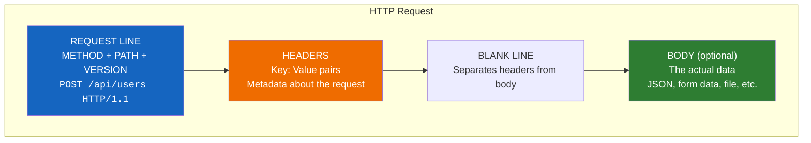
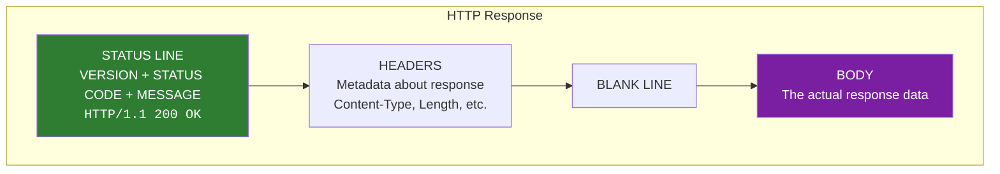
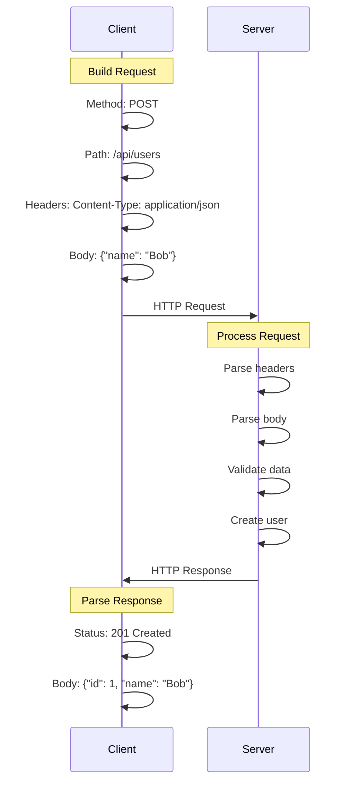

# Lesson 6.2: HTTP Under the Hood

> **Duration**: 30 min | **Section**: A - HTTP Under the Hood

## 🎯 The Problem (3-5 min)

You know APIs use HTTP. But what *is* HTTP? When your code sends a request:

- What actually travels over the wire?
- How does the server know what you want?
- Why do some requests have bodies and others don't?
- What do those numbers like 200, 404, 500 mean?

> **Scenario**: Your API call fails with "400 Bad Request". Someone says "check your headers." Another says "the body is malformed." You nod like you understand. But what ARE headers? What IS a body? What does 400 actually mean?

## 🧪 Try It: The Naive Understanding (5-10 min)

Most developers use HTTP without understanding it:

```python
import requests

# "It just works!" ... until it doesn't
response = requests.get("https://api.example.com/users")
data = response.json()
```

But when it breaks:
- "403 Forbidden" — Why?
- "Content-Type must be application/json" — What's Content-Type?
- "Method not allowed" — What methods exist?

Let's go **under the hood**.

## 🔍 Under the Hood (10-15 min)

### HTTP = HyperText Transfer Protocol

It's a **text-based protocol** for communication between clients and servers.

Every HTTP interaction has exactly two parts:
1. **Request** (client → server)
2. **Response** (server → client)

### Anatomy of an HTTP Request

```
POST /api/users HTTP/1.1        ← Request Line
Host: api.example.com            ← Headers
Content-Type: application/json   ← Headers
Authorization: Bearer abc123     ← Headers
                                 ← Empty line (separator!)
{"name": "Bob", "age": 25}       ← Body (optional)
```



### HTTP Methods (Verbs)

The **method** tells the server what you want to do:

| Method | Purpose | Has Body? | Idempotent? |
|--------|---------|:---------:|:-----------:|
| **GET** | Read/retrieve data | ❌ No | ✅ Yes |
| **POST** | Create new data | ✅ Yes | ❌ No |
| **PUT** | Update/replace data | ✅ Yes | ✅ Yes |
| **PATCH** | Partial update | ✅ Yes | ❌ No |
| **DELETE** | Remove data | ❌ Usually no | ✅ Yes |

**Idempotent** = calling it multiple times has the same effect as calling once.
- GET /users → same result every time
- POST /users → creates a NEW user each time

### Headers: Metadata About the Request

```
Host: api.example.com           → Which server (required)
Content-Type: application/json  → "My body is JSON"
Accept: application/json        → "I want JSON back"
Authorization: Bearer abc123    → "Here's my credential"
User-Agent: Python/3.11         → "I'm a Python client"
```

**Common Headers**:

| Header | Purpose |
|--------|---------|
| `Content-Type` | Format of the body you're SENDING |
| `Accept` | Format you want to RECEIVE |
| `Authorization` | Authentication token |
| `Content-Length` | Size of body in bytes |
| `Cookie` | Session data from browser |

### The Body: Your Actual Data

Only some methods have bodies:
- ✅ POST, PUT, PATCH typically have bodies
- ❌ GET, DELETE typically don't

Body format depends on `Content-Type`:
- `application/json` → `{"name": "Bob"}`
- `application/x-www-form-urlencoded` → `name=Bob&age=25`
- `multipart/form-data` → File uploads

### Anatomy of an HTTP Response

```
HTTP/1.1 200 OK                  ← Status Line
Content-Type: application/json   ← Headers
Content-Length: 42               ← Headers
                                 ← Empty line
{"id": 1, "name": "Bob"}         ← Body
```



### Status Codes: The Server's Verdict

| Range | Category | Meaning |
|:-----:|----------|---------|
| **1xx** | Informational | "Hang on, processing..." |
| **2xx** | Success | "Here's your data!" |
| **3xx** | Redirect | "Go look over there" |
| **4xx** | Client Error | "YOU messed up" |
| **5xx** | Server Error | "WE messed up" |

**Must-Know Status Codes**:

| Code | Name | When It Happens |
|:----:|------|-----------------|
| 200 | OK | Success (GET, PUT) |
| 201 | Created | Successfully created (POST) |
| 204 | No Content | Success, nothing to return (DELETE) |
| 400 | Bad Request | Your request is malformed |
| 401 | Unauthorized | Authentication required |
| 403 | Forbidden | Authenticated, but not allowed |
| 404 | Not Found | Resource doesn't exist |
| 422 | Unprocessable Entity | Validation failed (FastAPI uses this!) |
| 500 | Internal Server Error | Server crashed |

### Complete Request/Response Flow



## 💥 Where It Breaks (3-5 min)

### Wrong Content-Type

```python
# ❌ Body is JSON, but you forgot to say so
requests.post(url, data='{"name": "Bob"}')  # Content-Type: application/x-www-form-urlencoded

# ✅ Explicitly send JSON
requests.post(url, json={"name": "Bob"})  # Content-Type: application/json
```

### Wrong Method

```python
# ❌ GET can't have a body (most servers ignore it)
requests.get(url, json={"filter": "active"})

# ✅ Use POST for search with complex filters, or query params for simple
requests.get(url, params={"filter": "active"})
```

### Missing Headers

```python
# ❌ 401 Unauthorized - forgot auth header
requests.get("https://api.private.com/data")

# ✅ Include authorization
requests.get("https://api.private.com/data", 
             headers={"Authorization": "Bearer token123"})
```

## ✅ The Fix: Always Know What You're Sending (5 min)

Use this checklist for every HTTP request:

```python
# 1. What METHOD?
method = "POST"  # GET, POST, PUT, DELETE, PATCH

# 2. What URL (host + path)?
url = "https://api.example.com/users"

# 3. What HEADERS?
headers = {
    "Content-Type": "application/json",  # What am I sending?
    "Accept": "application/json",         # What do I want back?
    "Authorization": "Bearer my_token"    # How am I authenticated?
}

# 4. What BODY? (if POST/PUT/PATCH)
body = {"name": "Bob", "email": "bob@example.com"}

# 5. What STATUS CODES should I handle?
# 201 = success, 400 = bad input, 401 = bad auth, 500 = server error
```

## 🎯 Practice

### Exercise 1: Read Raw HTTP

This is a real HTTP request. Identify each part:

```
GET /api/posts?limit=10 HTTP/1.1
Host: jsonplaceholder.typicode.com
Accept: application/json
User-Agent: Python/3.11

```

1. Method: ___________
2. Path: ___________
3. Query params: ___________
4. Headers: ___________
5. Body: ___________

### Exercise 2: Predict the Response

For each request, predict the likely status code:

| Request | Likely Status |
|---------|:-------------:|
| GET /users/999 (user doesn't exist) | ______ |
| POST /users with valid data | ______ |
| DELETE /users/1 with no auth | ______ |
| POST /users with `{"age": "old"}` (invalid) | ______ |

### Exercise 3: Using requests

Write Python code to:
1. GET all posts from `https://jsonplaceholder.typicode.com/posts`
2. POST a new post with `{"title": "Test", "body": "Content", "userId": 1}`
3. Check the status code of each response

## 🔑 Key Takeaways

- HTTP is a **text protocol** with Request and Response
- Requests have: **Method**, **URL**, **Headers**, optional **Body**
- Responses have: **Status Code**, **Headers**, optional **Body**
- **GET** = read, **POST** = create, **PUT** = update, **DELETE** = remove
- Status codes: 2xx = success, 4xx = your fault, 5xx = server fault
- `Content-Type` header tells the format of the body

## ❓ Common Questions

| Question | Answer |
|----------|--------|
| "HTTP vs HTTPS?" | HTTPS is HTTP + encryption (TLS). Always use HTTPS in production. |
| "What's HTTP/2 or HTTP/3?" | Newer versions with better performance. Same concepts, different wire format. |
| "Why is GET body discouraged?" | Servers may ignore it. Use query params or POST instead. |
| "What's REST?" | A style of API design using HTTP methods + resources meaningfully. Next lesson! |

## 📚 Further Reading

- [HTTP Overview - MDN](https://developer.mozilla.org/en-US/docs/Web/HTTP/Overview)
- [HTTP Status Codes - MDN](https://developer.mozilla.org/en-US/docs/Web/HTTP/Status)
- [HTTP Headers - MDN](https://developer.mozilla.org/en-US/docs/Web/HTTP/Headers)
- [Python requests Library](https://requests.readthedocs.io/)

---

**Next**: [Lesson 6.3: Building a Server From Scratch](./Lesson-03-Building-A-Server-From-Scratch.md) — Let's build an HTTP server with raw Python sockets. Then you'll REALLY appreciate FastAPI!
