# Lesson 6.3: Building a Server From Scratch

> **Duration**: 35 min | **Section**: A - HTTP Under the Hood

## 🎯 The Problem (3-5 min)

You understand HTTP in theory. Request goes in, response comes out. But what ACTUALLY happens inside a server? How does Python receive network data and turn it into something useful?

> **Scenario**: Someone says "FastAPI handles all the socket stuff for you." You nod. But... what socket stuff? What would you have to do WITHOUT FastAPI? Let's find out—so you truly appreciate what frameworks do for you.

## 🧪 Try It: The Absolute Basics (10 min)

Before HTTP, before frameworks, there are **sockets**—the lowest level of network programming.

A socket is like a phone line:
1. One side **listens** for connections (server)
2. Other side **connects** (client)
3. They **send bytes** back and forth

Let's build a minimal server:

```python
# server.py - The bare minimum
import socket

# Create a socket (phone line)
server = socket.socket(socket.AF_INET, socket.SOCK_STREAM)

# Bind to address (get a phone number)
server.bind(("localhost", 8000))

# Start listening (pick up the phone)
server.listen(1)
print("Server listening on http://localhost:8000")

while True:
    # Accept a connection (answer a call)
    client, address = server.accept()
    print(f"Connection from {address}")
    
    # Receive data (hear what they say)
    request = client.recv(1024).decode()
    print(f"Received:\n{request}")
    
    # Send response (say something back)
    response = "HTTP/1.1 200 OK\r\n\r\nHello!"
    client.send(response.encode())
    
    # Close connection (hang up)
    client.close()
```

Run it:
```bash
python server.py
```

Then visit `http://localhost:8000` in your browser. You'll see "Hello!"

But look at what the browser sent:

```
GET / HTTP/1.1
Host: localhost:8000
User-Agent: Mozilla/5.0...
Accept: text/html,application/xhtml+xml...
Accept-Language: en-US,en;q=0.5
Accept-Encoding: gzip, deflate, br
Connection: keep-alive
```

That's raw HTTP. The browser sent a **GET request**, and we need to parse it.

## 🔍 Under the Hood (10-15 min)

### What a Real HTTP Server Must Do


The orange boxes are what FastAPI does FOR you. Let's do them manually.

### Parsing HTTP Requests

```python
def parse_request(raw_request: str) -> dict:
    """Parse raw HTTP into usable parts."""
    lines = raw_request.split("\r\n")
    
    # First line: METHOD PATH VERSION
    request_line = lines[0]
    method, path, version = request_line.split(" ")
    
    # Headers: until empty line
    headers = {}
    i = 1
    while lines[i]:  # Until empty line
        key, value = lines[i].split(": ", 1)
        headers[key] = value
        i += 1
    
    # Body: everything after empty line
    body = "\r\n".join(lines[i+1:]) if i+1 < len(lines) else ""
    
    return {
        "method": method,
        "path": path,
        "headers": headers,
        "body": body
    }
```

### Routing to Handler Functions

```python
# Define our "routes"
def home():
    return "Welcome!"

def get_users():
    return '{"users": ["Alice", "Bob"]}'

def not_found():
    return "404 Not Found"

# Route table
routes = {
    "GET /": home,
    "GET /users": get_users,
}

def route(method: str, path: str):
    """Find the right function for this request."""
    key = f"{method} {path}"
    return routes.get(key, not_found)
```

### Building HTTP Responses

```python
def build_response(status: int, body: str, content_type: str = "text/plain") -> str:
    """Build a proper HTTP response."""
    status_messages = {
        200: "OK",
        201: "Created",
        404: "Not Found",
        500: "Internal Server Error"
    }
    
    status_line = f"HTTP/1.1 {status} {status_messages.get(status, 'Unknown')}"
    headers = f"Content-Type: {content_type}\r\nContent-Length: {len(body)}"
    
    return f"{status_line}\r\n{headers}\r\n\r\n{body}"
```

### The Complete Manual Server

```python
# manual_server.py - Full implementation
import socket
import json

def parse_request(raw: str) -> dict:
    lines = raw.split("\r\n")
    method, path, _ = lines[0].split(" ")
    
    headers = {}
    i = 1
    while i < len(lines) and lines[i]:
        if ": " in lines[i]:
            key, value = lines[i].split(": ", 1)
            headers[key] = value
        i += 1
    
    body = "\r\n".join(lines[i+1:]) if i+1 < len(lines) else ""
    return {"method": method, "path": path, "headers": headers, "body": body}

def build_response(status: int, body: str, content_type: str = "text/plain") -> str:
    status_text = {200: "OK", 201: "Created", 404: "Not Found"}
    return (
        f"HTTP/1.1 {status} {status_text.get(status, 'Error')}\r\n"
        f"Content-Type: {content_type}\r\n"
        f"Content-Length: {len(body)}\r\n"
        f"\r\n"
        f"{body}"
    )

# Handlers
def home():
    return 200, "Welcome to my API!"

def get_users():
    users = [{"id": 1, "name": "Alice"}, {"id": 2, "name": "Bob"}]
    return 200, json.dumps(users)

def create_user(body: str):
    data = json.loads(body)
    return 201, json.dumps({"id": 3, "name": data["name"]})

# Router
def handle_request(req: dict) -> str:
    method, path = req["method"], req["path"]
    
    if method == "GET" and path == "/":
        status, body = home()
        return build_response(status, body)
    
    elif method == "GET" and path == "/users":
        status, body = get_users()
        return build_response(status, body, "application/json")
    
    elif method == "POST" and path == "/users":
        status, body = create_user(req["body"])
        return build_response(status, body, "application/json")
    
    else:
        return build_response(404, "Not Found")

# Server loop
server = socket.socket(socket.AF_INET, socket.SOCK_STREAM)
server.setsockopt(socket.SOL_SOCKET, socket.SO_REUSEADDR, 1)
server.bind(("localhost", 8000))
server.listen(5)
print("Server running on http://localhost:8000")

while True:
    client, addr = server.accept()
    try:
        raw = client.recv(4096).decode()
        if raw:
            req = parse_request(raw)
            print(f"{req['method']} {req['path']}")
            response = handle_request(req)
            client.send(response.encode())
    except Exception as e:
        error = build_response(500, str(e))
        client.send(error.encode())
    finally:
        client.close()
```

## 💥 Where It Breaks (3-5 min)

Our manual server has MANY problems:

### 1. No Validation
```python
# User sends: {"name": 123} instead of {"name": "Alice"}
# We just crash or produce garbage
data = json.loads(body)  # What if body isn't valid JSON?
```

### 2. No Type Safety
```python
# Nothing stops you from returning wrong types
def get_users():
    return "oops"  # Should return JSON, returns string
```

### 3. Manual Routing is Tedious
```python
# Every new endpoint = another if/elif
elif method == "GET" and path == "/users/1":
    ...
elif method == "GET" and path == "/users/2":
    ...
# Path parameters? Regex nightmare!
```

### 4. No Async (One Request at a Time)
```python
# While handling one request, others wait
# 10 clients = 10x slower
```

### 5. No Documentation
```python
# What endpoints exist? What do they accept?
# Who knows! Hope someone wrote it down.
```

### 6. Security Issues
```python
# No CORS handling
# No rate limiting
# Headers not sanitized
```

## ✅ The Fix: Use a Framework! (5 min)

Here's the SAME functionality in FastAPI:

```python
from fastapi import FastAPI
from pydantic import BaseModel

app = FastAPI()

class User(BaseModel):
    name: str

users = [{"id": 1, "name": "Alice"}, {"id": 2, "name": "Bob"}]

@app.get("/")
def home():
    return {"message": "Welcome to my API!"}

@app.get("/users")
def get_users():
    return users

@app.post("/users", status_code=201)
def create_user(user: User):
    new_user = {"id": len(users) + 1, "name": user.name}
    users.append(new_user)
    return new_user
```

That's it! And you get:
- ✅ Automatic JSON parsing
- ✅ Pydantic validation (name must be string!)
- ✅ Automatic documentation at `/docs`
- ✅ Async support
- ✅ Type hints everywhere
- ✅ Proper error responses

```mermaid
flowchart LR
    subgraph MANUAL["Manual Server (Our Code)"]
        M1[Socket handling]
        M2[HTTP parsing]
        M3[Routing]
        M4[Validation]
        M5[Response building]
        M6[Error handling]
    end
    
    subgraph FASTAPI["FastAPI"]
        F1["✅ Handled"]
        F2["✅ Handled"]
        F3["@app.get()"]
        F4["Pydantic"]
        F5["✅ Handled"]
        F6["✅ Handled"]
    end
    
    M1 -.-> F1
    M2 -.-> F2
    M3 -.-> F3
    M4 -.-> F4
    M5 -.-> F5
    M6 -.-> F6
    
    style MANUAL fill:#FFEBEE,stroke:#C62828
    style FASTAPI fill:#E8F5E9,stroke:#2E7D32
```



## 🎯 Practice

### Exercise 1: Run the Manual Server

Copy `manual_server.py` and run it. Then test with curl:

```bash
# Test GET
curl http://localhost:8000/
curl http://localhost:8000/users

# Test POST
curl -X POST http://localhost:8000/users \
     -H "Content-Type: application/json" \
     -d '{"name": "Charlie"}'
```

### Exercise 2: Break It

Try to crash the manual server:
1. Send invalid JSON
2. Send a request with no body to POST /users
3. Request a path that doesn't exist

### Exercise 3: Appreciate FastAPI

List 5 things FastAPI does that our manual server doesn't:

1. _________________
2. _________________
3. _________________
4. _________________
5. _________________

## 🔑 Key Takeaways

- HTTP servers receive bytes and send bytes—that's it
- Everything else is **parsing**, **routing**, **validating**, **building responses**
- Writing this manually is tedious and error-prone
- FastAPI handles ALL the boilerplate so you focus on **your logic**
- Understanding the low level helps you debug problems

## ❓ Common Questions

| Question | Answer |
|----------|--------|
| "Do I ever need raw sockets?" | Rarely. Maybe for custom protocols or learning. Frameworks handle HTTP. |
| "What's WSGI/ASGI?" | Standards for Python web servers. ASGI = async (FastAPI uses this). |
| "What's uvicorn?" | An ASGI server. It handles sockets; FastAPI handles HTTP logic. |
| "Is Flask similar?" | Flask uses WSGI (sync). FastAPI uses ASGI (async, faster). |

## 📚 Further Reading

- [Python socket module](https://docs.python.org/3/library/socket.html)
- [ASGI Specification](https://asgi.readthedocs.io/)
- [Uvicorn - Lightning-fast ASGI server](https://www.uvicorn.org/)

---

**Next**: [Lesson 6.4: HTTP Q&A](./Lesson-04-HTTP-QA.md) — Let's answer the burning questions: What's REST? Why JSON? When to use which status code?
