# Lesson 6.4: HTTP Q&A

> **Duration**: 10 min | **Section**: A - HTTP Under the Hood

## 🎯 The Problem (2 min)

You understand HTTP basics—methods, status codes, headers, bodies. But there are still questions:

- What exactly is REST?
- Why does everyone use JSON?
- When do I use 400 vs 422?
- What's the difference between query params and body?

Let's clear up the confusion.

## ❓ Frequently Asked Questions

### Q: What is REST?

**REST** = **RE**presentational **S**tate **T**ransfer

It's a **style** of API design (not a protocol). RESTful APIs follow conventions:

| Principle | Meaning |
|-----------|---------|
| **Resources** | URLs represent things (nouns): `/users`, `/posts` |
| **HTTP Methods** | Verbs for actions: GET reads, POST creates, etc. |
| **Stateless** | Each request is independent; server doesn't remember you |
| **Standard Responses** | Use proper status codes, return consistent JSON |

```mermaid
flowchart LR
    subgraph REST["RESTful Design"]
        R1["GET /users → List users"]
        R2["GET /users/1 → Get user 1"]
        R3["POST /users → Create user"]
        R4["PUT /users/1 → Replace user 1"]
        R5["DELETE /users/1 → Delete user 1"]
    end
    
    subgraph WRONG["NOT RESTful"]
        W1["GET /getUsers"]
        W2["POST /createUser"]
        W3["GET /deleteUser?id=1"]
    end
    
    style REST fill:#E8F5E9,stroke:#2E7D32
    style WRONG fill:#FFEBEE,stroke:#C62828
```



**RESTful**: Let the METHOD tell you the action. Let the URL tell you the resource.

---

### Q: Why JSON and not XML?

**JSON** = **J**ava**S**cript **O**bject **N**otation

```json
{"name": "Alice", "age": 25, "active": true}
```

**XML** (the old way):
```xml
<user><name>Alice</name><age>25</age><active>true</active></user>
```

| Aspect | JSON | XML |
|--------|------|-----|
| Readability | ✅ Cleaner | ❌ Verbose |
| Parsing speed | ✅ Faster | ❌ Slower |
| JavaScript native | ✅ Yes | ❌ No |
| Data types | ✅ Built-in (string, number, boolean, null, array, object) | ❌ Everything is text |

JSON won because it's simpler and works natively with JavaScript (the web's language).

---

### Q: Query Parameters vs Request Body?

**Query Parameters**: Data in the URL

```
GET /users?limit=10&offset=0&status=active
```

**Request Body**: Data in the request body

```
POST /users
Content-Type: application/json

{"name": "Alice", "email": "alice@example.com"}
```

| Use Case | Use Query Params | Use Body |
|----------|:----------------:|:--------:|
| Filtering/sorting | ✅ | ❌ |
| Pagination | ✅ | ❌ |
| Simple searches | ✅ | ❌ |
| Creating resources | ❌ | ✅ |
| Updating resources | ❌ | ✅ |
| Sensitive data | ❌ | ✅ |
| Large/complex data | ❌ | ✅ |

**Rule of thumb**: 
- GET requests → query params only
- POST/PUT/PATCH → body for main data, query params for optional modifiers

---

### Q: When to use 400 vs 422?

Both mean "client error" but differ in subtlety:

| Code | Meaning | Example |
|:----:|---------|---------|
| **400** Bad Request | Request is malformed—can't even parse it | Invalid JSON: `{name: Alice}` (missing quotes) |
| **422** Unprocessable Entity | Request is valid, but DATA doesn't pass validation | Valid JSON, but `{"age": -5}` fails "age must be positive" |


**FastAPI uses 422** for validation errors because Pydantic validates AFTER parsing.

---

### Q: What's the difference between 401 and 403?

| Code | Meaning | Scenario |
|:----:|---------|----------|
| **401** Unauthorized | "Who are you?" | No token provided, or invalid token |
| **403** Forbidden | "I know who you are, but you can't do this" | Valid token, but user lacks permission |

```
# No token
GET /admin/settings
→ 401 Unauthorized ("log in first")

# Valid token, but regular user
GET /admin/settings
Authorization: Bearer user_token
→ 403 Forbidden ("admins only")
```

---

### Q: Should I use PUT or PATCH?

| Method | Meaning | What You Send |
|--------|---------|---------------|
| **PUT** | Replace entirely | Complete new object |
| **PATCH** | Update partially | Only fields to change |

```python
# Current user: {"id": 1, "name": "Alice", "email": "a@b.com", "age": 25}

# PUT /users/1 - Replace everything
{"name": "Alicia", "email": "a@b.com", "age": 25}
# Must send ALL fields or they become null

# PATCH /users/1 - Update one field
{"name": "Alicia"}
# Only name changes, others untouched
```

In practice, many APIs use `PATCH` for updates because it's more flexible.

---

### Q: What about CORS?

**CORS** = **C**ross-**O**rigin **R**esource **S**haring

Browsers block requests from one domain to another by default (security).

```
Your frontend: https://myapp.com
Your API:      https://api.myapp.com

Browser says: "Different origin! Blocked unless API allows it."
```

The API must send headers allowing the frontend's origin:

```
Access-Control-Allow-Origin: https://myapp.com
```

FastAPI has `CORSMiddleware` to handle this. We'll cover it in Section E.

---

## 💥 Common Pitfalls

| Pitfall | Why It Happens | Fix |
|---------|---------------|-----|
| Using verbs in URLs (`/getUsers`) | Thinking of URLs as actions | Use nouns for resources, HTTP methods for actions |
| Using GET for state changes | Convenience or misunderstanding | GET is for reading only; use POST/PUT/PATCH for changes |
| Returning 200 for errors | Laziness or "it worked" mentality | Use proper status codes: 4xx for client errors, 5xx for server |
| Ignoring CORS in development | Works in Postman, fails in browser | Add CORS middleware early; browsers enforce cross-origin rules |
| Sensitive data in query params | Easier than request body | Query params appear in logs and browser history; use body for secrets |
| Using POST for everything | Avoiding learning HTTP methods | Follow REST conventions for predictable, cacheable APIs |

---

### Q: What's idempotency and why care?

**Idempotent** = calling multiple times has same effect as calling once.

| Method | Idempotent? | Why? |
|--------|:-----------:|------|
| GET | ✅ | Reading doesn't change anything |
| PUT | ✅ | Replacing with same data = same result |
| DELETE | ✅ | Deleting twice = still deleted |
| POST | ❌ | Creating twice = two resources! |

**Why care?**: Network failures. If your POST request times out, did it succeed? If you retry, you might create duplicates!

Solutions:
- Use idempotency keys
- Check before creating
- Use PUT with client-generated IDs

---

## 🔑 Key Takeaways

- **REST** is a design style: resources as URLs, actions as HTTP methods
- **JSON** won because it's simple and JavaScript-native
- **Query params** for filtering; **body** for data creation/updates
- **400** = can't parse; **422** = parsed but validation failed
- **401** = not authenticated; **403** = authenticated but not authorized
- **CORS** is browser security; your API must explicitly allow cross-origin requests

## 🎯 Quick Quiz

Match the scenario to the status code:

| Scenario | Code |
|----------|:----:|
| User not logged in | ____ |
| Resource created successfully | ____ |
| JSON body has syntax error | ____ |
| User tries to delete another user's data | ____ |
| `age: "twenty"` when it should be integer | ____ |

(Answers: 401, 201, 400, 403, 422)

## 📚 Further Reading

- [REST API Tutorial](https://restfulapi.net/)
- [CORS Explained - MDN](https://developer.mozilla.org/en-US/docs/Web/HTTP/CORS)
- [HTTP Methods - RESTful API](https://restfulapi.net/http-methods/)

---

**Next**: [Lesson 6.5: The Validation Problem](./Lesson-05-The-Validation-Problem.md) — Now we tackle Pydantic. Users send garbage. How do you protect your code?
