# Lesson 6.5: The Validation Problem

> **Duration**: 5 min | **Section**: B - Pydantic

## 🎯 The Problem (5 min)

Your API is live. Users are sending data. And they're sending **garbage**.

```python
# What you expect:
{"name": "Alice", "age": 25, "email": "alice@example.com"}

# What users actually send:
{"name": "", "age": "twenty-five", "email": "not-an-email"}
{"NAME": "Bob"}  # Wrong key casing
{"age": -5}  # Missing required fields, negative age
{"name": "A" * 10000}  # Name longer than your database column
None  # They sent literally nothing
```

Your code crashes. Or worse—it silently corrupts your database.

> **Scenario**: You have an endpoint that creates users. It takes `name`, `age`, and `email`. Here's what happens when you don't validate:

```python
@app.post("/users")
def create_user(data: dict):
    # Blindly trust user input (NEVER do this!)
    name = data["name"]      # KeyError if missing
    age = data["age"]        # What if it's a string?
    email = data["email"]    # Is it even a valid email?
    
    # Insert into database
    db.execute(f"INSERT INTO users VALUES ('{name}', {age}, '{email}')")
    # 🔥 SQL injection, type errors, data corruption
```

## 💥 What Goes Wrong Without Validation

```mermaid
flowchart TD
    REQ["User sends JSON"]
    PARSE["Parse JSON (might fail)"]
    ACCESS["Access fields (might not exist)"]
    USE["Use values (wrong types?)"]
    DB["Save to database (corrupt data?)"]
    CRASH["💥 CRASH"]
    
    REQ --> PARSE
    PARSE -->|"Invalid JSON"| CRASH
    PARSE -->|"Valid"| ACCESS
    ACCESS -->|"Missing key"| CRASH
    ACCESS -->|"Present"| USE
    USE -->|"Wrong type"| CRASH
    USE -->|"Type OK"| DB
    DB -->|"Data too long"| CRASH
    
    style CRASH fill:#C62828,color:#fff
```



Every step can fail. You need **validation at the gate**.

## 🛡️ The Solution: Validation as a Bouncer

Think of validation like a bouncer at a club:

```mermaid
flowchart LR
    subgraph OUTSIDE["Outside (Untrusted)"]
        U1["👤 Good data"]
        U2["👤 Bad data"]
        U3["👤 Malicious"]
    end
    
    subgraph BOUNCER["Pydantic (The Bouncer)"]
        B["Check IDs<br/>Check dress code<br/>Check behavior"]
    end
    
    subgraph INSIDE["Inside (Your Code)"]
        CLUB["🎉 Safe Zone<br/>Data is guaranteed valid"]
    end
    
    U1 --> B
    U2 --> B
    U3 --> B
    B -->|"✅ Valid"| CLUB
    B -->|"❌ Rejected"| OUT["422 Error"]
    
    style BOUNCER fill:#1565C0,color:#fff
    style CLUB fill:#2E7D32,color:#fff
    style OUT fill:#C62828,color:#fff
```



**Pydantic** is your bouncer. It checks EVERY piece of data BEFORE your code runs.

If data is invalid → **422 Unprocessable Entity** (never reaches your code!)

If data is valid → **Guaranteed types, guaranteed values**

## 🔑 What You'll Learn in This Section

| Lesson | Topic |
|--------|-------|
| 6.6 | Pydantic Under the Hood — How it works |
| 6.7 | Pydantic Models — Creating validation schemas |
| 6.8 | Custom Validation — Complex business rules |
| 6.9 | Nested Models — Real-world data structures |
| 6.10 | Settings & Config — Type-safe environment variables |

## ❓ Why Not Just Use If Statements?

You could write validation manually:

```python
def create_user(data: dict):
    if "name" not in data:
        raise ValueError("name required")
    if not isinstance(data["name"], str):
        raise ValueError("name must be string")
    if len(data["name"]) < 1:
        raise ValueError("name can't be empty")
    if len(data["name"]) > 100:
        raise ValueError("name too long")
    if "age" not in data:
        raise ValueError("age required")
    if not isinstance(data["age"], int):
        raise ValueError("age must be integer")
    if data["age"] < 0:
        raise ValueError("age must be positive")
    # ... 50 more lines for email, etc.
```

Or you could write:

```python
from pydantic import BaseModel, EmailStr, Field

class User(BaseModel):
    name: str = Field(min_length=1, max_length=100)
    age: int = Field(ge=0)
    email: EmailStr

def create_user(user: User):  # Already validated!
    ...
```

**Same validation. 90% less code. Zero bugs.**

---

**Next**: [Lesson 6.6: Pydantic Under the Hood](./Lesson-06-Pydantic-Under-The-Hood.md) — Let's see exactly how Pydantic validates and coerces data.
