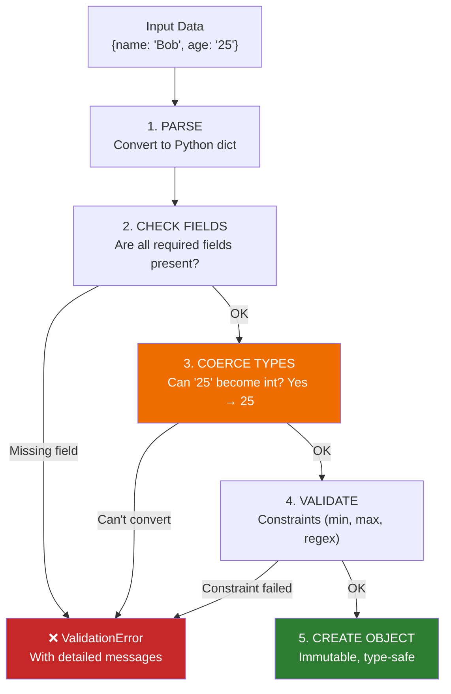

# Lesson 6.6: Pydantic Under the Hood

> **Duration**: 30 min | **Section**: B - Pydantic

## 🎯 The Problem (3-5 min)

You've heard Pydantic is "data validation." But what does that actually mean?

- How does it know `"25"` should become `25`?
- Where do those nice error messages come from?
- What's the difference from a regular class?
- Why is it so fast?

> **Scenario**: You write `age: int` and pass `"25"` (a string). Somehow it works—the age becomes `25` (an integer). Magic? Let's see the machinery.

## 🧪 Try It: Regular Classes vs Pydantic (5-10 min)

### Regular Python Class

```python
class UserRegular:
    def __init__(self, name, age):
        self.name = name
        self.age = age

# No validation whatsoever
user1 = UserRegular("Alice", 25)        # Works
user2 = UserRegular("Bob", "twenty")    # Works (but shouldn't!)
user3 = UserRegular(None, -100)         # Works (garbage in, garbage out)

print(user2.age)  # "twenty" — a string, not an int
```

### Pydantic Model

```python
from pydantic import BaseModel

class UserPydantic(BaseModel):
    name: str
    age: int

# Validation happens automatically
user1 = UserPydantic(name="Alice", age=25)     # ✅ Works
user2 = UserPydantic(name="Bob", age="25")     # ✅ Auto-converts to int!
user3 = UserPydantic(name="Bob", age="twenty") # ❌ ValidationError!
```

```
ValidationError: 1 validation error for UserPydantic
age
  Input should be a valid integer, unable to parse string as an integer
```

## 🔍 Under the Hood (10-15 min)

### What Happens When You Create a Pydantic Model



### Type Coercion: The Smart Conversion

Pydantic doesn't just check types—it **converts** when possible:

| Input | Expected Type | Result |
|-------|---------------|--------|
| `"25"` | `int` | `25` ✅ (string → int) |
| `25.0` | `int` | `25` ✅ (float → int, no decimals) |
| `25.7` | `int` | ❌ Error (would lose data) |
| `"true"` | `bool` | `True` ✅ |
| `1` | `bool` | `True` ✅ |
| `"alice"` | `int` | ❌ Error (can't convert) |

```python
from pydantic import BaseModel

class Demo(BaseModel):
    age: int
    active: bool
    score: float

# All these work due to coercion
demo = Demo(age="25", active="yes", score="3.14")
print(demo)
# age=25 active=True score=3.14

# Types are now correct
print(type(demo.age))     # <class 'int'>
print(type(demo.active))  # <class 'bool'>
print(type(demo.score))   # <class 'float'>
```

### The Model is the Schema

A Pydantic model is both a **schema** (what data looks like) and a **validator** (what data is allowed):

```python
from pydantic import BaseModel

class User(BaseModel):
    name: str           # Required, must be/become string
    age: int            # Required, must be/become int
    email: str | None = None  # Optional (has default)

# The schema in JSON form
print(User.model_json_schema())
```

```json
{
  "properties": {
    "name": {"title": "Name", "type": "string"},
    "age": {"title": "Age", "type": "integer"},
    "email": {"anyOf": [{"type": "string"}, {"type": "null"}], "default": null}
  },
  "required": ["name", "age"],
  "title": "User",
  "type": "object"
}
```

This schema is what FastAPI uses for automatic documentation!

### Error Messages: Detailed and Helpful

```python
from pydantic import BaseModel, ValidationError

class User(BaseModel):
    name: str
    age: int
    email: str

try:
    User(name="", age="old", email=12345)
except ValidationError as e:
    print(e)
```

```
3 validation errors for User
name
  String should have at least 1 character [type=string_too_short]
age
  Input should be a valid integer, unable to parse string as an integer [type=int_parsing]
email
  Input should be a valid string [type=string_type]
```

Notice:
- **Which field** failed
- **What was wrong** with it
- **What was expected**

### Accessing Error Details Programmatically

```python
except ValidationError as e:
    for error in e.errors():
        print(f"Field: {error['loc']}")
        print(f"Message: {error['msg']}")
        print(f"Type: {error['type']}")
        print("---")
```

```
Field: ('name',)
Message: String should have at least 1 character
Type: string_too_short
---
Field: ('age',)
Message: Input should be a valid integer, unable to parse string as an integer
Type: int_parsing
---
```

## 💥 Where It Breaks (3-5 min)

### Strict Mode vs Coercion

Sometimes coercion is unwanted:

```python
from pydantic import BaseModel

class StrictUser(BaseModel):
    model_config = {"strict": True}
    
    age: int

# With strict mode, no coercion
StrictUser(age=25)    # ✅ Works (int is int)
StrictUser(age="25")  # ❌ Error (string is not int!)
```

### Unhelpful Type Hints

```python
class BadModel(BaseModel):
    data: dict  # What's IN the dict? 🤷

# This "validates" but tells us nothing about structure
BadModel(data={"anything": "goes"})
```

**Fix**: Use typed dicts or nested models (Lesson 6.9).

## ✅ The Fix: Embrace Pydantic's Power (10 min)

### Basic Model Pattern

```python
from pydantic import BaseModel

class User(BaseModel):
    name: str
    age: int
    email: str | None = None  # Optional with default

# Create from dict (common with JSON)
data = {"name": "Alice", "age": 25}
user = User(**data)  # or User.model_validate(data)

# Access like object
print(user.name)  # "Alice"
print(user.age)   # 25

# Convert back to dict
print(user.model_dump())  # {"name": "Alice", "age": 25, "email": None}

# Convert to JSON string
print(user.model_dump_json())  # '{"name":"Alice","age":25,"email":null}'
```

### Immutability (Optional but Recommended)

```python
from pydantic import BaseModel, ConfigDict

class ImmutableUser(BaseModel):
    model_config = ConfigDict(frozen=True)
    
    name: str
    age: int

user = ImmutableUser(name="Alice", age=25)
user.name = "Bob"  # ❌ Error! Cannot modify frozen model
```

### Parsing JSON Directly

```python
json_string = '{"name": "Alice", "age": 25}'
user = User.model_validate_json(json_string)
```

## 🎯 Practice

### Exercise 1: Create a Model

Create a `Product` model with:
- `name` (required string)
- `price` (required float)
- `in_stock` (optional bool, default True)

Test it with:
```python
Product(name="Widget", price="19.99")
Product(name="Gadget", price=-5)  # Should this work?
```

### Exercise 2: Break It

Try to create a User with these inputs. Predict what happens:

| Input | What Happens? |
|-------|---------------|
| `{"name": "Alice", "age": 25}` | |
| `{"name": "Alice"}` | |
| `{"age": 25}` | |
| `{"name": 123, "age": "25"}` | |

### Exercise 3: Extract Errors

Write code that catches a ValidationError and prints each field that failed.

## 🔑 Key Takeaways

- Pydantic models = data classes + validation
- **Type coercion**: `"25"` → `25` automatically (when safe)
- **ValidationError**: Detailed, multi-field error messages
- **Model = Schema**: Generates JSON Schema for documentation
- Use `.model_dump()` to convert back to dict
- Use `.model_validate()` to create from dict

## ❓ Common Questions

| Question | Answer |
|----------|--------|
| "Pydantic v1 vs v2?" | V2 is faster and has different syntax. We use v2. |
| "What's the performance cost?" | Minimal. Pydantic v2 is compiled in Rust. |
| "Can I use with dataclasses?" | Yes! `from pydantic.dataclasses import dataclass` |
| "What about TypedDict?" | Pydantic can validate TypedDicts too. |

## 📚 Further Reading

- [Pydantic V2 Documentation](https://docs.pydantic.dev/latest/)
- [Pydantic V2 Migration Guide](https://docs.pydantic.dev/latest/concepts/migration/)
- [Type Coercion in Pydantic](https://docs.pydantic.dev/latest/concepts/conversion_table/)

---

**Next**: [Lesson 6.7: Pydantic Models](./Lesson-07-Pydantic-Models.md) — Learn all the field types, Optional, Field constraints, and real-world model patterns.
