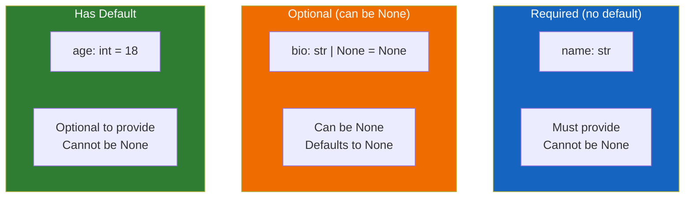

# Lesson 6.7: Pydantic Models

> **Duration**: 25 min | **Section**: B - Pydantic

## 🎯 The Problem (3-5 min)

You know Pydantic validates types. But real-world data is complex:

- What if a field is optional?
- How do you enforce minimum/maximum values?
- What types are available beyond `str`, `int`, `float`?
- How do you add descriptions for documentation?

> **Scenario**: You're building a user registration endpoint. Users must have a name (1-50 chars), email (valid format), age (18+), and optionally a bio. How do you enforce all these rules in one clean model?

## 🧪 Try It: Basic Field Types (10 min)

### Common Types

```python
from pydantic import BaseModel
from datetime import datetime, date
from typing import Optional
from uuid import UUID

class Event(BaseModel):
    id: UUID                    # UUID type
    name: str                   # String
    date: date                  # Date only (no time)
    created_at: datetime        # Date + time
    capacity: int               # Integer
    price: float                # Decimal
    is_public: bool             # Boolean
    tags: list[str]             # List of strings
    metadata: dict[str, str]    # Dictionary with string keys and values
```

### Optional Fields

```python
from pydantic import BaseModel

class User(BaseModel):
    name: str                       # Required
    email: str                      # Required
    bio: str | None = None          # Optional, defaults to None
    age: int = 18                   # Optional, defaults to 18

# These all work:
User(name="Alice", email="a@b.com")              # bio=None, age=18
User(name="Bob", email="b@b.com", bio="Hi!")     # age=18
User(name="Carol", email="c@c.com", age=25)      # bio=None
```

### The Difference: Optional vs Default

```python
# Optional means "can be None"
bio: str | None = None      # Can pass None, defaults to None

# Default without Optional means "has a value if not provided"
age: int = 18               # Must be int (not None), defaults to 18

# Required means "must be provided"
name: str                   # No default = required
```



## 🔍 Under the Hood: The `Field()` Function (10 min)

For more control, use `Field()`:

```python
from pydantic import BaseModel, Field

class User(BaseModel):
    name: str = Field(
        min_length=1,          # At least 1 character
        max_length=50,         # At most 50 characters
        description="User's full name"
    )
    age: int = Field(
        ge=0,                  # Greater than or equal to 0
        le=120,                # Less than or equal to 120
        description="Age in years"
    )
    email: str = Field(
        pattern=r'^[\w\.-]+@[\w\.-]+\.\w+$',  # Regex pattern
        description="Valid email address"
    )
    score: float = Field(
        default=0.0,           # Default value
        gt=0,                  # Greater than (not equal)
        lt=100,                # Less than (not equal)
    )
```

### Field Constraints Reference

| Constraint | Applies To | Meaning |
|------------|------------|---------|
| `min_length` | str, list | Minimum length |
| `max_length` | str, list | Maximum length |
| `pattern` | str | Regex pattern to match |
| `gt` | numbers | Greater than |
| `ge` | numbers | Greater than or equal |
| `lt` | numbers | Less than |
| `le` | numbers | Less than or equal |
| `multiple_of` | numbers | Must be multiple of value |

### Field Metadata (for documentation)

```python
from pydantic import BaseModel, Field

class Product(BaseModel):
    name: str = Field(
        description="Product name displayed to customers",
        examples=["Widget Pro", "Gadget Max"]
    )
    price: float = Field(
        description="Price in USD",
        examples=[19.99, 49.99],
        gt=0
    )
    sku: str = Field(
        description="Stock Keeping Unit identifier",
        pattern=r'^[A-Z]{3}-\d{4}$',
        examples=["ABC-1234"]
    )
```

This metadata appears in FastAPI's automatic documentation!

## 💡 Special Pydantic Types

Pydantic provides specialized types for common needs:

```python
from pydantic import BaseModel, EmailStr, HttpUrl, SecretStr
from pydantic import PositiveInt, NegativeFloat, constr

class UserProfile(BaseModel):
    email: EmailStr              # Validates email format
    website: HttpUrl             # Validates URL format
    password: SecretStr          # Hidden when printed (security)
    age: PositiveInt             # Must be > 0
    username: constr(            # Constrained string
        min_length=3,
        max_length=20,
        pattern=r'^[a-z0-9_]+$'
    )
```

### Common Special Types

| Type | What It Validates |
|------|-------------------|
| `EmailStr` | Valid email format |
| `HttpUrl` | Valid HTTP(S) URL |
| `AnyUrl` | Any valid URL |
| `SecretStr` | String hidden in repr/logs |
| `PositiveInt` | Integer > 0 |
| `NegativeInt` | Integer < 0 |
| `PositiveFloat` | Float > 0 |
| `constr(...)` | String with constraints |
| `conint(...)` | Integer with constraints |

### Installing Extra Types

```bash
pip install pydantic[email]  # For EmailStr
```

Or with all extras:
```bash
pip install pydantic[all]
```

## 💥 Where It Breaks (3-5 min)

### Forgetting Field() Default

```python
# ❌ Wrong: Field without default makes it required
class User(BaseModel):
    name: str = Field(min_length=1)  # Still required

# ✅ Right: Add default if you want it optional
class User(BaseModel):
    name: str = Field(default="Anonymous", min_length=1)
```

### Overly Strict Validation

```python
# ❌ Too strict for real-world names
class User(BaseModel):
    name: str = Field(pattern=r'^[A-Za-z]+$')  # No spaces, hyphens, apostrophes

# "Mary Jane" fails
# "O'Brien" fails
# "José" fails
```

### Confusing `|` and `Optional`

```python
# Modern Python (3.10+)
email: str | None = None

# Older style (still works)
from typing import Optional
email: Optional[str] = None

# These are equivalent!
```

## ✅ Real-World Model Patterns

### User Registration

```python
from pydantic import BaseModel, Field, EmailStr

class UserCreate(BaseModel):
    """Schema for creating a new user."""
    
    username: str = Field(
        min_length=3,
        max_length=20,
        pattern=r'^[a-z0-9_]+$',
        description="Lowercase alphanumeric username"
    )
    email: EmailStr = Field(
        description="Valid email address"
    )
    password: str = Field(
        min_length=8,
        description="Password (min 8 characters)"
    )
    full_name: str = Field(
        default="",
        max_length=100,
        description="Optional full name"
    )
    age: int | None = Field(
        default=None,
        ge=13,
        le=120,
        description="Optional age (must be 13+ if provided)"
    )
```

### API Response

```python
class UserResponse(BaseModel):
    """Schema for user data returned by API."""
    
    id: int
    username: str
    email: EmailStr
    full_name: str
    created_at: datetime
    
    # Never include password in response!
```

### Different Schemas for Different Operations

```python
# Create: requires all data, password included
class UserCreate(BaseModel):
    username: str
    email: EmailStr
    password: str

# Update: everything optional (partial update)
class UserUpdate(BaseModel):
    username: str | None = None
    email: EmailStr | None = None
    password: str | None = None

# Response: includes ID, excludes password
class UserResponse(BaseModel):
    id: int
    username: str
    email: EmailStr
```

## 🎯 Practice

### Exercise 1: Create a Product Model

Create a `Product` model with:
- `name`: required, 1-100 characters
- `description`: optional, max 1000 characters
- `price`: required, must be positive
- `quantity`: optional integer, defaults to 0, must be >= 0
- `category`: required, must match pattern `^[a-z-]+$`

### Exercise 2: User Profile

Create a `UserProfile` model for a social media app:
- `username`: 3-20 characters, lowercase alphanumeric + underscore
- `email`: valid email
- `bio`: optional, max 500 characters
- `website`: optional, must be valid URL if provided
- `followers_count`: non-negative integer, default 0

### Exercise 3: Validation Testing

Test your models with invalid data and observe the error messages.

## 🔑 Key Takeaways

- **Optional fields**: `field: str | None = None`
- **Default values**: `field: int = 0`
- **Field constraints**: `Field(min_length=1, max_length=100)`
- **Number constraints**: `ge`, `gt`, `le`, `lt`, `multiple_of`
- **Special types**: `EmailStr`, `HttpUrl`, `PositiveInt`, etc.
- **Documentation**: `description` and `examples` in Field()
- **Separate schemas**: Create, Update, Response

## ❓ Common Questions

| Question | Answer |
|----------|--------|
| "Why separate Create/Update/Response?" | Different contexts need different fields. Never expose passwords in responses! |
| "constr vs Field?" | `constr` creates a new type; `Field` adds constraints to existing type. Both work. |
| "Can I reuse validation?" | Yes! Create base classes and inherit, or use shared Field definitions. |

## 📚 Further Reading

- [Pydantic Field Types](https://docs.pydantic.dev/latest/concepts/fields/)
- [Pydantic Constrained Types](https://docs.pydantic.dev/latest/concepts/types/#constrained-types)
- [Pydantic Extra Types](https://docs.pydantic.dev/latest/api/networks/)

---

**Next**: [Lesson 6.8: Custom Validation](./Lesson-08-Custom-Validation.md) — What if your rules are too complex for built-in constraints? Write your own validators!
