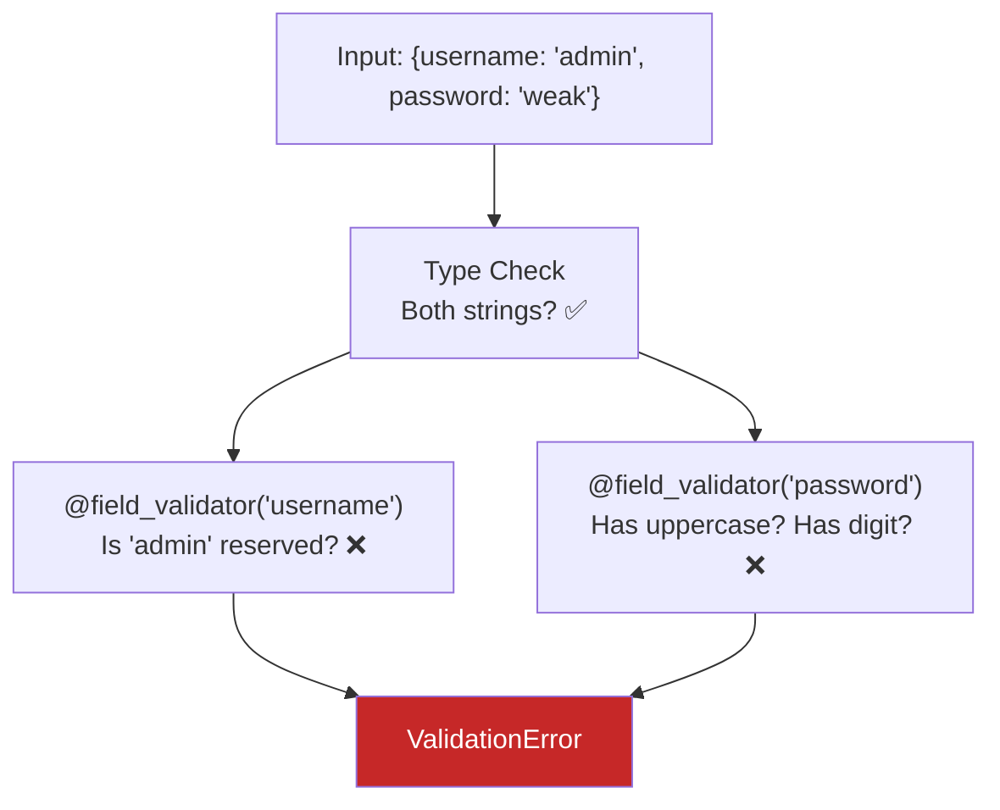
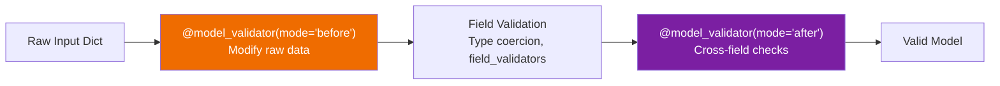

# Lesson 6.8: Custom Validation

> **Duration**: 30 min | **Section**: B - Pydantic

## 🎯 The Problem (3-5 min)

Pydantic's built-in constraints handle common cases: min/max length, number ranges, regex patterns. But real business rules are complex:

- "Username can't be a reserved word like 'admin'"
- "If country is US, ZIP code must be 5 digits"
- "Password must contain a number AND a special character"
- "Start date must be before end date"

> **Scenario**: Your registration form requires that passwords have at least one uppercase letter, one lowercase letter, one number, and one special character. How do you validate this? Regex becomes unreadable. You need custom validation logic.

## 🧪 Try It: The Naive Approach (5 min)

You could validate AFTER creating the model:

```python
from pydantic import BaseModel

class User(BaseModel):
    username: str
    password: str

def register_user(data: dict):
    user = User(**data)  # Pydantic validates types
    
    # Then manual validation 😫
    if user.username.lower() in ["admin", "root", "system"]:
        raise ValueError("Reserved username")
    
    if not any(c.isupper() for c in user.password):
        raise ValueError("Password needs uppercase")
    
    if not any(c.isdigit() for c in user.password):
        raise ValueError("Password needs digit")
    
    # ... more checks
```

**Problem**: Validation is scattered. Model doesn't protect itself.

## 🔍 Under the Hood: Field Validators (10-15 min)

Pydantic lets you attach validators directly to fields:

### `@field_validator` - Validate Individual Fields

```python
from pydantic import BaseModel, field_validator

class User(BaseModel):
    username: str
    password: str
    
    @field_validator('username')
    @classmethod
    def username_not_reserved(cls, v: str) -> str:
        reserved = ['admin', 'root', 'system', 'moderator']
        if v.lower() in reserved:
            raise ValueError(f'Username "{v}" is reserved')
        return v
    
    @field_validator('password')
    @classmethod
    def password_strong(cls, v: str) -> str:
        if len(v) < 8:
            raise ValueError('Password must be at least 8 characters')
        if not any(c.isupper() for c in v):
            raise ValueError('Password must contain uppercase letter')
        if not any(c.islower() for c in v):
            raise ValueError('Password must contain lowercase letter')
        if not any(c.isdigit() for c in v):
            raise ValueError('Password must contain digit')
        return v
```



### Validator Rules

1. **Decorator order**: `@field_validator` THEN `@classmethod`
2. **Must return value**: Return the (possibly modified) value
3. **Raise ValueError**: For validation failures
4. **`cls` first parameter**: It's a classmethod

### Transforming Values in Validators

Validators can also **transform** data:

```python
from pydantic import BaseModel, field_validator

class User(BaseModel):
    username: str
    email: str
    
    @field_validator('username')
    @classmethod
    def lowercase_username(cls, v: str) -> str:
        return v.lower().strip()  # Transform: lowercase + trim
    
    @field_validator('email')
    @classmethod
    def lowercase_email(cls, v: str) -> str:
        return v.lower().strip()
```

```python
user = User(username="  ALICE  ", email="ALICE@EXAMPLE.COM")
print(user.username)  # "alice"
print(user.email)     # "alice@example.com"
```

### Validating Multiple Fields Together

Sometimes fields depend on each other:

```python
from pydantic import BaseModel, model_validator
from datetime import date

class Event(BaseModel):
    name: str
    start_date: date
    end_date: date
    
    @model_validator(mode='after')
    def check_dates(self) -> 'Event':
        if self.end_date < self.start_date:
            raise ValueError('end_date must be after start_date')
        return self
```

### Validator Modes

```python
from pydantic import BaseModel, model_validator

class User(BaseModel):
    password: str
    password_confirm: str
    
    @model_validator(mode='before')
    @classmethod
    def check_before(cls, data: dict) -> dict:
        # 'before' mode: raw input, before field validation
        print(f"Raw input: {data}")
        return data
    
    @model_validator(mode='after')
    def check_after(self) -> 'User':
        # 'after' mode: validated model instance
        if self.password != self.password_confirm:
            raise ValueError('Passwords do not match')
        return self
```



## 💥 Where It Breaks (3-5 min)

### Wrong Decorator Order

```python
# ❌ WRONG: classmethod must come after field_validator
@classmethod
@field_validator('username')
def validate(cls, v):
    return v

# ✅ RIGHT
@field_validator('username')
@classmethod
def validate(cls, v: str) -> str:
    return v
```

### Forgetting to Return

```python
# ❌ WRONG: Forgot to return
@field_validator('username')
@classmethod
def validate(cls, v: str):
    if len(v) < 3:
        raise ValueError("Too short")
    # Forgot return! Field becomes None

# ✅ RIGHT
@field_validator('username')
@classmethod
def validate(cls, v: str) -> str:
    if len(v) < 3:
        raise ValueError("Too short")
    return v  # Always return!
```

### Using `self` in Field Validator

```python
# ❌ WRONG: field_validator uses cls, not self
@field_validator('username')
def validate(self, v):  # Wrong!
    return v

# ✅ RIGHT
@field_validator('username')
@classmethod
def validate(cls, v: str) -> str:
    return v
```

## ✅ Real-World Custom Validators (10 min)

### Password Strength Validator

```python
import re
from pydantic import BaseModel, field_validator

class UserCreate(BaseModel):
    email: str
    password: str
    
    @field_validator('password')
    @classmethod
    def password_strength(cls, v: str) -> str:
        if len(v) < 8:
            raise ValueError('Password must be at least 8 characters')
        
        checks = [
            (r'[a-z]', 'lowercase letter'),
            (r'[A-Z]', 'uppercase letter'),
            (r'\d', 'digit'),
            (r'[!@#$%^&*(),.?":{}|<>]', 'special character'),
        ]
        
        missing = [name for pattern, name in checks if not re.search(pattern, v)]
        
        if missing:
            raise ValueError(f'Password must contain: {", ".join(missing)}')
        
        return v
```

### Conditional Validation

```python
from pydantic import BaseModel, model_validator

class Address(BaseModel):
    country: str
    postal_code: str
    state: str | None = None
    
    @model_validator(mode='after')
    def validate_by_country(self) -> 'Address':
        if self.country == 'US':
            # US: ZIP must be 5 digits or 5+4 format
            if not re.match(r'^\d{5}(-\d{4})?$', self.postal_code):
                raise ValueError('US ZIP code must be 5 digits (or 5+4)')
            if not self.state:
                raise ValueError('US addresses require state')
        
        elif self.country == 'CA':
            # Canada: Postal code format A1A 1A1
            if not re.match(r'^[A-Z]\d[A-Z] \d[A-Z]\d$', self.postal_code):
                raise ValueError('Canadian postal code must be format A1A 1A1')
        
        return self
```

### Sanitizing Input

```python
import bleach
from pydantic import BaseModel, field_validator

class Comment(BaseModel):
    content: str
    
    @field_validator('content')
    @classmethod
    def sanitize_html(cls, v: str) -> str:
        # Remove dangerous HTML, keep safe tags
        allowed_tags = ['b', 'i', 'u', 'em', 'strong', 'a']
        return bleach.clean(v, tags=allowed_tags, strip=True)
```

### Reusable Validators with Annotated

```python
from typing import Annotated
from pydantic import BaseModel, AfterValidator

def normalize_email(v: str) -> str:
    return v.lower().strip()

def validate_not_empty(v: str) -> str:
    if not v.strip():
        raise ValueError('Cannot be empty or whitespace')
    return v.strip()

# Create reusable annotated types
NormalizedEmail = Annotated[str, AfterValidator(normalize_email)]
NonEmptyStr = Annotated[str, AfterValidator(validate_not_empty)]

class User(BaseModel):
    username: NonEmptyStr
    email: NormalizedEmail
    bio: NonEmptyStr | None = None
```

## 🎯 Practice

### Exercise 1: Username Validator

Create a `User` model where username:
- Is 3-20 characters
- Contains only lowercase letters, numbers, underscores
- Does not start with a number
- Is not in a list of reserved words

### Exercise 2: Date Range Validator

Create a `Booking` model with `check_in` and `check_out` dates where:
- Check-out must be after check-in
- Booking cannot be more than 30 days
- Check-in must be today or in the future

### Exercise 3: Card Number Validator

Create a `Payment` model with a `card_number` field that:
- Removes all spaces and dashes
- Must be exactly 16 digits after cleaning
- Passes Luhn algorithm check (Google it!)

## 🔑 Key Takeaways

- **`@field_validator`**: Validate/transform individual fields
- **`@model_validator`**: Validate relationships between fields
- **`mode='before'`**: Run on raw input dict
- **`mode='after'`**: Run on validated model instance
- **Always return** the value from validators
- **Raise `ValueError`** for validation failures
- Use **Annotated** for reusable validators

## ❓ Common Questions

| Question | Answer |
|----------|--------|
| "When to use field_validator vs model_validator?" | Single field = field_validator. Cross-field = model_validator. |
| "Can validators be async?" | Not directly. Use `asyncio.run()` if needed, but avoid in validators. |
| "How to validate in FastAPI?" | Just use Pydantic models—FastAPI handles calling validation! |

## 📚 Further Reading

- [Pydantic Validators](https://docs.pydantic.dev/latest/concepts/validators/)
- [Model Validators](https://docs.pydantic.dev/latest/concepts/validators/#model-validators)
- [Annotated Validators](https://docs.pydantic.dev/latest/concepts/validators/#annotated-validators)

---

**Next**: [Lesson 6.9: Nested Models](./Lesson-09-Nested-Models.md) — Real data is hierarchical. Learn to validate models inside models.
