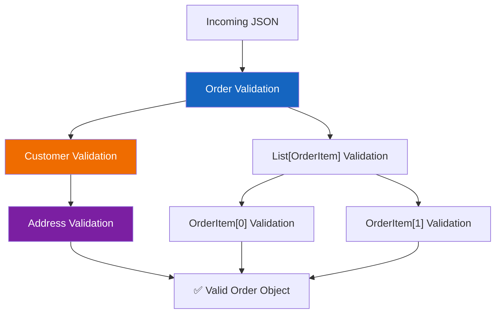

# Lesson 6.9: Nested Models

> **Duration**: 25 min | **Section**: B - Pydantic

## 🎯 The Problem (3-5 min)

Real-world data isn't flat. Orders contain items. Users have addresses. Posts have authors with profiles. How do you validate nested, hierarchical data?

```json
{
  "customer": {
    "name": "Alice",
    "email": "alice@example.com",
    "address": {
      "street": "123 Main St",
      "city": "Boston",
      "zip": "02101"
    }
  },
  "items": [
    {"product_id": 1, "quantity": 2, "price": 29.99},
    {"product_id": 3, "quantity": 1, "price": 49.99}
  ],
  "total": 109.97
}
```

> **Scenario**: You're building an e-commerce API. Orders come in with nested customer info, address, and a list of line items. Each level has its own validation rules. How do you handle this without chaos?

## 🧪 Try It: Flat vs Nested (5-10 min)

### The Flat Approach (Don't Do This)

```python
from pydantic import BaseModel

class OrderFlat(BaseModel):
    customer_name: str
    customer_email: str
    customer_address_street: str
    customer_address_city: str
    customer_address_zip: str
    item_1_product_id: int
    item_1_quantity: int
    item_1_price: float
    # ... 😱 This doesn't scale!
```

Problems:
- Repeated prefixes (`customer_`, `customer_address_`)
- Can't handle variable number of items
- No reusability (address used elsewhere?)

### The Nested Approach (Do This!)

```python
from pydantic import BaseModel, EmailStr

class Address(BaseModel):
    street: str
    city: str
    zip_code: str

class Customer(BaseModel):
    name: str
    email: EmailStr
    address: Address  # Nested model!

class OrderItem(BaseModel):
    product_id: int
    quantity: int
    price: float

class Order(BaseModel):
    customer: Customer          # Nested model
    items: list[OrderItem]      # List of nested models
    total: float
```

## 🔍 Under the Hood (10-15 min)

### How Nested Validation Works



Pydantic validates **recursively**. Each nested model validates its own fields.

### Creating Nested Models

```python
# From a dict (e.g., JSON payload)
data = {
    "customer": {
        "name": "Alice",
        "email": "alice@example.com",
        "address": {
            "street": "123 Main St",
            "city": "Boston",
            "zip_code": "02101"
        }
    },
    "items": [
        {"product_id": 1, "quantity": 2, "price": 29.99},
        {"product_id": 3, "quantity": 1, "price": 49.99}
    ],
    "total": 109.97
}

order = Order(**data)  # or Order.model_validate(data)
```

### Accessing Nested Data

```python
# Dot notation all the way down
print(order.customer.name)               # "Alice"
print(order.customer.address.city)       # "Boston"
print(order.items[0].product_id)         # 1
print(order.items[0].quantity)           # 2

# Full type hints and autocomplete work!
```

### Nested Validation Errors

When nested data is invalid, errors show the full path:

```python
bad_data = {
    "customer": {
        "name": "Alice",
        "email": "not-an-email",  # ❌ Invalid email
        "address": {
            "street": "123 Main St",
            "city": "",            # ❌ Empty (if we require it)
            "zip_code": "abc"
        }
    },
    "items": [],
    "total": 109.97
}
```

```
ValidationError: 2 validation errors for Order
customer.email
  value is not a valid email address [type=value_error.email]
customer.address.city
  String should have at least 1 character [type=string_too_short]
```

The path `customer.email` tells you exactly where the error is!

### Lists of Models

```python
from pydantic import BaseModel, Field

class OrderItem(BaseModel):
    product_id: int
    quantity: int = Field(ge=1)  # At least 1
    price: float = Field(gt=0)   # Positive price

class Order(BaseModel):
    items: list[OrderItem] = Field(min_length=1)  # At least one item
```

Each item in the list is validated as an `OrderItem`.

### Optional Nested Models

```python
class User(BaseModel):
    name: str
    address: Address | None = None  # Optional nested model

# Valid without address
user1 = User(name="Alice")

# Valid with address
user2 = User(name="Bob", address={"street": "...", "city": "...", "zip_code": "..."})
```

## 💥 Where It Breaks (3-5 min)

### Circular References

```python
# ❌ This won't work directly
class User(BaseModel):
    name: str
    friends: list['User']  # Forward reference

# ✅ Use model_rebuild() after definition
User.model_rebuild()
```

### Deep Nesting = Complex Errors

```json
{
  "order": {
    "customer": {
      "address": {
        "country": {
          "code": 123  // Should be string
        }
      }
    }
  }
}
```

Error: `order.customer.address.country.code - Input should be a valid string`

Deep paths can be hard to debug. Keep nesting reasonable.

### Missing Dict Coercion

```python
# If you pass an already-created model, it works
address = Address(street="...", city="...", zip_code="...")
customer = Customer(name="Alice", email="a@b.com", address=address)  # ✅

# If you pass a dict, Pydantic converts it
customer = Customer(
    name="Alice",
    email="a@b.com",
    address={"street": "...", "city": "...", "zip_code": "..."}  # ✅ Also works
)
```

## ✅ Real-World Patterns (10 min)

### API Response with Relationships

```python
from pydantic import BaseModel
from datetime import datetime

class Author(BaseModel):
    id: int
    name: str
    avatar_url: str | None = None

class Comment(BaseModel):
    id: int
    content: str
    author: Author
    created_at: datetime

class Post(BaseModel):
    id: int
    title: str
    content: str
    author: Author
    comments: list[Comment] = []
    published_at: datetime | None = None
```

### Reusing Models Across Endpoints

```python
# Shared models
class Address(BaseModel):
    street: str
    city: str
    state: str
    zip_code: str

# Used in multiple places
class User(BaseModel):
    name: str
    billing_address: Address
    shipping_address: Address | None = None

class Store(BaseModel):
    name: str
    location: Address
```

### Discriminated Unions (Polymorphism)

When you have different types of items:

```python
from pydantic import BaseModel, Field
from typing import Literal

class CreditCard(BaseModel):
    type: Literal['credit_card']
    card_number: str
    expiry: str

class BankTransfer(BaseModel):
    type: Literal['bank_transfer']
    account_number: str
    routing_number: str

class PayPal(BaseModel):
    type: Literal['paypal']
    email: str

class Order(BaseModel):
    amount: float
    payment: CreditCard | BankTransfer | PayPal = Field(discriminator='type')
```

```python
# Automatically picks the right type based on 'type' field
order1 = Order(amount=100, payment={"type": "credit_card", "card_number": "...", "expiry": "..."})
order2 = Order(amount=100, payment={"type": "paypal", "email": "..."})
```

## 🎯 Practice

### Exercise 1: Blog Post Model

Create models for a blog:
- `Author`: id, name, email
- `Tag`: id, name, slug
- `Post`: id, title, content, author (nested), tags (list of nested)

### Exercise 2: Nested Validation

Create an `Organization` model with:
- `name`: string
- `departments`: list of `Department`
  - Each `Department` has `name` and `employees`
  - Each `Employee` has `name`, `email`, `role`

Add validation that each department has at least one employee.

### Exercise 3: E-commerce Cart

Create models for a shopping cart:
- `Product`: id, name, price
- `CartItem`: product (nested), quantity
- `Cart`: items (list), with computed total

Add a validator that total matches sum of (price * quantity).

## 🔑 Key Takeaways

- **Nest models** by using one model as a field type in another
- **Lists of models**: `list[OrderItem]` validates each item
- **Errors show paths**: `customer.address.city` tells you exactly where
- **Reuse models** across different endpoints
- **Optional nested**: `field: Model | None = None`
- **Discriminated unions** for polymorphic data

## ❓ Common Questions

| Question | Answer |
|----------|--------|
| "How deep can I nest?" | No limit, but keep it reasonable for readability. |
| "Can I validate across nested levels?" | Use `@model_validator` on the parent model. |
| "Performance with many nested?" | Pydantic v2 is fast. Thousands of items are fine. |

## 📚 Further Reading

- [Pydantic Nested Models](https://docs.pydantic.dev/latest/concepts/models/#nested-models)
- [Discriminated Unions](https://docs.pydantic.dev/latest/concepts/unions/#discriminated-unions)
- [Self-referencing Models](https://docs.pydantic.dev/latest/concepts/postponed_annotations/)

---

**Next**: [Lesson 6.10: Settings & Config](./Lesson-10-Settings-And-Config.md) — Type-safe configuration from environment variables with Pydantic Settings.
