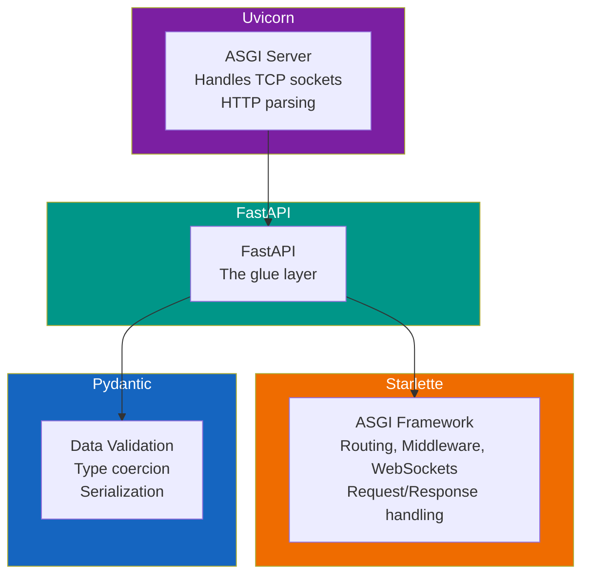
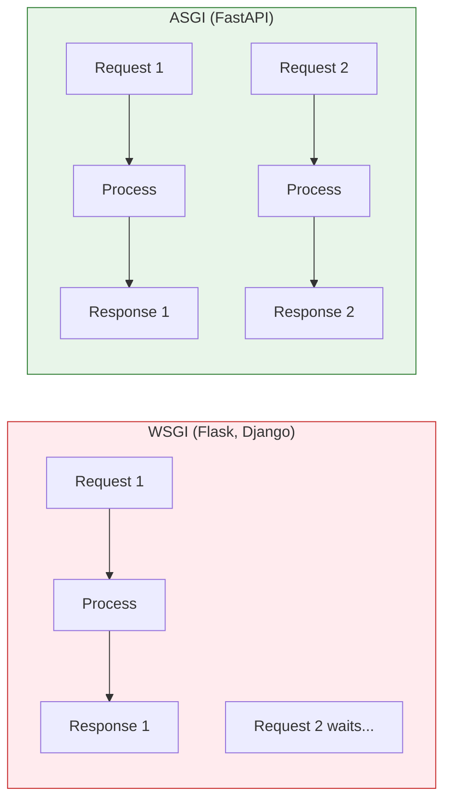

# Lesson 6.11: What IS FastAPI?

> **Duration**: 20 min | **Section**: C - FastAPI Fundamentals

## 🎯 The Problem (3-5 min)

You've learned HTTP and Pydantic. Now you need to build an actual web server. Python has options:

- **Flask**: Popular, minimal, synchronous
- **Django**: Full-featured, batteries-included, heavy
- **Tornado**: Async, older, more manual
- **FastAPI**: Modern, fast, automatic docs, built on Pydantic

> **Scenario**: You need to build an API for your ML model. It should be fast (async), validate inputs automatically, generate documentation, and use modern Python features (type hints). Which framework?

## 🧪 Try It: Flask vs FastAPI (5 min)

### Flask Approach

```python
from flask import Flask, request, jsonify

app = Flask(__name__)

@app.route('/users', methods=['POST'])
def create_user():
    data = request.get_json()
    
    # Manual validation 😫
    if 'name' not in data:
        return jsonify({"error": "name required"}), 400
    if not isinstance(data['name'], str):
        return jsonify({"error": "name must be string"}), 400
    if 'age' not in data:
        return jsonify({"error": "age required"}), 400
    if not isinstance(data['age'], int):
        return jsonify({"error": "age must be integer"}), 400
    
    # Finally, your logic
    user = {"id": 1, "name": data['name'], "age": data['age']}
    return jsonify(user), 201
```

### FastAPI Approach

```python
from fastapi import FastAPI
from pydantic import BaseModel

app = FastAPI()

class User(BaseModel):
    name: str
    age: int

@app.post('/users', status_code=201)
def create_user(user: User):
    # Validation already done! Just your logic:
    return {"id": 1, "name": user.name, "age": user.age}
```

**Same functionality, 80% less code.** Plus:
- Automatic validation
- Automatic error messages
- Automatic documentation

## 🔍 Under the Hood (10-15 min)

### What IS FastAPI?

FastAPI is a **web framework** that combines:



| Component | Role |
|-----------|------|
| **Uvicorn** | ASGI server - handles raw network I/O |
| **Starlette** | Web framework - routing, middleware, responses |
| **Pydantic** | Data validation and serialization |
| **FastAPI** | Combines everything with beautiful developer experience |

### Why "Fast"?

FastAPI is fast in TWO ways:

1. **Fast to run** (Performance)
   - Built on ASGI (async)
   - One of the fastest Python frameworks
   - Comparable to Node.js and Go

2. **Fast to code** (Developer experience)
   - Less code to write
   - Type hints = autocomplete
   - Automatic docs = less documentation work

### ASGI vs WSGI



- **WSGI** (Flask, Django): Synchronous. One request at a time per worker.
- **ASGI** (FastAPI): Asynchronous. Multiple requests concurrently.

### Automatic Documentation

FastAPI generates TWO documentation UIs automatically:

1. **Swagger UI**: `/docs`
   - Interactive (try endpoints from browser)
   - Shows request/response schemas
   
2. **ReDoc**: `/redoc`
   - Clean, readable documentation
   - Great for sharing with teams

These are generated from your code's type hints and docstrings!

### The Magic of Type Hints

```python
@app.post('/users')
def create_user(user: User) -> UserResponse:
    ...
```

FastAPI uses these type hints to:
- ✅ Validate input (`user: User`)
- ✅ Document request body (User schema)
- ✅ Document response (UserResponse schema)
- ✅ Serialize output to JSON
- ✅ Enable IDE autocomplete

## 💥 Where It Breaks (3-5 min)

### No Type Hints = No Magic

```python
# ❌ Without type hints, FastAPI can't help you
@app.post('/users')
def create_user(user):  # What is user? 🤷
    return user

# ✅ With type hints, full power
@app.post('/users')
def create_user(user: User) -> UserResponse:
    return UserResponse(id=1, **user.model_dump())
```

### Wrong Server

```bash
# ❌ Wrong: Flask's dev server won't work
python main.py  # If you wrote Flask-style runner

# ✅ Right: Use uvicorn
uvicorn main:app --reload
```

## ✅ Setting Up FastAPI (5 min)

### Installation

```bash
pip install fastapi uvicorn[standard]
```

- `fastapi`: The framework
- `uvicorn`: ASGI server to run it
- `[standard]`: Extra performance dependencies

### Minimal App

```python
# main.py
from fastapi import FastAPI

app = FastAPI()

@app.get('/')
def read_root():
    return {"message": "Hello, World!"}
```

### Running

```bash
uvicorn main:app --reload
```

- `main`: The Python file (main.py)
- `app`: The FastAPI instance
- `--reload`: Auto-reload on code changes (development only!)

### Check It Works

- **API**: http://localhost:8000/
- **Docs**: http://localhost:8000/docs
- **ReDoc**: http://localhost:8000/redoc

## 🎯 Practice

### Exercise 1: First FastAPI App

Create a FastAPI app with:
- GET `/` → returns `{"status": "ok"}`
- GET `/health` → returns `{"healthy": true}`

Run it and check `/docs`.

### Exercise 2: Add Metadata

```python
app = FastAPI(
    title="My API",
    description="A sample API",
    version="1.0.0"
)
```

See how it appears in `/docs`.

### Exercise 3: Compare Flask

If you've used Flask, list 3 things FastAPI does that Flask requires manual code for.

## 🔑 Key Takeaways

- **FastAPI** = Starlette (ASGI web) + Pydantic (validation)
- **Fast to run**: ASGI, async, high performance
- **Fast to code**: Type hints, automatic validation, auto docs
- **Run with**: `uvicorn main:app --reload`
- **Docs at**: `/docs` (Swagger) and `/redoc` (ReDoc)
- **Type hints are ESSENTIAL** for FastAPI to work its magic

## ❓ Common Questions

| Question | Answer |
|----------|--------|
| "FastAPI vs Flask?" | FastAPI: async, type hints, auto validation. Flask: simpler, more manual. |
| "FastAPI vs Django?" | Django: full stack (ORM, admin, templates). FastAPI: API-focused, lighter. |
| "Can FastAPI do templates?" | Yes, but it's designed for APIs. Use Jinja2 if needed. |
| "Is async required?" | No, `def` works. But `async def` unlocks concurrency. |

## 📚 Further Reading

- [FastAPI Official Documentation](https://fastapi.tiangolo.com/)
- [Starlette Documentation](https://www.starlette.io/)
- [Uvicorn Documentation](https://www.uvicorn.org/)
- [ASGI Specification](https://asgi.readthedocs.io/)

---

**Next**: [Lesson 6.12: Your First Endpoint](./Lesson-12-Your-First-Endpoint.md) — Let's build a real endpoint with path operations and see uvicorn in action!
