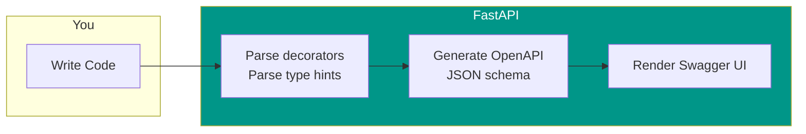
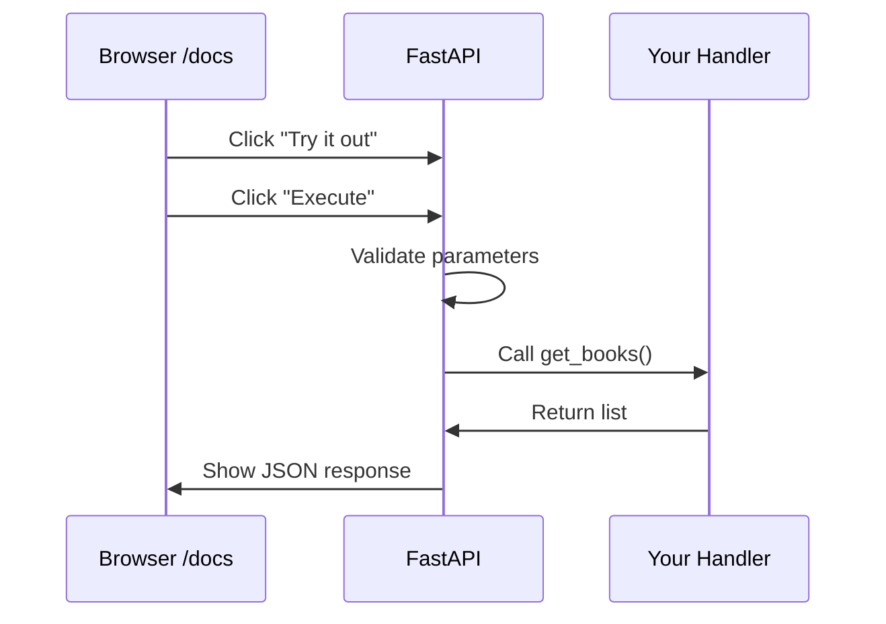

# Lesson 6.12: Your First Endpoint

> **Duration**: 25 min | **Section**: C - FastAPI Fundamentals

## 🎯 The Problem (3-5 min)

You understand FastAPI conceptually. Now you need to actually build something:

- How do you create endpoints?
- What does `@app.get("/")` actually do?
- How do you run the server?
- What do those automatic docs look like?

> **Scenario**: Build an API for a bookstore. Start with basic endpoints: list all books, get one book, add a book. Let's build it step by step.

## 🧪 Try It: First Endpoint (10 min)

### Step 1: Create the App

```python
# main.py
from fastapi import FastAPI

# Create the FastAPI application
app = FastAPI(
    title="Bookstore API",
    description="A simple bookstore API",
    version="0.1.0"
)

# Your first endpoint
@app.get("/")
def root():
    return {"message": "Welcome to the Bookstore API"}
```

### Step 2: Run It

```bash
uvicorn main:app --reload
```

You'll see:
```
INFO:     Uvicorn running on http://127.0.0.1:8000 (Press CTRL+C to quit)
INFO:     Started reloader process [12345]
INFO:     Started server process [12346]
INFO:     Waiting for application startup.
INFO:     Application startup complete.
```

### Step 3: Test It

Open your browser to http://localhost:8000

You'll see:
```json
{"message": "Welcome to the Bookstore API"}
```

### Step 4: Explore the Docs

Go to http://localhost:8000/docs

You'll see **Swagger UI** with your endpoint listed!



## 🔍 Under the Hood (10-15 min)

### Path Operations Explained

```python
@app.get("/")
def root():
    return {"message": "Hello"}
```

| Part | Meaning |
|------|---------|
| `@app` | The FastAPI application |
| `.get` | HTTP GET method |
| `("/")` | The URL path |
| `def root()` | The function to call |
| `return {...}` | Automatically converted to JSON |

### HTTP Methods as Decorators

```python
@app.get("/items")       # GET    - Read
@app.post("/items")      # POST   - Create
@app.put("/items/{id}")  # PUT    - Update/Replace
@app.patch("/items/{id}")# PATCH  - Partial Update
@app.delete("/items/{id}")# DELETE - Delete
```

### Let's Build the Bookstore

```python
# main.py
from fastapi import FastAPI

app = FastAPI(title="Bookstore API")

# Fake database (in-memory list)
books = [
    {"id": 1, "title": "1984", "author": "George Orwell"},
    {"id": 2, "title": "Brave New World", "author": "Aldous Huxley"},
]

# GET all books
@app.get("/books")
def get_books():
    return books

# GET one book
@app.get("/books/{book_id}")
def get_book(book_id: int):
    for book in books:
        if book["id"] == book_id:
            return book
    return {"error": "Book not found"}

# POST create book
@app.post("/books")
def create_book(title: str, author: str):
    new_book = {
        "id": len(books) + 1,
        "title": title,
        "author": author
    }
    books.append(new_book)
    return new_book

# DELETE book
@app.delete("/books/{book_id}")
def delete_book(book_id: int):
    for i, book in enumerate(books):
        if book["id"] == book_id:
            deleted = books.pop(i)
            return {"deleted": deleted}
    return {"error": "Book not found"}
```

### Testing with curl

```bash
# Get all books
curl http://localhost:8000/books

# Get book 1
curl http://localhost:8000/books/1

# Create book (query params for now)
curl -X POST "http://localhost:8000/books?title=Dune&author=Frank%20Herbert"

# Delete book
curl -X DELETE http://localhost:8000/books/3
```

### Testing with /docs

Go to http://localhost:8000/docs and:
1. Click on an endpoint
2. Click "Try it out"
3. Fill in parameters
4. Click "Execute"
5. See the response!



## 💥 Where It Breaks (3-5 min)

### Wrong File/App Name

```bash
# ❌ File is main.py but you type:
uvicorn app:main  # Wrong order!

# ✅ Correct: filename:variable
uvicorn main:app
```

### Port Already in Use

```bash
# Error: Address already in use

# Fix: Use different port
uvicorn main:app --reload --port 8001
```

### Forgot to Return

```python
# ❌ No return = returns null
@app.get("/items")
def get_items():
    items = [1, 2, 3]
    # Forgot return!

# ✅ Always return
@app.get("/items")
def get_items():
    items = [1, 2, 3]
    return items
```

### Function Names Don't Need to Match Path

```python
# Path is /users, function is anything
@app.get("/users")
def retrieve_all_users():  # Name doesn't matter
    return []

# But good practice: make them related!
```

## ✅ Best Practices (5 min)

### Organize Endpoints RESTfully

```python
# Resource: books
@app.get("/books")           # List all
@app.get("/books/{id}")      # Get one
@app.post("/books")          # Create
@app.put("/books/{id}")      # Update
@app.delete("/books/{id}")   # Delete

# Resource: authors
@app.get("/authors")
@app.get("/authors/{id}")
# ...
```

### Add Docstrings for Better Docs

```python
@app.get("/books")
def get_books():
    """
    Retrieve all books in the store.
    
    Returns a list of books with their ID, title, and author.
    """
    return books
```

This appears in Swagger UI!

### Use Status Codes

```python
from fastapi import FastAPI, status

@app.post("/books", status_code=status.HTTP_201_CREATED)
def create_book(title: str, author: str):
    ...
```

Status codes can be:
- Integers: `status_code=201`
- Constants: `status_code=status.HTTP_201_CREATED`

## 🎯 Practice

### Exercise 1: Todo API

Create a Todo API with:
- `GET /todos` - list all todos
- `GET /todos/{id}` - get one todo
- `POST /todos?task=...&done=false` - create todo
- `DELETE /todos/{id}` - delete todo

### Exercise 2: Add Docs Metadata

Add to your app:
```python
app = FastAPI(
    title="Todo API",
    description="Manage your tasks",
    version="1.0.0",
    contact={"name": "Your Name", "email": "you@example.com"}
)
```

Check `/docs` and `/redoc`.

### Exercise 3: Test with curl

Write curl commands to:
1. List todos
2. Create a todo
3. Get that todo by ID
4. Delete it

## 🔑 Key Takeaways

- **`@app.get/post/put/delete`** create endpoints
- **Path = URL**, **Method = action**
- **Return dict/list** → automatically becomes JSON
- **Run with** `uvicorn main:app --reload`
- **Docs at** `/docs` and `/redoc`
- **Docstrings** become API documentation

## ❓ Common Questions

| Question | Answer |
|----------|--------|
| "Can I have multiple apps?" | Yes, but usually one app per service |
| "How to handle HTTPS?" | Uvicorn can, or use nginx/Caddy in front |
| "Order of routes matters?" | Yes! More specific routes first |
| "Can I use classes instead of functions?" | Yes, but function-based is more common |

## 📚 Further Reading

- [FastAPI Path Operation](https://fastapi.tiangolo.com/tutorial/first-steps/)
- [Uvicorn Documentation](https://www.uvicorn.org/)
- [OpenAPI Specification](https://swagger.io/specification/)

---

**Next**: [Lesson 6.13: Path Parameters](./Lesson-13-Path-Parameters.md) — Learn how `/books/{book_id}` works and how FastAPI converts types automatically.
